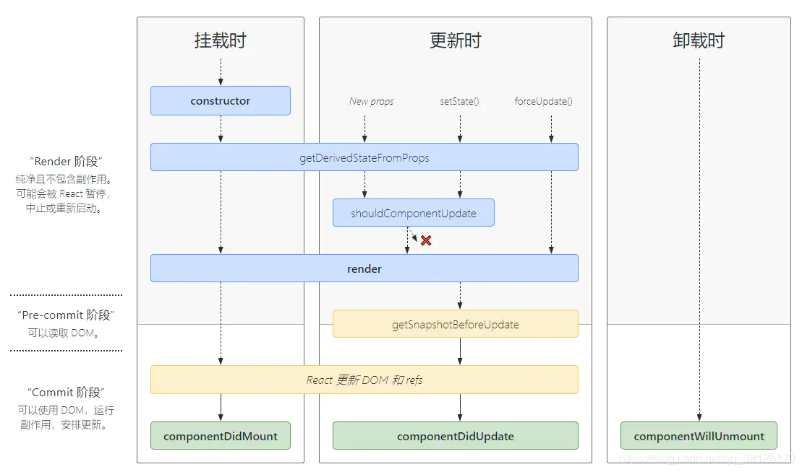

## 快速上手

- React：专注于构建用户**界面**的 JavaScript 库（相比较 jQuery 操作 DOM 元素，React 讲究生态和操作 data 修改页面）
- 从 MVC 角度看，React 仅仅是视图层（V），也就是负责图的渲染，并非提供了完整的 M 和 C 功能
- 特点：声明式（仅需描述结构）、<u>基于组件</u>（表述部分内容）、随处使用（VR开发-react360、原生应用-react-native）
- 原生 JS 没有组件化编码方案，复用率低下（HTML、CSS、JS 都需要拆）；直接操作 DOM 会造成大量的重绘重排
- Babel：ES6 => ES5、JSX => JS

- 安装：

```zsh
# react(核心库)创建元素、react-dom(拓展库)把元素渲染页面中、操作DOM
npm install react react-dom
```

- 引入：

```html
<script src="./node_modules/react/umd/react.development.js"></script> <!--必须之前-->
<script src="./node_modules/react-dom/umd/react-dom.development.js"></script>
<script type="text/babel">...ctx...</script> <!--可以不引-->
```

- <u>创建</u> React 元素并<u>渲染</u> React 元素到界面：

```html
<!-- 元素挂载点 -->
<div id="root"></div>
```

```html
<script>
  // createElement三个参数是:元素名称、元素属性、元素子节点(文本节点)
  const title = React.createElement('h1', null, 'Hello React')
  // render 方法的返回值描述了希望在屏幕上看到的内容
  // 参数一:要渲染的react元素、参数二:拿到页面的元素挂载点
	ReactDOM.render(title, document.getElementById('root'))
</script>
```

### React 脚手架

- 初始化

npx 是 npm@5.2.0 引入的一条命令，提供包内提供的命令行工具的使用体验。此前没有 npx 是需要全局安装脚手架再去使用包中提供的命令。而使用 npx 无需安装脚手架就可以直接使用这个包提供的命令。

```zsh
$ npx create-react-app my-app
```

- 启动项目

yarn 是 facebook 发布的包管理器，看作与 npm 替代品。初始化新项目：`yarn init`、安装包：`yarn add 包名`

```zsh
# 在项目根目录执行(上一步创建的my-app)
$ npm start
```

package.json 文件中和 start 并列还有其他几个命令，其中 build 可以创建生产环境优化代码，test 用于单元测试，还有一个 eject 命令
把潜藏在 react-scripts 中的一系列技术栈配置都“弹射”到应用的顶层，然后就可以研究配置细节，进行更灵活地定制应用的配置。值得一提的是 eject 命令是不可逆的，就好像战斗机飞行员选择“弹射”出驾驶舱，等于是放弃了这架战斗机，是不可能再飞回驾驶舱的。所以，当执行 eject 之前，最好做一下备份。完成 eject 后当前目录下会增加两个目录，一个是 scripts，另一个是 config，同时，package.json文件中的 scripts 部分也发生了变化。

```json
"scripts": {
	"start": "node scripts/start.js",
	"build": "node scripts/build.js",
	"test": "node scripts/test.js --env=jsdom"
	}
```

在 config 目录下的 webpack.config.js 文件，定制的就是 npm start 所做的构造过程，其中有一段关于 babel 的定义：

```js
...
{
  test: /\.(js|mjs|jsx|ts|tsx)$/, // 📍
  include: paths.appSrc,
  loader: require.resolve('babel-loader'),
  options: {
    customize: require.resolve(
      'babel-preset-react-app/webpack-overrides'
    ),
    presets: [
      [
        require.resolve('babel-preset-react-app'),
        {
          runtime: hasJsxRuntime ? 'automatic' : 'classic',
        },
      ],
    ],  
    plugins: [
      [
        require.resolve('babel-plugin-named-asset-import'),
        {
          loaderMap: {
            svg: {
              ReactComponent:
                '@svgr/webpack?-svgo,+titleProp,+ref![path]',
            },
          },
        },
      ],
      isEnvDevelopment &&
        shouldUseReactRefresh &&
        require.resolve('react-refresh/babel'),
    ].filter(Boolean),
    // This is a feature of `babel-loader` for webpack (not Babel itself).
    // It enables caching results in ./node_modules/.cache/babel-loader/
    // directory for faster rebuilds.
    cacheDirectory: true,
    // See #6846 for context on why cacheCompression is disabled
    cacheCompression: false,
    compact: isEnvProduction,
  },
}
...
```

代码中 paths.appSrc 的值就是 src，所以这段配置的含义指的是所有以 js 或者 jsx 之流为扩展名的文件，都会由babel所处理。并不是所有的浏览器都支持所有 ES6 语法，但是有了 babel 就可以不用顾忌太多，因为 babel 会把 ES6 语法的 JavaScript 代码转译（transpile）成浏览器普遍支持的 JavaScript 代码，实际上，在 React 的社区中，不使用 ES6 语法写代码显得奇怪。

- 导入 React 和 React-dom 两个包

```js
// 基于 webpack 模块化 ES6 语法导入
import React from 'react'
import ReactDOM from 'react-dom'
```

- 调用 `React.createElement()` 方法创建 react 元素
- 调用 `ReactDOM.render()` 方法渲染 react 元素到页面中

### 对比 jQuery

选中一些 DOM 元素，然后对这些元素做一些操作，这是一种最容易理解的开发模式。jQuery 的发明人 John Resig 就是发现了网页应用开发者的这个编程模式，才创造出了 jQuery，其一问世就得到普遍认可，因为这种模式直观易懂。但是，对于庞大的项目，这种模式会造成代码结构复杂难以维护，频繁的操作 DOM 也会使网页性能下降。

```html
<! doctype html>
<html>
  <body>
    <div>
      <button id="clickMe">Click Me</button>
      <div>
        Click Count: <span id="clickCount">0</span>
      </div>
    </div>
    <script src="http://lib.sinaapp.com/js/jquery/3.1.0/jquery-3.1.0.min.js"></script>
    <script src="./clickCounter.js"></script>
  </body>
</html>
```

```js
$(function() {
  $('#clickMe').click(function() {
    var clickCounter = $('#clickCount');
    var count = parseInt(clickCounter.text(), 10);
    clickCounter.text(count+1);
  })
})
```

React 的理念归结为 UI=render(data) 。这个函数是一个**纯函数**，所谓**纯函数**，指的是**没有任何副作用，输出完全依赖于输入的函数**，两次函数调用如果输入相同，得到的结果也绝对相同。如此一来，最终的用户界面，在 render 函数确定的情况下完全取决于输入数据。

对于开发者来说，重要的是区分开哪些属于 data，哪些属于 render，想要更新用户界面，要做的就是更新 data，用户界面自然会做出响应，所以 React 实践的也是“响应式编程”（Reactive Programming）的思想。

1、下列关于 React.createElement 方法描述错误的是（C）

A、该方法有多个参数	B、参数一表示创建元素的名	C、参数一表示创建元素的属性	D、参数二表示创建元素的属性

2、下列描述正确的是（A）

A、react 包是核心，提供创建元素、组件的功能	B、react 包 是核心，提供样式、组件的功能	C、react包是不是核心，只提供了组件的功能	D、react-dom 包是核心，提供创建元素、组件的功能

3、安装react指令正确的是（B）

A、`npm i react`	B、`npm i react react-dom`	C、`npm i react react-doe`	D、`npm i react-dom`

## JSX

使用 `createElement()` 容易出现繁琐不简洁、不直观的问题。<u>JSX 是 JavaScript XML 的简写</u>，表示在 JavaScript 代码中写 XML（HTML）格式代码，声明式更加直观。JSX 也是 React 的核心内容。

```js
React.createElement(
	'div',
  {className: 'shopping-list'},
  React.createElement('h1', null, 'shopping list')
  React.createElement(
  	'ul', 
  	null,
  	React.createElement('li', null, 'Instagram')
		React.createElement('li', null, 'Wechat')
	)
)
```

```jsx
<div className="shopping-list">
  <h1>Shopping List</h1>
  <ul>
  	<li>Instagram</li>
    <li>Wechat</li>
  </ul>
</div>
```

### 使用步骤

```jsx
// 使用 JSX 创建 react 元素 - 与 const title = React.createElement(...) 达到的效果相同但是更为简洁
const title = <h1>Hello JSX<span /></h1>
// 渲染创建好的 React 元素
ReactDOM.render(title, root)
```

注意点：

- 为什么脚手架可以直接使用 JSX 语法？（JSX 不是标准的 ECMAScript 语法，仅为 ECMAScript 语法的扩展）因为 `create-react-app` 脚手架中<u>已经默认有 babel 之流的配置</u>，无需手动配置，那么就可以运行浏览器中。编译 JSX 语法的包为 `@babel/preset-react`。

- React 元素的属性名使用驼峰命名法。

- 特殊属性名：`class->className`、`for->htmlFor`、`tabindex->tabIndex`。
- 没有子节点的 React 元素可以使用 `/>` 结束，即可以把双标签替换为单标签。
- 推荐使用小括号包裹 JSX，避免 JS 中自动插入分号陷阱

### 嵌入表达式

通常数据存储在 JavaScript 中，需要使用 `{JavaScript表达式}` 嵌入（注意是单花括号）。

```html
<div id="nameage"></div>
```

```jsx
const name = 'zairesinatra', age = 22;
const hhh = (
  <h1>
    Hello, I'm {name}, and {age} years old.
  </h1>
)
ReactDOM.render(hhh,document.getElementById('nameage'))
```

注意点：

- 定义虚拟 DOM 不需要引号；
- 单括号内可以使用任意合法的 JavaScript 表达式（要使用 JS 表达式就用花括号）；
- 样式类名不要用 class 而是 className；
- 内联样式使用双花括号；
- 唯一根标签；
- 标签必须闭合（不一定成双）；
- 标签首字母小写开头转换为 html 同名元素，无该标签同名元素则报错；首字母大写开头会渲染对应的组件，若组件未定义则报错；

```jsx
const sayHi = () => 'Hi~'
const abc = (
	<h1>
    hahahaha
  	<p>{1}</p><p>{'a'}</p><p>{1+7}</p><p>{1>2?"大于":"小于"}</p>
    <p>{sayHi()}</p>
  </h1>
)
```

- JSX 本身也是 JavaScript 表达式；

```jsx
const h1 = <h1>JSX表达式也是JavaScript表达式</h1>
const jsbds = (
	<div>嵌入JSX表达式=>{h1}</div>
)
```

- JavaScript 中的对象是一个例外，仅能出现在 style 属性中；

```jsx
<p>{{num:'666'}}</p> // 会报错
```

- 不能在 `{}` 中出现语句：（如：`for、if、switch`）。语句（代码）不等于表达式（会产生一个值，可以放在任何一个需要值的地方）。简而言之能在左侧用 `const bds = ` 接住值的就是表达式（`a、a+b、demo(1)、arr.map()`）。

```jsx
const data = ['Angular','React','Vue']
const VDOM = (
  <div>
  	<h1>前端框架</h1>
    <ul>
    	{
        data.map((item, index) => { // key用index会存在隐患
          return <li key={index}>{item}</li> // 读变量要用{}
        })
      }
    </ul>
  </div>
)
```

### 条件渲染

根据条件特定渲染 JSX 结构。

```jsx
const isLoading = true
const loadData = () => {
  if(isLoading) {
    return <div>数据加载中请稍候...</div>
  }
  return <div>数据加载完成</div>
}
const lloadData = (
  <div>
  	{loadData()}
  </div>
)
```

### 列表渲染

渲染数组应该使用数组的 `map()` 方法。

```jsx
const songs = [
	{id: 0, name: '园游会'},
	{id: 1, name: '晴天'},
	{id: 2, name: '美人鱼'},
]
const list = (
  <ul>
    {songs.map(item=><li key={item.id}>{item.name}</li>)}
  </ul>
)
```

### 样式处理

- 行内样式——`style`

```jsx
// 行内样式可以有多个,所以是对象形式
<h1 style={{color: 'red', backgroundColor: 'skyblue'}}> JSX 样式 </h1>
```

- 类名——`className`

```jsx
<h1 className="title"> JSX样式 </h1>
```

### 总结

- JSX 是 React 的核心内容。
- JSX 表示在 JavaScript 代码中写 HTML 结构，是 React 声明式的体现。而 `React.createElement()` 是命名式。
- 推荐使用 `className` 给 JSX 增加样式。
- React 利用 JavaScript 语言自身能力编写结构需要（没有指令概念），而不是造轮子增强 HTML 功能（`Vue` 中是由框架提供的语法增强 HTML 结构的，如 `v-for`、`v-if`）

1、在 JSX 中嵌入表达式正确的是（C）

A、（JavaScript表达式）	B、[JavaScript表达式]	C、{JavaScript表达式}	D、{{JavaScript表达式}}

2、下列关于使用 JSX 描述不正确的是（D）

A、React 元素属性使用驼峰命名	B、`class`属性对应 `className`	C、没有子节点的react元素可以用`/>`结束	D、不推荐使用小括号包裹 `JSX`

## 组件

### 函数组件

使用函数或箭头函数创建组件后以函数名作为组件名渲染（适用于简单组件 —— 因为没有状态 state）。

```jsx
// 函数名必须大写字母开头 - 因此区分组件与普通 React 元素
// 箭头函数写法 const Hello = () => <div>这是函数组件</div>
function Hello () { // 函数组件没有 this 何谈实例
  return ( // 函数组件必须有返回值
  	<div>这是函数组件</div>
  )
}
ReactDOM.render(<Hello /></Hello>, document.getElementById('root'))
// react解析组件标签,找到了Hello组件,发现组件是使用函数标签,随后调用该函数,将render返回的虚拟DOM转为真实DOM呈现在页面
```

### 类组件

使用 ES6 中 class 创建组件（适用于复杂组件 —— 因为有状态 state）。

```jsx
// 类名称必须大写开头
// render() 方法必须有返回值,表示该组件的结构
class Hello extends React.Component { // 类组件应该继承 React.Component 父类,从而使用父类中提供的方法或属性
  render () { // 类组件必须提供 render() 方法
    console.log(this); // 此处的this是undefined,因为babel编译后开启了严格模式,不开启严格模式则为组件实例对象Hello{...}
    // 实例身上四大属性:context、refs、props、state
    return (<div>这是 class 组件</div>)
  }
}
ReactDOM.render(<Hello /></Hello>, document.getElementById('root'))
// react解析组件标签,找到了Hello组件
// 发现组件是使用类标签,随后new出该类实例,并通过该实例调用原型(Hello)上的render方法
// 将render返回的虚拟DOM转为真实DOM呈现在页面
```

上述两种渲染组件方法不需要渲染内容则返回 `null` 就可以；<u>类中构造器不是必须写的，要对实例进行一些初始化操作，如添加指定属性时才写。A 类继承了 B 类，且 A 类中写了构造器，那么 A 类构造器中 super 是必须啊要调用的。</u>类中所定义的方法，都是在类的原型对象上，供实例去使用。

### 抽离组件

```js
// 通常将组件放在单独的 .js 文件中
import React from 'react'
class Hello extends React.Component {
  render () { // render在类的原型上,供实例使用
    return <div>Hello Class Component!</div>
  }
}
export default Hello
```

```jsx
// 导入
import Hello from './Hello'
// 渲染
ReactDOM.render(<Hello />, document.getElementById('root'))
```

React 组件实例对象上的数据分为两种，prop 和 state，<u>无论 prop 或者 state 的改变，都可能引发组件的重新渲染</u>。那么设计组件的时候，怎么选择用 prop 或者 state 呢？原则很简单，<u>prop 是组件的对外接口，state 是组件的内部状态，对外用 prop，内部用 state</u>。在 React 中，prop（property的简写）是从外部传递给组件的数据，组件通过定义自身能够接受的 prop 就定义了自己的对外公共接口。

看起来，React 组件的 prop 很像是 HTML 元素的属性，不过，HTML 组件属性的值都是字符串类型，即使是内嵌 JavaScript，也依然是字符串形式表示代码。React 组件的 prop 所能支持的类型则丰富得多，除了字符串，可以是任何一种 JavaScript 语言支持的数据类型。

```jsx
<SampleButton id="sample" borderWidth={2} onClick={onButtonClick} style={{color: "red"}}/>
```

比如在上面的 SampleButton 中，borderWidth 就是数字类型，onClick 是函数类型，style 的值是一个包含 color 字段的对象，当 prop 的类型不是字符串类型时，在 JSX 中必须用花括号 `{}` 把 prop 值包住，所以 style 的值有两层花括号，外层花括号代表是 JSX 的语法，内层的花括号代表这是一个对象常量。

当外部世界要传递一些数据给 React 组件，一个最直接的方式就是通过 prop；同样，React 组件要反馈数据给外部，也可以用 prop，因为 prop 的类型不限于纯数据，也可以是函数，函数类型的 prop 等于让父组件交给了子组件一个回调函数，子组件在恰当的实际调用函数类型的 prop，可以带上必要的参数，这样就可以反过来把信息传递给外部世界。

如果一个组件需要定义自己的构造函数，一定要记得在构造函数的第一行通过 super 调用父类也就是 React.Component 的构造函数。如果在构造函数中没有调用 super(props)，那么组件实例被构造之后，类实例的所有成员函数就无法通过 this.props 访问到父组件传递过来的 props 值。很明显，<u>给 this.props 赋值是 React.Component 构造函数的工作之一</u>。

### Demo

```jsx
/*
!!评论列表模板
正常情况渲染评论列表(列表渲染)，没有评论数据时渲染"暂无评论"(条件渲染)。
获取评论信息，包括评论人和评论内容(受控组件)。
发表评论，更新评论列表(setState())。
*/
import React from 'react';
import './index.css'
export default class Comments extends React.Component {
  state = {
      comments: [
        { id: 1, name: 'jackChen', content: '沙发!!!' },
        { id: 2, name: 'rosebp', content: '板凳~' },
        { id: 3, name: 'tomcat', content: 'nice~' }
      ],
      userName: '',
      userContent: ''
  }
  renderList(){
    // 通过条件渲染来判断是否显示暂无评论
    if (this.state.comments.length === 0) {
      return (<div className="no-comment">暂无评论，快去评论吧~</div>)
    } else {
      return (
        <ul> {
          this.state.comments.map(item => {
            return (
              <li key={item.id}>
                <b>{item.name}</b>:
                <span>{item.content}</span>
              </li>
            )
          })
        }
        </ul>
      )
    }
  }
  handleForm = (e) => {
     this.setState({
       [e.target.name] : e.target.value
     })
  }
  handleClick = (e) => {
    // 拿到用户输入的内容
    let {userName,userContent} = this.state
    if(userName.trim()==='' || userContent.trim() === ''){
        alert('请输入内容')
        return
    }
    // 利用数组拓展运算符来进行数据的拼接，把用户输入的存放在数组的第一个位置
    let newComments = [{
      id: this.state.comments.length+1,
      name: userName,
      content: userContent
    },...this.state.comments]
    this.setState({
      comments: newComments,
      userName:'',
      userContent: ''
    })
  }
  render() {
    return (
      <div className="app">
        <div>
          <input className="user" type="text" placeholder="请输入评论人" value={this.state.userName} name="userName" onChange={this.handleForm}/>
          <br />
          <textarea
          className="content"
          cols="30"
          rows="10"
          placeholder="请输入评论内容"
          value={this.state.userContent}
          name="userContent"
          onChange={this.handleForm}
          />
          <br />
          <button onClick={this.handleClick}>发表评论</button>
        </div>
        {this.renderList()}
      </div>
    )
  }
}
```

```css
/* index.css */
.app {
  width: 300px;
  padding: 10px;
  border: 1px solid #999;
}

.user {
  width: 100%;
  box-sizing: border-box;
  margin-bottom: 10px;
}

.content {
  width: 100%;
  box-sizing: border-box;
  margin-bottom: 10px;
}

.no-comment {
  text-align: center;
  margin-top: 30px;
}
ul li {
    list-style: none;
}
```

### ref

#### [过时字符串类型的 ref](https://zh-hans.reactjs.org/docs/refs-and-the-dom.html#legacy-api-string-refs)

<u>ref 相当于原生的 id ，也可以看作大标识</u>。在标签上定义了 ref 属性后，可以在组件实例身上找到 refs 属性，每一个 ref 都会在 refs 中存在键值对，键为 ref 设置的属性，值为 DOM 节点。

```jsx
class Demo extends React.Component{
  showData = () => {
    // const inputt = document.getElementById('inputt')
    // alert(inputt.value)
    const {inputt} = this.refs
    alert(inputt.value)
  }
  showDataa = () => {
    const {inputtt} = this.refs
    alert(inputtt.value)
  }
  render () {
    return (
    	<div>
      	{/* <input id="inputt" type="text" placeholder="点击按钮提示数据"></input>&nbsp; */}
        {/* Warning: A string ref, "inputt", has been found within a strict mode tree. String refs are a source of potential bugs and should be avoided. We recommend using useRef() or createRef() instead. */}
        <input ref="inputt" type="text" placeholder="点击按钮提示数据"></input>&nbsp;
        <button onClick={this.showData}>点击我提示左侧数据</button>&nbsp;
        <input onBlur={this.showDataa} ref="inputtt" type="text" placeholder="失去焦点提示数据"></input>
      </div>
    )
  }
}
ReactDOM.render(<Demo/>, document.getElementById('test'))
```

#### 回调函数形式的 ref

传递一个函数。这个函数中接受 React 组件实例或 HTML DOM 元素作为参数，以使它们能在其他地方被存储和访问。

```jsx
class Demo extends React.Component{
  showData = () => {
    const {inputt} = this
    alert(inputt.value)
  }
  saveInputt = (c) => {
    this.inputt = c;
    console.log('@', c); // <input type="text">
    console.log(this); // Demo {props: {…}, context: {…}, refs: {…}, showData: ƒ, inputt: input…}
  }
  render () {
    return (
    	<div>
        {/* 把 ref 当前所属的节点挂载到实例自身上并且取一个名字inputt */}
        {/*<input ref={(currentNode) => {this.inputt = currentNode}} type="text" placeholder="点击按钮提示数据"></input>&nbsp;*/}
        <input ref={this.saveInputt} type="text" placeholder="点击按钮提示数据"></input>&nbsp;
        <button onClick={this.showData}>点击我提示左侧数据</button>&nbsp;
      </div>
    )
  }
}
ReactDOM.render(<Demo/>, document.getElementById('test'))
```

如果 `ref` 回调函数是以内联函数的方式定义的，在更新过程中它会被执行两次，第一次传入参数 `null`，然后第二次会传入参数 DOM 元素。这是因为在每次渲染时会创建一个新的函数实例，所以 React **清空**旧的 ref 传入一个 null 进来并且设置新的。通过将 ref 的回调函数定义成 class 的绑定函数的方式可以避免上述问题，但是大多数情况下它是无关紧要的。

#### React.createRef

`React.createRef()` 调用后可以返回一个容器，<u>该容器可以存储被 ref 所标识的节点</u>。再把 ref 当前所在的节点存储到容器中。但是此容器是"专人专用"的。

```jsx
class Demo extends React.Component{
  myRef = React.createRef()
	myReff = React.createRef()
	showData = () => {
    console.log(this.myRef) // {current: input}
    console.log(this.myRef.current) // <input type="text">
    alert(this.myRef.current.value)
  }
  showw = () => {
    alert(this.myReff.current.value)
  }
  render () {
    return (
    	<div>
        <input ref={this.myRef} type="text" placeholder="点击按钮提示数据"></input>&nbsp;
        <button onClick={this.showData}>点击我提示左侧数据</button>&nbsp;
        <input ref={this.myReff} onBlur={this.showw} type="text" placeholder="失去焦点提示数据"></input>&nbsp;
      </div>
    )
  }
}
ReactDOM.render(<Demo/>, document.getElementById('test'))
```

### 非受控组件

调用 `React.createRef()` 方法创建 ref 对象。借助于 ref，使用元素 DOM 方式获取表单元素值，ref 的作用是获取 DOM 或者组件。将创建好的 ref 对象添加到文本框中。通过 ref 对象获取到文本框的值。

```jsx
class App extends React.Component {
    constructor(){
        super()
        // 创建 ref
        // this.自定义Ref = React.createRef()
        this.txtRef = React.createRef() // txtRef自定义
    }
    // 通过 ref 对象获取文本框的值
    getTxt =() => {
        console.log(this.txtRef.current.value)
    }
    render(){
        return (
          <div>
            {/* 将创建好的 ref 对象添加到文本框中 */}
            {/* <input type="text" ref={this.自定义Ref}></input> */}
            <input type ="text" ref={this.txtRef} />
            <button onClick ={this.getTxt}>获取值</button>
          </div>
        )
    }
}
```

```jsx
// 非受控组件的特点是现用现取
class Login extends React.component{
  handleSubmit = (event) => {
    event.preventDefault() // 阻止表单提交
    const {username, password} = this
    alert(`您输入的帐号是：${username.value}，请确认密码：${password.value}`)
  }
  render() {
    return (
    	<form onSubmit={this.handleSubmit}>
      	用户名：<input ref={c => this.username = c} type="text" name="username"></input>
        密码：<input ref={c => this.password = c} type="password" name="password"></input>
        <button>登录</button>
      </form>
    )
  }
}
ReactDOM.render(<Login />, document.getElementById('test'))
```

### 受控组件📍

**表单处理**是受控组件的一个典型用例。HTML 中的表单元素是可输入的，也就是有自己的可变状态（冲突）。而 React 中可变状态通常保存在 state 中，并且只能通过`setState()` 方法来修改（冲突）。React 将 `state` 与表单元素值 `value` 绑定在一起，**由 `state` 的值来控制表单元素的值**（本来各自管理，现在合二为一）。综上**受控组件就是其值受到 React 控制的表单元素**。

```jsx
// 受控组件 - 输入类的 DOM 随着输入就可以把改变的内容维护到状态,需要用再从状态内取出(类似双向数据绑定,但是需要自定义事件)
// 优势也就省略了上述的 ref
class Login extends React.component{
  handleSubmit = (event) => {
    event.preventDefault() // 阻止表单提交
    const {username, password} = this.state
    alert(`您输入的帐号是：${username}，请确认密码：${password}`)
  }
  state = { // 初始化状态
    username: '', // 用户名
    password: '' // 密码
  }
	saveUsername = (event) => { // 保存帐号到状态中
    this.setState({username:event.target.value})
  }
  savePassword = (event) => { // 保存秘密到状态中
    this.setState({password:event.target.value})
  }
  render() {
    return (
    	<form onSubmit={this.handleSubmit}>
      	用户名：<input onChange={this.saveUsername} type="text" name="username"></input>
        密码：<input onChange={this.savePassword} type="password" name="password"></input>
        <button>登录</button>
      </form>
    )
  }
}
ReactDOM.render(<Login />, document.getElementById('test'))
```

👍如果一个函数符合以下规范的任意一种，那么这个函数就是**高阶函数**：1. 若 A 函数接收的参数是一个函数，那么 A 就可以称为高阶函数；2. 若 A 函数调用的结果依然是一个函数，那么 A 就可以称为高阶函数。常见的高阶函数有 `Promise、setTimeout、arr.map()`。

👍**函数的柯里化**：通过函数调用继续返回函数的方式，实现多次接收参数最后返回统一的处理方式。

```js
function sum(a) {return (b) => {return (c) => {return a+b+c}}}
console.log(sum(1)(2)(3)); // 6
```

```jsx
// 柯里化实现
class Login extends React.component{
  handleSubmit = (event) => {
    event.preventDefault() // 阻止表单提交
    const {username, password} = this.state
    alert(`您输入的帐号是：${username}，请确认密码：${password}`)
  }
  state = { // 初始化状态
    username: '', // 用户名
    password: '' // 密码
  }
	saveFormData = (dataType) => { // 保存帐号到状态中
    return (event) => { // event是react帮助生成的事件对象
      this.setState({[dataType]: event.target.value})
    }
  }
  render() {
    return (
    	<form onSubmit={this.handleSubmit}>
      	用户名：<input onChange={this.saveFormData('username')} type="text" name="username"></input>
        密码：<input onChange={this.saveFormData('password')} type="password" name="password"></input>
        <button>登录</button>
      </form>
    )
  }
}
ReactDOM.render(<Login />, document.getElementById('test'))
```

```jsx
// 不使用柯里化
class Login extends React.component{
  handleSubmit = (event) => {
    event.preventDefault() // 阻止表单提交
    const {username, password} = this.state
    alert(`您输入的帐号是：${username}，请确认密码：${password}`)
  }
  state = { // 初始化状态
    username: '', // 用户名
    password: '' // 密码
  }
	saveFormData = (dataType, value) => { // 保存帐号到状态中
    this.setState({[dataType]: value})
  }
  render() {
    return (
    	<form onSubmit={this.handleSubmit}>
        {/* 思路:必须把!! saveFormData 调用返回的函数 !!交给onChange作为回调才可 */}
      	用户名：<input onChange={event=>this.saveFormData('username',event.target.value)} type="text" name="username"></input>
        密码：<input onChange={event=>this.saveFormData('password',event.target.value)} type="password" name="password"></input>
        <button>登录</button>
      </form>
    )
  }
}
ReactDOM.render(<Login />, document.getElementById('test'))
```

#### 使用步骤

- 在state中添加一个状态，作为表单元素的value值

```jsx
state = { txt: '' }
```

```jsx
<input type="text" value={this.state.txt} onChange = {e => this.setState({txt: e.target.value})} />
```

- 给表单元素绑定change事件，将表单元素的值设置为state的值

```jsx
import React from 'react';
import ReactDOM from 'react-dom';
import './index.css';

class App extends React.Component {
  state = {
    txt: 'zsxzy',
    content: 'zairesinatra',
    city: 'sandiego',
    isChecked: false
  }
  handleChange = (e) => {
    this.setState({
      txt: e.target.value
    })
  }
  handleContent = (e) => {
    this.setState({
      content: e.target.value
    })
  }
  handleselect = (e) => {
    this.setState({
      city: e.target.value
    })
  }
  handleCheck = (e) => {
    this.setState({
      isChecked: e.target.checked
    })
  }
  // select中的value表示自动选择同value属性的option
  // checkbox须在input框中,checked进行属性绑定,handleChecked进行状态控制
  render() {
    return (
      <div>
        <input type="text" value = {this.state.txt} onChange={this.handleChange}></input>
        <br></br>
        <textarea value={this.state.content} onChange={this.handleContent}></textarea>
        <br></br>
        <select value={this.state.city} onChange={this.handleselect}>
          <option value="changsha">1</option>
          <option value="sandiego">2</option>
          <option value="harbin">3</option>
        </select>
        <br></br>
        <input type="checkbox" checked={this.state.isChecked} onChange={this.handleCheck}></input>
      </div>
    )
  }
}

ReactDOM.render(<App />,document.getElementById('root'));
```

#### 多表单元素优化

每个表单元素都有一个单独的事件处理函数较为繁琐，可以使用一个事件处理程序同时处理多个表单元素

- 给表单元素添加 `name` 属性（用来区分是哪一个表单），名称与 `state` 相同（用来更新数据的）
- 根据表单元素类型来获取对应值 `(e.target.type)`
- 在触发事件处理程序中通过 `[name]` 来修改对应的 `state`

```jsx
inputChange = (e) => {
   let value = e.target.type == 'checkbox' ? e.target.checked : e.target.value;
   this.setState({
       [e.target.name]: value
   })
}
<input type="text" value={this.state.txt} name="txt" onChange={this.inputChange}/>
<input type="checkbox" value={this.state.isChecked} name="isChecked" onChange={this.inputChange}/>
```

### props📍

组件是封闭的，默认情况下只能使用组件内部的数据。接受外部数据应该通过 props，即 **props** 的作用是接收传递给组件的数据，数据的传递是通过给组件标签添加属性完成。

```jsx
ReactDOM.render(<Hello name="zs" age={23} />,document.getElementById('root'))
```

- 接收数据：**函数组件通过参数 props 接收数据，类组件通过 `this.props` 接收数据**📌

  - 函数组件获取

    ```jsx
    const Hello = props => {
      console.log(props); // { "name": "zs", "age": 23 }
      return (
        <div>
          <h1>props:{props.name}</h1>
        </div>
      )
    }
    ReactDOM.render(<Hello name="zs" age={23} />,document.getElementById('root'))
    ```

  - 类组件获取

    ```jsx
    class Hello extends React.Component{
      render() {
        console.log(this.props);
        return (
          <div>
            <h1>props:{this.props.name}</h1>
          </div>
        )
      }
    }
    // 23 不用花括号而是双引号则是字符串类型的数据,使用其他类型数据需要放在花括号中
    ReactDOM.render(<Hello name="zs" age={23} />,document.getElementById('root'))
    ```

- 可以给组件传递任意类型的数据（数组、函数、JSX结构...但是需要放在 `{}` 之中）
- props 是只读属性，不能对值进行修改 => `props.name = 'zy' // 不能修改`
- 注意：使用类组件时，如需在构造函数中获取到 props，应该将 props 传递给 `super()`，当然，其他的地方是可以拿到的

```jsx
class Consprop extends React.Component{
  constructor(props) {
    super(props) // 传递父类构造函数
    console.log(this.props); // obj
  }
  render() {
    console.log(this.props.arr[0]); // 可以拿到
    console.log(this.props); // 可以拿到
    return (
      <div>
        <h1>props:{this.props.name}</h1>
        {this.props.jjsx}
      </div>
    )
  }
}
ReactDOM.render(<Consprop name="zs" age={23} arr={['zsxzy']} jjsx={<p>这是p标签</p>}/>,document.getElementById('cons'))
```

#### children 属性

- props.children 属性表示组件标签的子节点，即调用、渲染组件时开始和结束标记之间的内容。
- 当组件标签有子节点时，props 就会有该属性。
- children 属性与普通的 props 一样，值可以使任意值（文本、react 元素、组件、甚至是函数）；

```jsx
const PropsHasChildren = (props) => {
  console.log(props); // {children: Array(3)}
  return (
    <div>
      <b>组件标签子节点:</b>
      {props.children}
    </div>
  );
};
export default PropsHasChildren;
```

```jsx
<PropsHasChildren>
  <br />
  组件标签的子节点内容是：
  {'zs is ' + 2 + 1 + ' years old'}
</PropsHasChildren>
```

#### props 校验

ES6 方法定义的组件类可以通过增加类的 propTypes 属性来定义 prop 规格。这不只是声明，而且是一种限制，在运行时和静态代码检查时，根据 propTypes 判断外部是否正确地使用组件的属性。这是因为对于组件来说，props 是外来的，无法保证组件使用者传入什么格式的数据，简单来说就是组件调用者可能不知道封装的组件需要什么样的数据。如果传入的数据不对，可能会导致报错。props 校验可以允许在创建组件时，指定 props 的类型、格式等。

- 安装包 prop-types （在 15 版本是挂载 React 上，16 版本引入 PropTypes）

  ```shell
  yarn add prop-types | npm i props-types
  ```

- 导入 prop-types 包

- 使用`组件名.propTypes={}` 来给组件的 props 添加校验规则

- 校验规则通过 PropTypes 对象来指定

- 捕获使用组件时因为 props 类型导致的错误，给出明确的错误提示，增加组件的健壮性

```jsx
const Bpp = props => {
  const arr = props.colors
  const lis = arr.map((item, index) => <li key={index} > {item}</li>)
  return (
    <ul>
      {lis}
    </ul>
  )
}
// 添加 props 校验
Bpp.propTypes = { // 组件.propTypes
  colors: PropTypes.array // 约定color属性为array类型
  // 类型不对可以得出明确报错
}
ReactDOM.render(
  <Bpp colors={['red','blue']}></Bpp>,
  document.getElementById('proptypes')
);
```

```js
// 明确提示
Warning: Failed prop type: Invalid prop `colors` of type `number` supplied to `Bpp`, expected `array`.
at Bpp
```

**常见的[约束规则](https://zh-hans.reactjs.org/docs/typechecking-with-proptypes.html#proptypes)**

- 创建的类型： `array、bool、func、number、object、string`
- React 元素类型：`element`
- 必填项：`isRequired`
- 特定结构的对象： `shape({})`

**props 的默认值**

- 场景：分页组件 -> 每页显示条数
- 作用：给 props 设置默认值，在未传入 props 时生效

```jsx
// props默认值
function Cpp(props) {
  console.log(props);
  return(
    <div>
      <h4>此处展示props的默认值:{props.uname}\{props.pageSize}</h4>
    </div>
  )  
}
// 添加props默认值⭕️
Cpp.defaultProps = {
  uname: "zairesinatra",
  pageSize: 10
}
// 前提组件没有传入属性值,若属性传输入props则会被取代
ReactDOM.render(<Cpp uname={'zy'}></Cpp>,document.getElementById('cpp'))
```

## 事件处理

原生事件绑定有三种方式：获取元素 + `addEventListener('click',()=>{})`、`DOM.onclick=()=>{}`、🤩在标签内调用函数 `onclick="demo()"`。

#### 事件绑定

- React 事件（自定义合成事件）绑定语法与DOM事件语法相似。但是将原生的事件写为驼峰形式，且回调函数不要用引号包裹，使用花括号并去括号。这也是为了更好地兼容性与原生事件形成差异。React 事件是通过事件委托方式处理的（委托最外层元素，通常也就是 `<div>` 盒子），这是为了高效。此外可以通过 event.target 得到事件的 DOM 元素对象（为了避免过度使用 ref）。

  ```jsx
  class Demo extends React.component{
    myRef = React.createRef()
  	myReff = React.createRef()
    render () {
      showData = () => {
        console.log(this.myRef.current) // <input type="text">
        alert(this.myRef.current.value)
      }
      showw = (event) => { // 发生事件的元素正好是需要操作的元素就可以避免使用 ref
        alert(event.target.value)
      }
      return (
      	<div>
          <input ref={this.myRef} type="text" placeholder="点击按钮提示数据"></input>&nbsp;
          <button onClick={this.showData}>点击我提示左侧数据</button>&nbsp;
          <input onBlur={this.showw} type="text" placeholder="失去焦点提示数据"></input>&nbsp;
        </div>
      )
    }
  }
  ReactDOM.render(<Demo/>, document.getElementById('test'))
  ```

- 语法：`on+事件名称={事件处理函数}`，如： `onClick = {function(){}}、onClick={this.handleClick}、onClick={()=>{}}`

- 注意：React 事件采用驼峰命名法，如：`onMouseEnter`、`onFocus`

- 类组件与函数组件绑定事件是差不多的，只是在类组件中绑定事件函数的时候需要用到this，代表指向当前的类的引用，在函数中不需要调用this

```jsx
class App extends React.Component{
  handle() {
    console.log("类组件点击事件触发需要this");
  }
  render() {
    return <button onClick={this.handle}>点我触发</button>
  }
}
```

```jsx
ReactDOM.render(<App/>, document.getElementById('clickk'))
function Bpp() {
  function funcclick () {
    console.log('函数组件触发不需要this');
  }
  return (
    <button onClick={funcclick}>点我试试</button>
  )
}
ReactDOM.render(<Bpp />, document.getElementById('noclick'))
```

#### 事件对象

- 可以通过事件处理函数的参数获取到事件对象
- React中的事件对象叫做：合成事件
- 合成事件：兼容所有浏览器，无需担心跨浏览器兼容问题
- 除兼容所有浏览器外，它还拥有和浏览器原生事件相同的接口，包括 `stopPropagation()`和 `preventDefault()`
- 如果你想获取到原生事件对象，可以通过 `nativeEvent` 属性来进行获取

#### 有 | 无状态组件

- 函数组件成为无状态组件，类组件成为有状态组件
- 状态（State）即应用程序的数据
- 函数组件没有自己的状态，只负责数据的展示
- 类组件有自己的状态，负责更新页面，使页面有响应有反馈（比如计数器让按钮数值增加，那么显示的数据状态改变，页面也许要相应更新，这里就需要状态组件完成）
- 从本质上来说，无状态组件就是一个单纯的`render`函数，所以无状态组件的缺点也是显而易见的。因为它没有`shouldComponentUpdate`生命周期函数，所以每次`state`更新，它都会重新绘制`render`函数。
- 个人认为无状态组件较佳的使用场景应该是使用在`ListView`组件的`renderRow`函数内部，因为每次对`ListView`组件的数据进行操作，都会不可避免的调用`renderRow`函数

#### 组件状态

**state 内部状态**

驱动组件渲染过程的除了 prop，还有 state, state 代表组件的内部状态。**由于 React 组件不能修改传入的 prop**，所以需要记录自身数据变化，就要使用 state。通常在组件类的构造函数结尾处初始化 state （写在 constructor 对象中）。

- 状态 (state) 即数据，是组件内部的私有数据，只能在组件内部使用
- state 的值是对象，表示一个组件中可以有多个数据
- 通过 `this.state` 来获取状态

```jsx
constructor(props) { ... this.state = { count: props.initValue || 0 } }
```

如果传入的 props 是一个可选的 props，要考虑到父组件没有指定这个 props 值的情况，我们优先使用传入属性的 initValue，如果没有，就使用默认值0。

组件的 state 必须是一个 JavaScript 对象，不能是 string 或者 number 这样的简单数据类型，即使我们需要存储的只是一个数字类型的数据，也只能把它存作 state 某个字段对应的值。不过，让这样的判断逻辑充斥在我们组件的构造函数之中并不是一件美观的事情，而且容易有遗漏。我们可以用React的defaultProps功能，让代码更加容易读懂。

```jsx
Counter.defaultProps = { initValue: 0 };
```

```js
class Dpp extends React.Component{
  // 注意以下方式仅存在一种
  // 方式一 —— 写在 constructor 对象中,通常在组件类的构造函数结尾处初始化state
  // constructor() {
  //   super()
  //   // init state
  //   this.state = {
  //     num:0
  //   }
  // }
  // 方式二 ES6 简化语法
  state = {
    count:666
  }
  render() {
    return (
      <div>初始化数据:{this.state.num};以及通过ES6简化语法初始化数据:{this.state.count}</div>
    )
  }
}
ReactDOM.render(<Dpp />, document.getElementById('initstate'))
```

**setState 修改状态**

直接修改 this.state 的值，虽然事实上改变了组件的内部状态，但只是野蛮地修改了 state，却没有驱动组件进行重新渲染，既然组件没有重新渲染，当然不会反应 this.state 值的变化；而 this.setState() 函数所做的事情，首先是改变 this.state 的值，然后驱动组件经历更新过程，这样才有机会让 this.state 里新的值出现在界面上。需要注意，render 函数应该是一个纯函数，完全根据 this.state 和 this.props 来决定返回的结果，而且不要产生任何副作用。在 render 函数中去调用 this.setState 毫无疑问是错误的，因为一个纯函数不应该引起状态的改变。

- 状态是可变的
- 语法：`this.setState({要修改的数据})`
- **注意：不要直接修改state中的值，这是错误的**
- `setState() `作用：1. 修改 `state` 2. 更新页面
- 思想：数据驱动视图

```jsx
ReactDOM.render(<Dpp />, document.getElementById('initstate'))
class Epp extends React.Component{
  state = {
    numm: 0
  }
  render() {
    return (
      <div>
        <h4>计数器:{this.state.numm}</h4>
        <button onClick={()=>{
          this.setState({
            // 不要自行加1
            numm: this.state.numm + 1
          })
        }}>点击加一</button>
      </div>
    )
  }
}
ReactDOM.render(<Epp />, document.getElementById('statesetarea'))
```

#### 抽取事件处理函数

JSX 代码目的是描述页面结构，如果当中参杂过多 JavaScript 代码，会导致逻辑混乱。

```jsx
// 抽取事件处理函数 -- 错误情况
class Fpp extends React.Component{
  state = {
    num: 123
  }
  onIncrement() {
    console.log("事件处理程序中的this:"+this);
    this.setState({
      num: this.state.num + 1
    })
  }
  render() {
    return (
      <div>
        <h4>当前数:{this.state.num}</h4>
        <button onClick={this.onIncrement}>抽离逻辑代码增加</button>
      </div>
    )
  }
}
ReactDOM.render(<Fpp />, document.getElementById('apartincre'))
```

```js
index.js:138 Uncaught TypeError: Cannot read property 'setState' of undefined
    at onIncrement (index.js:138)
    at HTMLUnknownElement.callCallback (react-dom.development.js:3945)
    at Object.invokeGuardedCallbackDev (react-dom.development.js:3994)
    at invokeGuardedCallback (react-dom.development.js:4056)
    at invokeGuardedCallbackAndCatchFirstError (react-dom.development.js:4070)
```

- **原因：**相比未抽离前在 JSX 中写的事件处理函数可以找到 `this`，原因在于在 JSX 中利用箭头函数，箭头函数是不会绑定 `this`，所以会向外一层去寻找，外层是 `render` 方法，在 `render` 方法里面的 `this` 刚好指向的是当前实例对象。
- **报错：**
  1. `babel`编译出来的代码都会添加`"use strict"`，变成严格模式。而你知道，如果使用严格模式，而没有手动绑定`this`的话，那么`this`不是`window`，而是`undefined`。而如果使用`bind(null)`的话，`this`就是`null`。
  2. 然后，由于`react`使用的是事件代理，并不是原生的事件，所以他的调用方法并不会像原生那样绑定对象的`DOM`。
  3. 最后，经过源码的观察来看，事件的`callback`在存入的时候，并没有做任何绑定。在调用的时候，在`production`下，没有做什么绑定。而在`development`下，绑定了`null`。（或者这么说不准确，事件的回调在添加的时候，使用`proxyMethod`做了一层封装，而在里面是用了`apply(this, arguments)`来调用原来的回调函数。而在`production`下，没有对`proxyMethod`做什么绑定，所以上面`apply`时候的`this`是`undefined`。而在`development`下，绑定了`null`，所以上面的`this`是`null`）
  4. React.js 调用你所传给它的方法的时候，并不是通过对象方法的方式调用（`this.onIncrement`），而是直接通过函数调用（`onIncrement`），所以事件监听函数内并不能通过`this`获取到实例。
  5. 在 JS 中，类中定义的方法在局部已经开启了严格模式。
  6. onIncrement 位于 Fpp 的原型对象上，且由于 onIncrement 作为 onClick 的回调，不是用过实例调用，而是直接调用。再者，在类的方法中局部开启严格模式。
- **解决：**1. 箭头函数、2. `Function.prototype.bind()`、3. `class` 的实例方法解决

对于方法一，箭头函数自身不绑定 `this` ，也就是说箭头函数中的 `this` 并不是由自身决定（并不属于自身）的，而是由（属于）外部环境决定的——外部环境中 `this` 指向谁，箭头函数中的 `this` 就是指向谁。

```jsx
// 抽取事件处理函数
class Fpp extends React.Component{
  state = {
    num: 123
  }
  onIncrement() {
    console.log("事件处理程序中的this:"+this);
    this.setState({ // 在development环境下是null; 在production环境下是undefined
      num: this.state.num + 1
    })
  }
  render() {
    return (
      <div>
        <h4>当前数:{this.state.num}</h4>
        <button onClick={()=>{this.onIncrement()}}>抽离逻辑代码增加</button>
      </div>
    )
  }
}
ReactDOM.render(<Fpp />, document.getElementById('apartincre'))
```

上述调用方法（`onIncrement`）中的 `this` 是箭头函数中的 `this` ，而箭头函数中的 `this` 是由 `render` 方法 new 出指向实例的。

对于方法二，利用 ES5 中的 bind 方法，将事件处理程序中的 this 与组件实例绑定一起。因为利用原型 bind 方法是可以更改函数里面 this 的指向的，所以可以在构造中调用 bind 方法，然后把返回的值赋值给我们的函数即可。

```jsx
class Funcprotob extends React.Component{
	constructor() {
		super()
    this.state = {
      num = 666
    }
    // 原型的onIncrement中的this改为构造器中指向实例this的bind生成的新的函数挂载到实例自身上,并命名为onIncrement
		this.onIncrement = this.onIncrement.bind(this)
	}
  onIncrement() {
    console.log("事件处理程序中的this:"+this);
    this.setState({
      num: this.state.num + 1
    })
  }
  render() {
    return (
    	<div>
        <h4>当前数:{this.state.num}</h4>
        <!--此时调挂载自身身上的onIncrement-->
        <button onClick={this.onIncrement}>抽离逻辑代码增加</button>
      </div>
    )
  }
}
ReactDOM.render(<Funcprotob />, document.getElementById('Funcprotob'))
```

这里额外复习一下ES6的类与 `this`：

```js
// 指定对象的特征:
var girl = {
	name: 'xc',
	height: '167',
	weight: '90',
	detail: function () {
		console.log('姓名：' + this.name + ', 身高：' + this.height + ', 体重：' + this.weight )
	}
} 
girl.detail(); // 姓名：xc, 身高：167, 体重：90
```

```js
// 默认绑定
function a () {
	function b () {
		console.log(this); // 没有明确指明调用的对象--window
    function c () {
      "use strict";
      console.log(this); // undefined
    }
    c();
	}
  b();
}
a();
```

```js
// 对象方法调用发生隐式绑定--this指向调用该方法的对象
var name = "Crayon Shin-Chan";
function callme () {
  console.log('叫我' + this.name);
}
var girl = {
  name: 'Misaki', // 米撒磕
  detail: function () {
    console.log("叫我" + this.name)
  },
  woman: {
    name: 'Nanaji',
    detail: function () {
      console.log("叫我" + this.name)
    },
  },
  // callme只是借用callme函数完成输出
  callme: callme,
}
girl.detail(); // 隐式绑定指向--Misaki
girl.woman.detail(); // 执行girl对象下woman对象的detail方法--this依旧指向调用该方法的对象--Nanaji
girl.callme(); // this 指向实际调用该方法的对象--Misaki
```

更多请移步本人博客——[点此](https://zairesinatra.github.io/my-blog/blog-tech/tech/2019/12/24/this-keyword.html)。

对于方法三，利用 class 的实例方法（推荐👍）

- 利用箭头函数形式的 class 实例方法
- 该语法是实验性语法，但是由于 babel 的存在可以使用

```react
  // 事件处理程序
  onIncrement = () => {
    console.log('事件处理程序中的this：', this)
    this.setState({
      count: this.state.count + 1
    })
  }
```

#### 小结

- 修改 `state` 里面的值我们需要通过 `this.setState()` 来进行修改；
- React 底层会有监听，一旦我们调用了 `setState` 导致了数据的变化，就会重新调用一次 `render` 方法，重新渲染当前组件；

1、在 React 中关于事件对象描述错误的是（D）

A、可以通过事件处理程序的参数获取事件对象	B、React 中的事件对象叫做：合成事件	C、合成事件没有兼容问题	D、合成事件对ie浏览器不友好

React 合成事件（SyntheticEvent）是 React **模拟原生 DOM 事件所有能力的一个事件对象**，即浏览器原生事件的跨浏览器包装器。它根据 [W3C 规范](https://www.w3.org/TR/DOM-Level-3-Events/) 来定义合成事件，兼容所有浏览器，拥有与浏览器原生事件相同的接口。

在 React 中，所有事件都是合成的，不是原生 DOM 事件，但可以通过 `e.nativeEvent` 属性获取 DOM 事件。

2、在 React 中事件绑定语法正确的是（A）

A、`onClick = {()=>{}}`	B、`Click = {()=>{}}`	C、`on = ()=>{}`	D、`onclick = {()=>{}}`

3、在 React 中使用类创建组件说法错误的（D）

A、类名称必须以大写字母开头	B、类组件应该继承React.Component父类	C、组件必须提供render方法	D、render方法不需要返回值

## 组件通讯🧩

### 父组件传递数据给子组件

父组件提供要传递的 state 数据。给子组件标签添加属性，值为 state 中的数据。子组件中通过 props 接收父组件中传递的数据。

```jsx
// 组件传值-父子
class Parent extends React.Component{
  state = {
    lastName: 'xie'
  }
  render() {
    return (
      <div className="parent">
        父组件
        <Child name={this.state.lastName}></Child>
        到这里
      </div>
    )
  }
}
const Child = (props) => {
  console.log(props);
  return (
    <div className="childName">
      <p>子组件接收父组件的值: {props.name}</p>
    </div>
  )
}
ReactDOM.render(<Parent />,document.getElementById('parent'))
```

```jsx
.parent {
  background-color: #D086F5;
}
.childName {
  background-color: #06B4FE;
}
```

### 子组件传递数据给父组件

利用回调函数，父组件提供回调，子组件调用，将要传递的数据作为回调函数的参数（谁接收，谁提供）。父组件提供一个回调函数，用来接收数据，将该函数作为属性的值，传递给子组件。子组件通过 props 调用回调函数。

```jsx
// 子组件向父组件传值
// 组件传值-父子
import React from "react";
export default class SonToParent extends React.Component {
  getChildMsg = (data) => {
    console.log("接收子组件的数据: ", data);
  };
  render() {
    return (
      <div className="parent">
        父组件
        <Sonson getMsg={this.getChildMsg}></Sonson>
        到这里
      </div>
    );
  }
}
class Sonson extends React.Component {
  state = { sonMsgg: "Hello World" };
  handleClick = () => {
    this.props.getMsg(this.state.sonMsgg);
  };
  render() {
    console.log(this.props); // {getMsg: ƒ ()}
    return <button onClick={this.handleClick}>向父组件传值</button>;
  }
}
```

### 兄弟组件传递

将共享状态（数据）提升到最近的公共父组件中，由公共父组件管理这个状态，这个称为状态提升。公共父组件职责：1. 提供共享状态 2.提供操作共享状态的方法。要通讯的子组件只需要通过 props 接收状态或操作状态的方法。

```jsx
// 组件之间传值
import React from "react";
export default class Exchangeofcomp extends React.Component {
  // 共享的状态
  state = {
    count: 0
  };
  // 提供修改状态的方法
  onIncrement = () => {
    this.setState({
      count: this.state.count + 1
    });
  };
  render() {
    return (
      <div>
        <Child1 count={this.state.count} />
        <Child2 onIncrement={this.onIncrement} />
      </div>
    );
  }
}
const Child1 = (props) => {
  return <h1>计数器:{props.count}</h1>;
};
const Child2 = (props) => {
  return <button onClick={() => props.onIncrement()}>+1</button>;
};
```

### Context

Context 设计目的是为了共享那些对于一个组件树而言是“全局”的数据，例如当前认证的用户、主题或首选语言。如果出现组件层级比较多的情况（例如：`<App>=><Node>=><subNode>=><child>`），使用 Context 进行**跨组件传递数据**。

**如果你只是想避免层层传递一些属性，[组件组合（component composition）](https://zh-hans.reactjs.org/docs/composition-vs-inheritance.html)有时候是一个比 context 更好的解决方案。**

```jsx
import React from "react";
// 调用 React.createContext() 创建提供数据 Provider和消费数据 Consumer 两个组件
const { Provider, Consumer } = React.createContext();
export default class ContextComponentsTest extends React.Component {
  state = {
    owner: "zs"
  };
  render() {
    return (
      // 使用 Provider 组件作为父节点,设置 value 属性表示要传递的数据
      <Provider value={this.state.owner}>
        <div className="big">
          {/* 哪一层想要接收数据,就用 Consumer 进行包裹,在里面回调函数中的参数就是传递过来的值 */}
          <Consumer>
            {(data) => <span>data参数表示接收到的数据 -- {data}</span>}
          </Consumer>
        </div>
      </Provider>
    );
  }
}
```

```jsx
// Context 可以让我们无须明确地传遍每一个组件，就能将值深入传递进组件树。
// 为当前的 theme 创建一个 context（“light”为默认值）。
import React from "react";
const OwnerContext = React.createContext();
export default class ContextOffice extends React.Component {
  state = {
    name: "zszy"
  };
  render() {
    // 使用一个 Provider 来将当前的 name 传递给以下的组件树。
    // 无论多深，任何组件都能读取这个值。
    return (
      <OwnerContext.Provider value={this.state.name}>
        <Toolbar />
      </OwnerContext.Provider>
    );
  }
}

// 中间的组件再也不必指明往下传递 name 了。
function Toolbar() {
  return (
    <div>
      <OwnerButton />
    </div>
  );
}

class OwnerButton extends React.Component {
  // 指定 contextType 读取当前的 name context。
  // React 会往上找到最近的 name Provider，然后使用它的值。
  static contextType = OwnerContext;
  render() {
    console.log(this.context);
    return <Button owner={this.context} />;
  }
}

const Button = (props) => {
  console.log(props);
  return <button>击穿传递的内容 -- {props.owner}</button>;
};
```

如果两个组件相隔层级比较多，可以使用 Context 实现组件通讯。Context 提供了两个组件：Provider 和 Consumer。Provider 组件用来提供数据，Consumer 组件用来消费数据。

## 生命周期

```jsx
class Life extends React.component {
  state = {opacity:1}
  gogogo = () => {
    clearInterval(this.timer)
    React.unmountComponentAtNode(document.getElementById('test')) // 卸载组件!👍
  }
  componentDidMount(){
    this.timer = setInterval(()=>{
      let {opacity} = this.state // 获取原来状态
      opacity -= 0.1
      if(opacity <= 0) {
        opacity = 1
      }
      this.setState({opacity})// 设置新透明度
    },200)
  }
	componentWillUnmount(){ // 组件将要卸载
    clearInterval(this.timer)
  }
  render () {
    return (
    	<div>
      	<h2 style={{opacity: this.state.opacity}}>React is so cool</h2>
        <button onclick={this.gogogo}>卷她!</button>
      </div>
    )
  }
}
ReactDOM.render(<Life />, document.getElementById('test'))
```

组件的生命周期是组件从被创建到挂载到页面中运行，再到组件不在时卸载的过程（Mount、Update、Unmount）。生命周期的每个阶段总是伴随着一些方法调用，这些方法就是生命周期的钩子函数。钩子函数帮助在不同阶段提供特殊的函数操作组件。但是**只有 类组件 才有生命周期（class组件才有生命周期）**。钩子函数可以理解为 React 会在合适的时间点将函数钩出来执行。

### 三个阶段

**Hook 使你在无需修改组件结构的情况下复用状态逻辑。** 



#### 挂载阶段 | 创建

- 执行时机：组件创建时（页面加载时）
- 执行顺序：constructor => getInitialState => getDefaultProps => componentWillMount => render => componentDidMount

| 钩子函数          | 触发时机                  | 作用                                    |
| ----------------- | ------------------------- | --------------------------------------- |
| constructor       | 创建组件，最先执行        | 1.初始化 state 2.为事件处理程序绑定this |
| render            | 每次渲染时触发            | 渲染UI（不在 render 中调用setState）    |
| componentDidMount | 组件挂载（完成DOM渲染）后 | 1.发送网络请求 2.DOM操作                |

在 render 调用 setState 会导致既更新状态又重新渲染UI，那么就会又会调用 render 。这样形成递归更新，导致报错。

同时并不是每个组件都需要定义自己的构造函数，无状态的 React 组件往往就不需要定义构造函数，一个 React 组件需要构造函数，往往是为了下面的目的：
□ 初始化 state，因为组件生命周期中任何函数都可能要访问 state，那么整个生命周期中第一个被调用的构造函数自然是初始化 state 最理想的地方；
□ 绑定成员函数的 this 环境。在 ES6 语法下，**类的每个成员函数在执行时的 this 并不是和类实例自动绑定的**。而在构造函数中，this 就是当前组件实例，所以，为了方便将来的调用，往往在构造函数中将这个实例的特定函数绑定 this 为当前实例。

在构造函数常有这样如下的代码：

```jsx
this.onClickIncrementButton = this.onClickIncrementButton.bind(this);
this.onClickDecrementButton = this.onClickDecrementButton.bind(this);
```

这两条语句的作用，就是通过 bind 方法让当前实例中 onClickIncrementButton 和 onClickDecrementButton 函数被调用时，this 始终是指向当前组件实例。在某些教程中，还会看到另一种 bind 函数的方式，类似下面的语句：

```jsx
this.foo = ::this.foo;
```

等同于下面的语句：

```jsx
this.foo = this.foo.bind(this);
```

getInitialState 这个函数的返回值会用来初始化组件的 this.state，但是，这个方法只有用 React.createClass 方法创造的组件类才会发生作用，当下通常使用的 ES6 语法，所以这个函数根本不会产生作用。

getDefaultProps 函数的返回值可以作为 props 的初始值，和 getInitialState 一样，这个函数只在 React.createClass 方法创造的组件类才会用到。总之，实际上 getInitialState 和 getDefaultProps 两个方法在 ES6 的方法定义的 React 组件中根本不会用到。

React.createClass 已经被 Facebook 官方逐渐废弃，这里不推荐深入了解。以下对比两种等价的组件创建方式结束。

```jsx
const Sample = React.createClass({
	getInitialState: function() {
		return {foo: 'bar'};
	},
	getDefaultProps: function() {
		return {sampleProp: 0}
})
```

```jsx
class Sample extends React.Component {
	constructor(props) {
		super(props)
		this.state = {foo: 'bar'}
  }
}
Sample.defaultProps = { sampleProp: 0 };
```

<u>render 函数并不做实际的渲染动作，它只是返回一个 JSX 描述的结构，最终由 React 来操作渲染过程。</u>

render 函数被调用完之后，componentDidMount 函数并不是会被立刻调用，componentDidMount 被调用的时候，render 函数返回的东西已经引发了渲染，组件已经被 "装载" 到了DOM树上。

#### 更新时

组件接收到新的 props（父组件 render）、`setState()、 forceUpdate()` 三者任意一种变化，组件就会重新渲染。

执行顺序：componentWillReceiveProps => shouldComponentUpdate => componentWillUpdate => render => componentDidUpdate

shouldComponentUpdate 默认返回值为布尔值的 true。保证后续更新继续执行。也可以理解为阀门。

forceUpdate 在不对状态作任何修改进行更新，绕过 shouldComponentUpdate 进行更新。调用 `this.forceUpdate()` 进行强制更新。

**初始渲染**由 `ReactDOM.render()` 触发，依次进行 constructor、componentWillMount、render、componentDidMount。

**更新阶段**由内部的 this.setState 或父组件重新 render 触发，依次进行 shouldComponent、componentWillUpdate、render、componentDidUpdate。

卸载阶段由 ReactDOM.unmountComponentAtNode 触发，执行 componentWillUnmount。

| 钩子函数           | 触发时机                    | 作用                                                         |
| ------------------ | --------------------------- | ------------------------------------------------------------ |
| render             | 每次组件渲染触发            | 渲染UI（是挂载阶段同一render）                               |
| componentDidUpdate | 组件更新（完成DOM渲染之后） | 1.发送网络请求 2.DOM操作（若使用 setState ）必放在一个 if 条件中 |

```jsx
if(prevProps.xxx !== this.props.xxx){ // 避免递归更新
  this.setState({})	// 两次出现时因为会存在一次子组件调用setState而父组件没有更新
}
```

实际上，只要是父组件的 render 函数被调用，在 render 函数里面被渲染的子组件就会经历更新过程，不管父组件传给子组件的 props 有没有改变，都会触发子组件的 componentWillReceiveProps 函数。通过 this.setState 方法触发的更新过程不会调用这个函数，这是因为这个函数适合根据新的 props 值（也就是参数 nextProps）来计算出是不是要更新内部状态 state。可见 componentWillReceiveProps 并不是当 props 值变化的时候才被调用，所以，这个函数有必要把传入参数 nextProps 和 this.props 作必要对比。nextProps 代表的是这一次渲染传入的 props 值，this.props 代表的上一次渲染时的 props 值，只有两者有变化的时候才有必要调用 this.setState 更新内部状态。

render 和 shouldComponentUpdate 函数，也是 React 生命周期函数中唯二两个要求有返回结果的函数。render 函数的返回结果将用于构造 DOM 对象，而 shouldComponent-Update 函数返回一个布尔值，告诉 React 库这个组件在这次更新过程中是否要继续。在更新过程中，React 库首先调用 shouldComponentUpdate 函数，如果这个函数返回 true，那就会继续更新过程，接下来调用 render 函数；反之，如果得到一个 false，那就立刻停止更新过程，也就不会引发后续的渲染了。能大大提高组件性能。

值得一提的是，通过 this.setState 函数引发更新过程，并不是立刻更新组件的 state 值，在执行到到函数 shouldComponentUpdate 的时候，this.state 依然是 this.setState 函数执行之前的值，所以我们要做的实际上就是在 nextProps、nextState、this.props 和 this. state 中互相比对。

和装载过程不同的是，当在服务器端使用 React 渲染时，这一对函数中的 Did 函数，也就是 componentDidUpdate 函数，并不是只在浏览器端才执行的，无论更新过程发生在服务器端还是浏览器端，该函数都会被调用。

`getSnapshotBeforeUpdate()` 在最近一次渲染输出（提交到 DOM 节点）之前调用。它使得组件能在发生更改之前从 DOM 中捕获一些信息（例如，滚动位置）。此生命周期方法的任何**返回值**将作为参数传递给 `componentDidUpdate()`。此用法并不常见，但它可能出现在 UI 处理中，如需要以特殊方式处理滚动位置的聊天线程等。

componentDidUpdate 生命周期接收两个参数，第一项为 preProps，第二项为 preState，第三项为从 getSnapshotBeforeUpdate 传递过来的 snapshot 值 snapshotValue。页面完成更新则之前的数据可能获取不到，需要从前一个生命周期钩子 getSnapshotBeforeUpdate 获取。过年亲戚一起拍个找，年后亲戚都回家了就很难见到了。

```jsx
componentDidUpdate(preProps,preState,snapshotValue){console.log(preProps,preState,snapshotValue)}
```

#### 卸载时

React 组件的卸载过程只涉及一个函数 componentWillUnmount，当组件要从 DOM 树上删除掉之前，对应的 componentWillUnmount 函数会被调用，所以这个函数适合做一些清理性的操作。和装载过程与更新过程不一样，这个函数没有配对的 Did 函数，就一个函数，因为卸载完就完了，没有"卸载完再做的事情"。卸载中的工作往往和 componentDidMount 有关，componentDidMount 中用非 React 的方法创造了一些 DOM 元素，如果撒手不管可能会造成内存泄露，那就需要在 componentWillUnmount 中把这些创造的 DOM 元素清理掉。

| 钩子函数             | 触发时机               | 作用                       |
| -------------------- | ---------------------- | -------------------------- |
| componentWillUnmount | 卸载组件（从页面消失） | 执行清理操作（清除定时器） |

```jsx
class Counter extends React.Component {
  componentDidMount() {
    this.timerId = setInterval(()=>{
      console.log('定时器在执行')
    },500)
  }
  render() {}
  componentWillUnmount() {
    console.log('生命周期钩子函数:componentWillUnmount')
    clearInterval(this.timerId)
  }
}
```

### 不常用的钩子函数

**生命周期演变**（旧版的生命周期钩子函数）

|    React版本    |                           挂载阶段                           |                           更新阶段                           |       卸载阶段       |
| :-------------: | :----------------------------------------------------------: | :----------------------------------------------------------: | :------------------: |
| React 16.3 之前 | constructor **componentWillMount** render componentDidMount  | **componentWillReceiveProps** shouldComponentUpdate **componentWillUpdate** render componentDidUpdate | componentWillUnmount |
|      现在       | constructor **getDerivedStateFromProps** render componentDidMount | **getDerivedStateFromProps** shouldComponentUpdate render **getSnapshotBeforeUpdate** componentDidUpdate | componentWillUnmount |

以下生命周期钩子被废弃，特点都是带有 will 的钩子：

- componentWillMount
- componentWillReceiveProps
- componentWillUpdate

引入了以下两个生命周期钩子：

- getDerivedStateFromProps
- getSnapshotBeforeUpdate

#### 新版完整生命周期钩子函数

```jsx
创建时								更新时								卸载时
	|										|										|
constructor						|										|
	|										|										|
getDerivedStateFormProps									|
	|										|										|
	|							shouldComponentUpdate		  |
 	|										|										|
	|		(New props\setState\forceUpdate)		|
  renderrenderrenderrenderrender					|
	|										|										|
  |							getSnapshotBeforeUpdate		|
	|										|										|
componentDidMount	componentDidUpdate	componentWillUnmount
```

##### `getDerivedStateFromProps()`

- **`getDerivedStateFromProps`** 会在调用 render 方法之前调用，并且在初始挂载及后续更新时都会被调用。它应返回一个对象来更新 state，如果返回 null 则不更新任何内容。
- 不管原因是什么，都会在每次渲染前触发此方法
- 在项目中若 state 的值任何时候都取决于 props ，可以使用 [getDerivedStateFromProps](https://www.bilibili.com/video/BV1wy4y1D7JT?p=44)。

##### `shouldComponentUpdate()`

- 根据 **`shouldComponentUpdate()`** 的返回值，判断 React 组件的输出是否受当前 state 或 props 更改的影响。默认行为是 state 每次发生变化组件都会重新渲染
- 当 props 或 state 发生变化时，**`shouldComponentUpdate()`** 会在渲染执行之前被调用。返回值默认为 true

##### `getSnapshotBeforeUpdate()`

- **`getSnapshotBeforeUpdate()`** 在最近一次渲染输出（提交到 DOM 节点）之前调用。它使得组件能在发生更改之前从 DOM 中捕获一些信息（例如，滚动位置）。此生命周期的任何返回值将作为参数传递给 **`componentDidUpdate()`**
- 此用法并不常见，但它可能出现在 UI 处理中，如需要以特殊方式处理滚动位置的聊天线程等

## Render Props 模式📍

- 知道 render-props 模式有什么作用
- 能够说出 render-props 的使用步骤

React 组件复用即存在多个组件中的部分功能相似或相同，应该<u>复用相似的功能</u>（如 state、操作 state 的方法）。通常有两种解决方案，即 Render Props模式与 HOC（高阶组件）。值得注意的是这两种方案不是新的 API，而是利用带有 React 自身特点的编码技巧，演化而成的固定模式。

### 思路分析

- 思路：将要复用的 state 和操作 state 的方法封装到一个组件中

- 如何拿到该组件中复用的 state

  - 在使用组件时，添加一个值为函数的prop，通过函数参数来获取

    ```jsx
    <Mouse render={(mouse) => {}} />
    ```

- 如何渲染到任意的UI

  - 使用该函数的返回值作为要渲染的UI内容

    ```jsx
    <Mouse render={(mouse) => {
        <p>鼠标当前位置{mouse.x},{mouse.y}</p>
      }} />
    ```

### 使用步骤

- 创建Mouse组件，在组件中提供复用的逻辑代码（1.状态、2.操作状态的方法）--主要是状态逻辑操作的复用，而不考虑UI结构
- **将要复用的状态作为 `props.render(state)` 方法的参数，暴露到组件外部**
- 使用 `props.render()`  的返回值作为要渲染的内容

```react
class Mouse extends React.Component {
  // 状态
  state = {
    x:0,
    y:0
  }
  // 操作方法
  handleMouseMove = e => {
    this.setState({
      x: e.clientX,
      y: e.clientY
    })
  }
  // 完成移动事件的监听
  // componentDidMount必须小写
  componentDidMount() {
    window.addEventListener('mousemove', this.handleMouseMove)
  }
  render() {
    return (
      // console.log(this.props.render(this.state)),
      this.props.render(this.state)
    )
  }
}
ReactDOM.render(
  <div>
    <span>ReactDevTool查看变化</span>
    <Mouse render={(geiwodethisstate)=>{
      return (<p>鼠标位置:{geiwodethisstate.x} {geiwodethisstate.y}</p>)
    }}></Mouse>
  </div>,
  document.getElementById('root')
);
```

### children 代替 render 属性

- 注意：并不是该模式叫 render props 就必须使用名为 render 的 prop，实际上可以使用任意名称的prop
- 把 prop 是一个函数并且告诉组件要渲染什么内容的技术叫做： render props模式
- 推荐：使用childre代替render属性

```jsx
<Mouse>
  {({x, y}) => <p>鼠标的位置是 {x}, {y}</p>}
</mouse>
// 组件内部
this.props.children(this.state)
```

### 优化代码

- 推荐给 render props 模式添加 props 校验

```jsx
Mouse.propTypes = {
	children: PropTypes.func.isRequired
}
```

-  在组件卸载时移除 mousemove 的绑定

```jsx
componentWillUnmount() {
	window.removeEventListener('mousemove', this.handleMouseMove)
}
```

## 高阶组件

高阶组件 HOC (Higher-Order Component) 是一个函数，接收要包装的组件（包装模式）并返回增强后的组件，实现状态逻辑复用。高阶组件就相当于手机壳，通过包装组件，增强组件功能。

```jsx
const EnhencedComponent = withHOC(WrappedComponent)
```

- 高阶组件内部创建了一个类组件，在这个类组件中提供复用的状态逻辑代码，通过prop将复用的状态传递给被包装组件`WrappedComponent`

```jsx
// 高阶自建内部创建的类组件
class Mouse extends React.Component {
	render() {
		return <wrappedComponent {...this.state} />
	}
}
```

### 使用步骤

- 创建一个函数，**名称约定以 with 开头**。--高阶组件实际就是一个函数
- 指定函数参数，参数应该以大写字母开头
- 在函数内部创建一个类组件，提供复用的状态逻辑代码，并返回
- 在该组件中，渲染参数组件，同时将状态通过prop传递给参数组件
- 调用该高阶组件，传入要增强的组件，通过返回值拿到增强后的组件，并将其渲染到页面

**包装函数**

```react
// 高阶组件
function withMouse(WrappedComponent) {
  class Mouse extends React.Component{
    // 鼠标状态
    state = {
      x: 0,
      y: 0
    }
    handleMouseMove = e => {
      this.setState({
        x: e.clientX,
        y: e.clientY
      })
    }
    // 控制鼠标状态的逻辑
    componentDidMount() {
      window.addEventListener('mousemove', this.handleMouseMove)
    }
    componentWillUnmount() {
      window.removeEventListener('mousemove', this.handleMouseMove)
    }
    render() {
      return <WrappedComponent {...this.state}></WrappedComponent>
    }
  }
  // 返回方法
  return Mouse
}
// 注意这里用的是()而不是{}
const Position = couldget => (
  <p>
    鼠标当前位置:(x: {couldget.x}, y: {couldget.y})
  </p>
)

// 获取增强后组件
const MousePosition = withMouse(Position)
// 根组件
class App extends React.Component{
  render() {
    return (
      <div>
        <h4>高阶组件</h4>
        <MousePosition></MousePosition>
      </div>
    )
  }
}
ReactDOM.render(<App/>, document.getElementById('gaojie'))
```

### 设置`displayName`

- 使用高阶组件存在的问题：得到两个组件的名称相同
- 原因：默认情况下，React使用组件名称作为`displayName`
- 解决方式：为高阶组件设置`displayName`，便于调试时区分不同的组件
- `displayName的作用：用于设置调试信息(React Developer Tools信息)`
- 设置方式：

```jsx
// 设置displayname
Mouse.displayName =  `withMouse${getDisplayName(WrappedComponent)}`

function getDisplayName(WrappedComponent) {
  return WrappedComponent.displayName || WrappedComponent.name || 'Component'
}
```

### 传递props

- 问题：如果没有传递props，会导致props丢失问题
- 解决方式： 渲染`WrappedComponent`时，将 state 和 props 一起传递给组件

```jsx
// 高阶组件
function withMouse(WrappedComponent) {
  class Mouse extends React.Component{
    // 鼠标状态
    state = {
      x: 0,
      y: 0
    }
    handleMouseMove = e => {
      this.setState({
        x: e.clientX,
        y: e.clientY
      })
    }
    // 控制鼠标状态的逻辑
    componentDidMount() {
      window.addEventListener('mousemove', this.handleMouseMove)
    }
    componentWillUnmount() {
      window.removeEventListener('mousemove', this.handleMouseMove)
    }
    render() {
      // console.log('Mouse:', this.props);
      return <WrappedComponent {...this.state} {...this.props}></WrappedComponent>
    }
  }

  // 设置displayname
  Mouse.displayName =  `withMouse${getDisplayName(WrappedComponent)}`
  // 返回方法
  return Mouse
}
function getDisplayName(WrappedComponent) {
  return WrappedComponent.displayName || WrappedComponent.name || 'Component'
}
// 注意这里用的是()而不是{}
const Position = couldget => {
  // console.log(couldget)
  return (
    <p>
      鼠标当前位置:(x: {couldget.x}, y: {couldget.y})
    </p>
  )
}


// 获取增强后组件
const MousePosition = withMouse(Position)
// 根组件
class App extends React.Component{
  render() {
    return (
      <div>
        <h4>高阶组件</h4>
        <MousePosition a={1}></MousePosition>
      </div>
    )
  }
}
ReactDOM.render(<App/>, document.getElementById('gaojie'))
```

### 小结

- 组件通讯是构建 React 应用必不可少的一环
- props 的灵活性让组件更加强大
- 状态提升是 React 组件的常用模式
- 组件生命周期有助于理解组件的运行过程
- 钩子函数让开发者可以在特定的时机执行某些功能
- `render props` 模式和高阶组件都可以实现组件状态逻辑的复用
- 组件极简模型： `(state,props) => UI`

1、在react中关于函数组件使用props说法错误的是（C）

A、props的作用是用于接受传递给组件的数据	B、传递数据时需要给组件标签添加属性	C、函数组件通过this.props接受数据	D、函数组件通过参数props接受数据

2、在react中关于使用context属性跨组件传值描述错误的是（C）

A、使用时要调用React.createContext方法创建Provider组件和Conumer组件

B、Provider组件用于提供数据Conumer组件用于消费数据

C、Provider组件用于消费数据Conumer组件用于提供数据

D、使用Provider组件作为父节点

3、在react中关于组建传值说法错误的是（D）

A、父组件可以向子组件传值

B、子组件可以向父组件传值

C、兄弟组件可以相互传值

D、兄弟组件不可以相互传值

## React 高级原理

- 知道`setState()`更新数据是异步的
- 知道 JSX 语法的转化过程

### setState 说明

- `setState()`更新数据是异步的
- 注意：使用该语法，后面的`setState`不要依赖前面`setState`的值
- 多次调用`setState`，只会触发一次 render（提高性能）

```jsx
this.setState((state, props) => {
	return {
		count: state.count + 1
	}
})
console.log(this.state.count) // 1
this.setState((state, props) => {
	return {
		count: state.count + 1
	}
})
// 结果仍然只会加1
```

#### 推荐语法 

- 推荐：使用 **`setState((state,props) => {})`** 语法（回调函数）
- 参数state： 表示最新的state
- 参数props： 表示最新的props
- 多个这种方法写可以使后面的数据基于前面的改变

```jsx
this.setState((state, props) => {
	return {
		count: state.count + 1
	}
})
console.log(this.state.count) // 1
```

#### 第二个参数

- 场景：在状态更新(页面完成重新渲染)后立即执行这个回调函数
- 语法：`setState(update[,callback])`

```jsx
this.setState(
	(state, props) => {},
	() => {console.log('这个回调函数在状态更新后立即执行')}
)
```

### JSX 语法的转化过程📍

- JSX仅仅是`createElement()` 方法的语法糖(简化语法)
- JSX语法被 @babel/preset-react 插件编译为`createElement()` 方法
- React 元素：是一个对象，用来描述你希望在屏幕上看到的内容

### 组件更新机制

- setState 的两个作用
  - 修改state
  - 更新组件

- 过程：父组件重新渲染时，也会重新渲染子组件，但只会渲染当前组件子树（当前组件以其所有子组件）

### 组件性能优化

#### 减轻state

- 减轻state：只存储跟组件渲染相关的数据（比如：count/ 列表数据 /loading等）
- 注意：不用做渲染的数据不要放在 state 中
- 对于这种需要在多个方法中用到的数据，应该放到this中

```jsx
class Hello extends Component {
  componentDidMount () {
    // timeId存储在this中,而不是state中
    this.timerId = setInterval(() => {}, 2000)
  }
  componentWillUnmount() {
    clearInterval(this.timeId)
  }
  render() {...}
}
```

#### 避免不必要的重新渲染

- 组件更新机制：父组件更新会引起子组件也被更新，这种思路很清晰
- 问题：子组件没有任何变化时也会重新渲染
- 如果避免不必要的重新渲染？
- 解决方式：使用钩子函数 `shouldComponentUpdate(nextProps, nextState)`
  - 在这个函数中，nextProps 和 nextState 是最新的状态以及属性（this.state拿到的是更新前的状态）
- 作用：这个函数有返回值，如果返回 true，代表需要重新渲染，如果返回 false 则阻止重新渲染
- 触发时机：更新阶段的钩子函数，组件重新渲染前执行（shouldComponentUpdate => render）

```jsx
class Hello extends Component {
  shouldComponentUpdate() {
    // 根据条件,决定是否重新渲染组件
    return false
  }
  render() {...}
}
```

#### 随机数案例

需求：随机生成数字，显示在页面，如果生成的数字与当前显示的数字相同，那么就不需要更新UI，反之更新UI。

利用nextState参数来判断当前组件是否需要更新

```react
class App extends React.Component{
  state = {
    number: 0
  }
  handleClick = () => {
    this.setState(() => {
      return {
        number: Math.floor(Math.random()*3)
      }
    })
  }
  // 因为生成的两次随机数可能相同没必要重新渲染
  shouldComponentUpdate(nextProps, nextState) {
    console.log(nextState,nextProps);
    if(nextState.number === this.state.number) {
      return false
    }
    return true
  }
  render() {
    console.log('render');
    return (
      <div>
        <h4>随机数:{this.state.number}</h4>
        <button onClick={this.handleClick}>点我随机生成</button>
      </div>
    )
  }
}
ReactDOM.render(<App />, document.getElementById('root'))
```

利用 props 参数来判断是否需要进行更新

```react
lass App extends React.Component{
  state = {
    number: 0
  }
  handleClick = () => {
    this.setState(() => {
      return {
        number: Math.floor(Math.random()*3)
      }
    })
  }
  // 因为生成的两次随机数可能相同没必要重新渲染
  // shouldComponentUpdate(nextProps, nextState) {
  //   console.log(nextState,nextProps);
  //   // if(nextState.number === this.state.number) {
  //   //   return false
  //   // }
  //   // return true
  //   return nextState.number !== this.state.number
  // }
  render() {
    // console.log('render');
    return (
      <div>
        <NumberBox number={this.state.number}></NumberBox>
        <button onClick={this.handleClick}>点我随机生成</button>
      </div>
    )
  }
}
class NumberBox extends React.Component {
  render () {
    console.log('render');
    return (
      <h4>随机数:{this.props.number}</h4>
    )
  }
  shouldComponentUpdate(nextProps) {
    console.log('最新的props',nextProps,',当前props',this.props);
    // 这里注意要具体到的props或者state中的项
    return (nextProps.number !== this.props.number)
  }
}
ReactDOM.render(<App />, document.getElementById('root'))
```

### 纯组件

- 纯组件： PureComponent 与 React.Component 功能相似，很多情况下可以替换，比如输入框、switch 开关组件。
- 区别： PureComponent 内部自动实现 shouldComponentUpdate，不需要手动比较不必要的更新，减少 render 调用次数性能损耗。
- 原理：纯组件内部通过分别比对前后两次 props 和 state 的值（更加彻底），来决定是否重新渲染组件。
- 其他：`PureComponent`中如果有数据操作最好配合一个第三方组件——`Immutable`一起使用，`Immutable`需要使用npm安装该插件才可以使用，因为`Immutable`可以保证数据的不变性。

```jsx
class Hello extends React.PureComponent {
	render() {
		return (
			<div>纯组件</div>
		)
	}
}
```

**实现原理**

- 说明：<u>纯组件内部的对比是 shallow compare（浅层对比）</u>
- 对于值类型来说：比较两个值是否相同

```jsx
let number = 0
let newNumber = number
newNumber = 2
console.log(number === newNumber) // false
```

- 引用类型：只比对象的引用地址是否相同

```jsx
const obj = {number: 0}
const newObj = obj
newObj.number = 2
console.log(newObj === obj) // true
```

- 注意：state 或 props 中属性值为引用类型时，应该创建新数据，不要直接修改原数据

```jsx
class Ccc extends React.PureComponent{
  state = {
    obj: {
      number: 0
    }
  }
  handleClick = () => {
    // 错误演示
    const newobj = this.state.obj
    newobj.number = Math.floor(Math.random()*3)
    this.setState(() => {
      return {
        obj: newobj
      }
    })
  }
  render() {
    // console.log('render');
    return (
      <div>
        <h4>随机数:{this.state.obj.number}</h4>
        <button onClick={this.handleClick}>点我随机生成</button>
      </div>
    )
  }
}
ReactDOM.render(<Ccc/>,document.getElementById('app'))
```

```jsx
class Bpp extends React.PureComponent{
  state = {
    obj: {
      number: 0
    }
  }
  handleClick = () => {
    /* 
    错误演示
    const newobj = this.state.obj
    newobj.number = Math.floor(Math.random()*3)
    */
    // 正确演示-创建新对象而不是修改原始的对象
    const newobj = {...this.state.obj, number:Math.floor(Math.random()*3)}
    this.setState(() => {
      return {
        obj: newobj
      }
    })
  }
  render() {
    // console.log('render');
    return (
      <div>
        <h4>随机数:{this.state.obj.number}</h4>
        <button onClick={this.handleClick}>点我随机生成</button>
      </div>
    )
  }
}
ReactDOM.render(<Bpp/>,document.getElementById('bpp'))
// --------------------------
// 不用数组的 push 或 unshift 等直接修改当前数组的方法
// 应该用 concat 或 slice 等这些返回新数组的方法
this.setState({
  list:[...this.state.list, {新数据}]
})
```

### Virtual DOM & Diff

- React 更新视图的思想是：只要 state 变化就调用 render 方法重新渲染视图
- 问题：组件中只有一个DOM元素需要更新时，也得把整个组件的内容重新渲染吗？ 不是这样的——部分更新（只更新变化的地方）
- React 运用的核心点就是 虚拟 DOM 配合 Diff 算法
- 虚拟 DOM 本质是 Object 类型对象，挂载少量属性；而真实 DOM 挂载较多属性

```jsx
ReactDOM.render(VDOM, document.getElementById('vvdom'));console.log('虚拟DOM', VDOM);
console.log('真实DOM', document.getElementById('redom'));debugger;
// 在source中查看挂载属性
```

#### 虚拟 DOM

本质上就是一个JavaScript对象，用来描述期望在屏幕上看到的内容。React 利用 Virtual DOM，让每次渲染都只重新渲染最少的DOM元素。要了解 Virtual DOM，就要先了解 DOM，DOM 是结构化文本的抽象表达形式，特定于 Web 环境中，这个结构化文本就是 HTML 文本，HTML 中的每个元素都对应 DOM 中某个节点，这样，因为 HTML 元素的逐级包含关系，DOM 节点自然就构成了一个树形结构，称为 DOM 树。

浏览器为了渲染 HTML 格式的网页，会先将 HTML 文本解析以构建 DOM 树，然后根据 DOM 树渲染出用户看到的界面，当要改变界面内容的时候，就去改变 DOM 树上的节点。Web 前端开发关于性能优化有一个原则：尽量减少 DOM 操作。虽然 DOM 操作也只是一些简单的 JavaScript 语句，但是 DOM 操作会引起浏览器对网页进行重新布局，重新绘制，这就是一个比 JS 语句执行慢很多的过程。

如果使用 mustache 或者 hogan 这样的模板工具，那就是生成 HTML 字符串塞到网页中，浏览器又要做一次解析产生新的 DOM 节点，然后替换 DOM 树上对应的子树部分，这个过程肯定效率不高。虽然 JSX 看起来很像是一个模板，但是最终会被 Babel 解析为一条条创建 React 组件或者 HTML 元素的语句，神奇之处在于，React 并不是通过这些语句直接构建 DOM 树，而是首先构建 Virtual DOM。

既然 DOM 树是对 HTML 的抽象，那 Virtual DOM 就是对 DOM 树的抽象。Virutal DOM 不会触及浏览器的部分，只是存在于 JavaScript 空间的树形结构，每次自上而下渲染 React 组件时，会对比这一次产生的 Virtual DOM 和上一次渲染的 Virtual DOM，对比就会发现差别，然后修改真正的 DOM 树时就只需要触及差别中的部分就行。

```jsx
// 虚拟DOM对象
const element = {
  type: 'h1',
  props: {
    className: 'zszszs',
    children: 'Hello zs'
  }
}
```

```jsx
// HTML结构
<h1 class="zszszs">
	Hello zs
</h1>
```

#### Diff 算法

初次渲染时，React 会根据初始化的 state（model），创建一个虚拟 DOM 对象（树）。根据虚拟 DOM 生成真正的 DOM，渲染到页面。当数据变化后（`setState()`），会重新根据新的数据，创建新的虚拟 DOM 对象（树）。与上一次得到的虚拟 DOM 对象，使用 Diff 算法比对（找不同），得到需要更新的内容。最终，React 只将变化的内容更新（patch）到 DOM 中，重新渲染到页面。组件 `render()` 调用后，根据 **组件状态** 和 **JSX结构** 生成虚拟DOM对象（**`render()`方法的调用并不意味着浏览器进行渲染**，而是调用时意味着 Diff 算法开始进行）

### 小结

- 原理有助于更好的理解React的自身运行机制
- `setState()` 异步更新数据（如果是同步的，则会存在一个方法中多次调用 setState 导致一直渲染的性能不高问题）
- 父组件更新导致子组件更新，纯组件提升性能（或者手动调用 `shouldComponetUpdate`）
- 思路清晰简单为前提，虚拟DOM 和 Diff 保效率（渲染变化的组件）
- 虚拟DOM -> state + JSX 共同构成
- 虚拟DOM 最大的特点是 脱离了浏览器的束缚，也就是意味着只要是能支持 JavaScript 的地方都可以用到 React，所以为什么说 React是可以进行跨平台的开发（进行 虚拟DOM 开发）

1、在react中关于数据更新说法正确的是（C）

A、`getState()` 是异步更新数据的	B、`getState() `是同步更新数据的	C、`setState()` 是异步更新数据的	D、`setState()` 是同步更新数据的

2、下列描述错误的是（B）

A、JSX 仅是`createElement()` 方法的语法糖	B、JSX 与 `createElement()` 方法没有关系	C、JSX 是被 `@babel/pareset-react` 插件编译为 `createElement()` 方法	D、React 元素指一个对象描述期望在屏幕展示的内容

3、下列说法正确的是（C）

A、`getState()` 是可以修改state的	B、`getState()` 是可以更新组件的	C、`setState()` 是可以更新组件的	D、`setState()` 是不可以更新组件的

## React Router

现代的前端应用大多数是用户体验更好、对服务器压力更小的 SPA 单页应用程序，也就是只有一个 HTML 页面的应用程序。为了有效的使用单个页面来管理多页面的功能，前端路由应运而生。

前端路由功能是让用户从一个视图（页面）导航到另一个视图（页面）。前端路由是一套映射规则，即 **URL路径** 与 **组件** 的对应关系。使用 React 路由简单来说，就是 **配置路径** 和 **组件**，即 React Router 保持 UI 与 URL 同步。<u>前端路由一般借助 BOM 身上的 history。</u>

### react-router 与 react-router-dom 区别👍

```js
import { Switch, Route, Router } from 'react-router';
import { Swtich, Route, BrowserRouter, HashHistory, Link } from 'react-router-dom';👍
```

在 API 方面 React-router 提供了路由的核心 API。如 Router、Route、Switch 等，但没有提供有关 DOM 操作进行路由跳转的 API；而 React-router-dom 提供了BrowserRouter、Route、Link 等 API，可以通过 DOM 操作触发事件控制路由。其中的 Link 组件，会渲染一个 `<a>` 标签；BrowserRouter 和 HashRouter 组件，前者使用 pushState 和 popState 事件构建路由，后者使用 hash 和 hashchange 事件构建路由。动态路由跳转的实现上，React-router 在 router4.0 以上采取 this.props.history.push('/path') 实现跳转；在 router3.0 以上选择 this.props.router.push('/path') 实现跳转；而 React-router-dom 直接用 this.props.history.push('/path') 实现跳转。最后 react-router-dom 中 package.json 依赖中存在对 react-router 的依赖，故此不需要再安装 react-router。

### 路由的基本使用

- 全局安装 yarn 以及 react-router-dom

```zsh
# 全局安装 yarn
$ npm install -g yarn
# 安装react-router-dom
$ yarn add react-router-dom # npm install --save react-router 要注意缺少 DOM 操作
```

- 导入路由的三个核心组件： Router / Route / Link

```react
import {BrowserRouter as Router, Route, Link} from 'react-router-dom' // 注意引入的是BrowserRouter
```

- 使用 Router 组件包裹整个应用

```jsx
<Router>
	<div className="App">
  	// ... 
  </div>
</Router>
```

- 使用Link组件作为导航菜单（路由入口）

```jsx
<Link to="/first">first</Link>
```

- 使用 Route 组件配置路由规则和要展示的组件（路由出口）

```jsx
import React from 'react';
import ReactDOM from 'react-dom';
import './index.css';
import { BrowserRouter as Router, Route, Link } from 'react-router-dom'
const First = () => (
  <h4>first content</h4>
)
const App = () => (
  <Router>
    <div>
      <h4>React路由基础</h4>
      {/*路由入口*/}
      {/*Link需要大写*/}
      <Link to="/first">first</Link>
      {/*路由出口*/}
      <Route path="/first" component={First}></Route>
    </div>
  </Router>
)
ReactDOM.render(<App />,document.getElementById('root'))
```

### 常用组件说明

- **Router 组件：**包裹整个应用，一个 React 应用只需要使用一次
  - 两种常用的Router： HashRouter 和 BrowserRouter（若需要则只需将 BrowserRouter 改成 HashRouter）
  - HashRouter： 使用URL的哈希值实现 （localhost:3000/#/first）
  - 推荐 BrowserRouter：使用H5的history API实现（localhost3000/first）
  
- **Link 组件：**用于指定导航链接（a标签）
  - 最终Link会编译成a标签，而to属性会被编译成 a标签的href属性
  
- **Route 组件：**指定路由展示组件相关信息
  
  - path属性：路由规则，这里需要跟Link组件里面to属性的值一致
  - component属性：展示的组件
  - Route写在哪，渲染出来的组件就在哪
  
- **NavLink：**就是一个Link，一个会有 style 的 Link
  activeClassName：string，就是被匹配到的时候，对他增加class name
  activeStyle：object，就是被匹配到的时候，对他增加css inline-style样式
  isActive：boolean，利用function来判断该NavLink是否被匹配到
  exact：是否路径要与网址一模一样
  strict：是否要严格判断结尾斜线

  ```html
  import { NavLink } from 'react-router-dom'
  <NavLink to="/faq" activeClassName="selected">FAQs</NavLink>
  <NavLink to="/faq" activeStyle={{ fontWeight: "bold", color: "red" }}>FAQs</NavLink>
  ```

### 路由的执行过程

- 当我们点击 Link 组件 的时候，修改了浏览器地址栏中的 URL
- React路由监听地址栏 URL 的变化
- React路由内部遍历所有的Route组件，拿着Route里面 path规则 与 pathname 进行匹配（location.pathname === {path}）
- 当路由规则（path）能够匹配地址栏中的 pathname 时，就展示该Route组件的内容

### 编程式导航

- **场景：**点击登陆按钮，登陆成功后，通过代码跳转到后台首页，如何实现？
- **编程式导航：**通过JS代码来实现页面跳转
- history是React路由提供的，用于获取浏览器历史记录的相关信息
- **push(path)：**跳转到某个页面，参数path表示要跳转的路径
- go(n)：前进或后退功能，参数n表示前进或后退页面数量

```jsx
class Login extends Component {
  handleLogin = () => {
    // ... 
    this.props.history.push('/home')
  }
  render(){...省略其他代码}
}
```

### 默认路由

- 现在的路由都是通过点击导航菜单后展示的，如果进入页面的时候就主动触发路由呢
- 默认路由：表示进入页面时就会匹配的路由
- 默认路由：只需要把path设置为 `'/'`

```jsx
<Route path="/" component={Home} />
```

### 匹配模式

#### 模糊匹配

默认情况下，React 路由是模糊匹配模式，即只要组件 to 属性的 pathname 以 Route 组件的 path 开头就会匹配成功。

模糊匹配会导致渲染问题。如下代码，当 Link 组件的 to 属性值为 '/login' 时候，默认路由也被匹配成功。

```jsx
<Link to="/login">登录页面</Link> // 组件 to 属性的 pathname 以 Route 组件的 path 开头(也就是 location.pathname)
<Route path="/" component={Home} /> // 依旧显示
<Route path="/login" component={login} /> // 匹配成功
```

| path   | 能够匹配的pathname           |
| ------ | ---------------------------- |
| /      | 所有的pathname               |
| /first | /first、/first/a、/first/a/b |

#### 精准匹配

如果避免默认路由任何情况下都会展示的问题？给 Route 组件添加 exact 属性，让其变为**精准匹配模式**，即只有当 path 和 pathname 完全匹配时才会展示该路由。

```jsx
// 此时该组件只能匹配 pathname='/'着一种情况
<Route exact path="/" component=... />
```

1、在react中下列代码可以实现编程式导航的是（A）

A、this.props.history.push('/index')	B、this.history.push('/index')	C、this.props.push('/index')	D、this.push('/index')

2、下列关于路由执行过程正确的是（B）

a.React监听到地址栏url的变化

b.点击link组件，修改了浏览器地址栏中url

c.当路由规则（path）能够匹配地址栏中pathname，就展示该Route组件内容

d.React内部遍历所有Route组件，使用路由规则与pathname匹配

A、a b c d	B、b a d c	C、b d c a	D、d a c b

3、在react中使用路由时可以实现跳转功能的组件是（C）

A、`<routeLink to="/index.html">走你</routeLink>`	B、`<link href="/index.html">走你</link>`	C、`<link to="/index.html">走你</link>`	D、`<routeLink href="/index.html">走你</routeLink>`

## 易于维护组件要素

作为软件设计的通则，组件的划分要满足高内聚(High Cohesion)和低耦合(Low Coupling)的原则。

- 高内聚指的是把**逻辑紧密相关的内容放在一个组件中**。用户界面无外乎内容、交互行为和样式。传统上，内容由 HTML 表示，交互行放在 JavaScript 代码文件中，样式放在 CSS 文件中定义。这虽然满足一个功能模块的需要，却要放在三个不同的文件中，这其实不满足高内聚的原则。React却不是这样，展示内容的 JSX、定义行为的 JavaScript 代码，甚至定义样式的 CSS，都可以放在一个 JavaScript 文件中，因为它们本来就是为了实现一个目的而存在的，所以说 React 天生具有高内聚的特点。
- 低耦合指的是**不同组件之间的依赖关系要尽量弱化**，也就是**每个组件要尽量独立**。保持整个系统的低耦合度，需要对系统中的功能有充分的认识，然后根据功能点划分模块，让不同的组件去实现不同的功能，这个功夫还在开发者身上，不过，React 组件的对外接口非常规范，方便开发者设计低耦合的系统。

## 代理设置

在 package.json 文件中补加 "proxy" 配置。这注意是 localhost 3000 没有的才会转发给 5000。若在 public 目录下存在同名文件则不会转发，直接读取同名文件。

```json
"proxy": "http://localhost:5000"
// http 请求所有发送给3000请求都会转发给5000
```

上述方式存在不能配置多个代理的局限。可以在 src 文件夹建立 setupProxy.js 文件（因通过脚手架交给 webpack 故需使用 CJS 语法）设置。

```js
const proxy = require('http-proxy-middleware') // react 下载好了
module.exports = function(app) {
  app.use(
  	proxy('/api1',{ // api1的数据转发给5000 —— 预检请求前缀,是否触发代理
      target: 'http://localhost:5000', // 请求转发
      changeOrigin: true, // 控制服务器收到的请求头中 host 字段的值——host表示本次请求从哪里发出
      pathRewrite: {'^/api1':''} // 改回路径——api1只是指明转发给的服务器,实际没有
    }),
    proxy('/api2',{ // api2的数据转发给5001
      target: 'http://localhost:5001',
      changeOrigin: true,
      pathRewrite: {'^/api2':''}
    })
  )
}
```

## 全文小结

- React路由可以有效的管理多个视图实现 SPA

- 路由先需要通过安装

- Router组件包裹整个应用，只需要使用一次

- Link组件是入口，Route组件是出口

- 通过props.history实现编程式导航

- 默认是模糊匹配，添加exact编程精确匹配

- React路由的一切都是组件，可以像思考组件一样思考路由

- React 构造器里初始化数据，也可以改变 this 的指向。

- 类里面可以写构造器、函数、直接赋值语句（不要 var、let、const 之流）

- **propTypes 和 defaultProps 可以写在类组件中，但是需要加上静态属性修饰词 static 。**

- **类中构造器接收与传入 props 与否就是取决于是否希望在构造器中通过实例去访问 props。**

- 函数组件能接收参数（props对象）所以可以使用 props ，但是与 state 以及 refs 无缘。

- 由于复用、独立、可组合，所以组件是 React 中的 一等公民

- React 组件两种创建方式：函数组件和类组件

- React 组件无状态函数组件，负责静态结构显示

- React 组件有状态类组件，负责更新页面

- 绑定事件注意 this 指向

- 推荐受控组件处理表单

- 标签体也是特殊的标签属性——children

- 通过引入的 switch 标签包裹注册路由后，匹配一个路由就不会接着往下匹配了，避免匹配过多路由的资源消耗。因为通常情况下 path 与路径是一一对应关系。应该使用 switch 包裹提高效率进行单一匹配。

- 方法别写到 render 函数的代码块内，切记！

- 写 constructor 更多的是为了在构造函数中，给事件处理函数绑定 this，尤其是存在多个事件处理函数需要绑定时，这种模版式的代码还是会显得繁琐。

  ```jsx
  class ManageAddress extends React.Component {
  
      constructor(props) {
          super(props);
          this.handleChange = this.handleChange.bind(this)
          ...
      }
  
      /**
       * 切换地址类型，重新获取地址列表
       * @param key
       */
      handleChange(key) {
       ...
      };
  
    render() {
          return (
              ...
              <button onClick={this.handleChange}>测试</button >
             ...
          )
      }
  }
  ```

  
