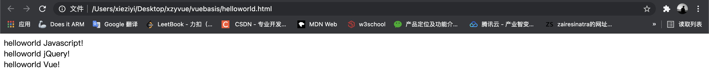
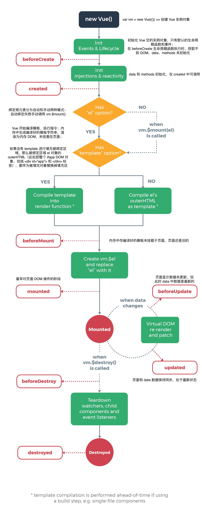

# Vue

------

## 初识

Vue 是一套用于**构建用户界面的渐进式框架**。渐进式即需要多少使用多少，声明式渲染 -> 组件系统 -> 客户端路由（单页面应用、局部更新、浏览器历史回执）-> 集中状态管理（大规模业务数据）-> 项目构建。

框架与库界限已逐渐模糊，不必细究，库主要以提供 API 为主、框架提供基础类服务。Vue 的核心关注**视图层**，虚拟 DOM 帮助高效更新页面局部内容。

### Vue.config

`Vue.config` 是一个包含 Vue 全局配置的对象。[productionTip](https://cn.vuejs.org/v2/api/index.html#productionTip) 设置为 false 可关闭 vue 在启动时生成生产提示。

```js
Vue.config.productionTip
```

### helloworld

Vue -- 编译 --> 原生 JavaScript；在 VSCode 的 live server 下，会在 5500 端口开启服务器托管资源，此处可能存在 favicon 找不到。引入 vue 后全局会多出一个 Vue 的构造函数。最好在调整配置后增加代码。实例化 Vue 对象需要传入一个参数，也就是配置对象。其配置对象有 ele（id 选择器）让实例与容器建立关系；data 对象设置数据，供指定的容器使用。

一个 vue 实例不能同时接管两个容器，前一个容器渲染，其后容器不会渲染。一个容器只能被一个 vue 实例接管，除了首个实例后续实例不产生效果且报错。总的来说，容器与实例是以一一对应的关系。

通过开发者工具观察的 \<Root> 不是容器 root，而是根，代表 vue 实例。

花括号中需要写 js 表达式。一旦 data 中数据改变，则页面使用该数据的地方也会自动更新。

```html
<!DOCTYPE html>
<html lang="en">
<head>
    <meta charset="UTF-8">
    <meta http-equiv="X-UA-Compatible" content="IE=edge">
    <meta name="viewport" content="width=device-width, initial-scale=1.0">
    <title>helloworld</title>
</head>
<body>
    <!--原生JS实现-->
    <div id="msg"></div>

    <!--jQuery实现-->
    <div id="zs"></div>

    <!-- Vue实现:标签、引入、语法 -->
    <div id="app">
      {{ message }}
      <!-- 支持简单计算 -->
      <!-- {{ 3+3 }} -->
    </div>
    <script src="https://cdn.staticfile.org/jquery/1.10.0/jquery.min.js"></script>
    <script src="https://cdn.staticfile.org/vue/0.10.0/vue.js"></script>
    <script>
        // 原生js
        var msg="helloworld Javascript!";
        var div = document.getElementById('msg');
        div.innerHTML = msg; // 功能复杂代码量较大

        // jQuery
        var zyvue = "helloworld jQuery!";
        $('#zs').html(zyvue);

        // Vue
        var app = new Vue({ // 变量存储Vue指令-对象形式的参数指令
          // 也可以使用 app.$mount 进行挂载 —— 是 Vue 实例上的方法
          el: '#app', // 元素挂载、关联位置,用于指定当前 vue 与具体容器建立联系,值通常为 css 选择器
          // 对象式
          data: { // 模型数据
              message: 'helloworld Vue!' // 不需要直接DOM操作
            }
          // 函数式 —— 不能使用箭头函数,this会不再指向实例;在组件使用必须用函数式
          data: function(){ // data() {...} 简写
              return {
                name: 'helloworld Vue!'
              }
            }
        })
    </script>
</body>
</html>
```



### Object.defineProperty

使用 `Object.defineProperty(obj,'attr',{config})` 追加的属性不可以被枚举（遍历），可以通过配置项进行高级的限制。

```js
let number = 18
let person = {
  name: "zs",
  gender: "man"
  // age: 22
}
Object.defineProperty(person,'age',{
  value: 22,
  enumerable: true, // 控制属性是否可枚举,默认false
  writable: true, // 控制属性是否可被修改,默认false
  configurable: true, // 控制属性是否可被删除,默认false -> delete person.age
})
Object.defineProperty(person,'age',{
  get: function(){ // get函数整体称为getter,当有人读取person的age属性时,get函数(getter)就会被调用,返回age的值
    return '22'
  }
})
Object.defineProperty(person,'age',{
  get(){ // get函数整体称为getter,当有人读取person的age属性时,get函数(getter)就会被调用,返回age的值
    return '22'
  },
  set(value){ // set函数整体称为setter,当有人修改person的age属性时,set函数(setter)就会被调用,返回age的值
    console.log("有人修改了age值且值是",value) // person.age = 1 => 有人修改了age值且值是1
    number = value
  }
})
```

### 模板语法

这里理解类比 art-template 实现渲染功能 —— 数据填充HTML标签：通过 Ajax 获取后端数据，渲染模板。前端渲染方式通常有原生 JS 拼接字符串、前端模板引擎（不提供事件机制）、Vue 模板语法。

## 指令

- 本质就是<font color="red">自定义属性</font>
- `Vue` 中指定都是以 `v-` 开头 

### v-cloak

- 防止<font color="red">页面加载时出现闪烁问题</font>
  
  ```html
   <style type="text/css">
    /* 1、通过属性选择器,选择到带有属性 v-cloak的标签 使其隐藏 */
    /* 标准的属性选择器[] */
    [v-cloak]{
      /* 元素隐藏 */
      display: none;
    }
    </style>
  <body>
    <div id="app">
      <!-- 2、让带有插值语法{{}}的元素添加 v-cloak 属性 在数据渲染后，v-cloak 属性会被自动去除，v-cloak一旦移除也就是没有这个属性了,属性选择器就选择不到该标签,也就是对应的标签会变为可见 -->
      <div v-cloak>{{msg}}</div>
    </div>
    <script type="text/javascript" src="js/vue.js"></script>
    <script type="text/javascript">
      var vm = new Vue({
        //  el->指定元素id是 app 的元素  
        el: '#app',
        //  data->里面存储的是数据
        data: {
          msg: 'Hello Vue' // 插值表达式将数据填充、且插值表达式支持基本的计算
        }
      });
  </script>
  </body>
  </html>
  ```

### v-text

- v-text指令用于将数据填充到标签中，作用于插值表达式类似，但是**没有闪动问题**
- 如果数据中有HTML标签会将HTML标签一并输出
- 注意：此处为单向绑定，数据对象上的值改变，插值会发生变化；但是当插值发生变化并不会影响数据对象的值

```html
<div id="app">
    <!--  
        注意:在指令中不要写插值语法  直接写对应的变量名称 
        在 v-text 中 赋值的时候不要在写 插值语法
        一般属性中不加 {{}}  直接写 对应 的数据名 
    -->
    <p v-text="msg"></p>
    <p>
        <!-- Vue  中只有在标签的 内容中 才用插值语法 -->
        {{msg}}
    </p>
</div>

<script>
    new Vue({
        el: '#app',
        data: {
            msg: 'Hello Vue.js'
        }
    });
</script>
```

### v-html

与 v-text 相似，但可以将 HTML 片段填充到标签中，即浏览器支持对其结构解析（v-text 输出的是纯文本）。但是存在安全问题（XSS攻击）, 一般只在可信任内容上使用 v-html，**永不**用在用户提交的内容上。

```html
<div id="app">
  <p v-html="html"></p> <!-- 输出：html标签在渲染的时候被解析 -->
  <p>{{message}}</p> <!-- 输出：<span>通过双括号绑定</span> -->
  <p v-text="text"></p> <!-- 输出：<span>html标签在渲染的时候被源码输出</span> -->
</div>
<script>
　　let app = new Vue({
　　el: "#app",
　　data: {
　　　　message: "<span>通过双括号绑定</span>",
　　　　html: "<span>html标签在渲染的时候被解析</span>",
　　　　text: "<span>html标签在渲染的时候被源码输出</span>",
　　}
 });
</script>
```

### v-pre

显示原始信息，跳过 vue 编译过程，即<font color="red">跳过这个元素和它的子元素的编译过程</font>。**一些静态的内容不需要编译加这个指令可以<font color="red">加快渲染</font>**。

```html
<span v-pre>{{ this will not be compiled }}</span>    
<!-- 显示的是{{ this will not be compiled }} -->
<span v-pre>{{msg}}</span>  
<!--  即使data里面定义了msg这里仍然是显示的{{msg}} -->
<script>
    new Vue({
        el: '#app',
        data: {
            msg: 'Hello Vue.js'
        }
    });
</script>
```

### **v-once**

- 执行<font color="red">一次性的插值（编译）</font>即当数据改变时，插值处的内容<font color="red">不会继续更新</font>
- 对比`v-pre` => 一个完全不编译；一个编译一次

```html
  <!-- 即使data里面定义了msg 后期我们修改了 仍然显示的是第一次data里面存储的数据即 Hello Vue.js  -->
     <span v-once>{{ msg}}</span>    
<script>
    new Vue({
        el: '#app',
        data: {
            msg: 'Hello Vue.js'
        }
    });
</script>
```

### 理解响应式

- 数据响应式=>数据驱动内容变化
- HTML5的响应式=>屏幕尺寸导致样式变化

### v-model

**v-model**是一个指令，限制在 `<input>、<select>、<textarea>、components`中使用，即可以在表单中完成双向数据绑定，数据发生变化的时候，视图也就发生变化。视图发生变化的时候，数据也会跟着同步变化。

若在 type 为 text 时，则 v-model 收集的是 value 值，用户输入的就是 value 值。若在 type 为 radio 时，则 v-model 收集的是 value 值，且要给标签配置 value 值。若 type 为 checkbox ，那么没有设置 input 的 value 属性，收集的就是 checked（是否勾选的布尔值）；若配置 input 的 value 为数组，那么收集的就是 value 组成的数组。此外注意 v-model 的三个修饰符：lazy 是去焦点再手机数据；number 使输入的字符串转为有效的数字，常配合 type 为 number 一起使用；trim 适合输入收尾空格的过滤。

```html
 <div id="app">
      <div>{{msg}}</div>
      <div>
        <!-- 当输入框中内容改变的时候，页面上的msg会自动更新 -->
        <input type="text" v-model='msg'>
      </div>
  </div>
```

### mvvm

MVC 是后端的分层开发概念；MVVM 主要关注于前端视图层分离，也就是说 MVVM 把前端的视图层，分为了三部分 Model、View、 VM ViewModel。model 层提供数据，即 Vue 中数据层都放在 data 里面。view 视图层本质是展示效果的 DOM，Vue 中的 view 即 HTML 页面视图层。vm 即 Vue 的实例（view-model 控制器，将数据和视图层建立联系）。v 与 m 不能直接交互，需要 vm 通过 **DOMListeners**（DOM改变影响数据）、数据绑定 **DataBindings** 连接 model 和 data。在 data 上的所有属性最后都出现在了 vm 上，vm 上所有属性以及 vue 原型上的所有属性，在 vue 模板中都可以直接使用（有且还有 JavaScript 表达式）。

### `v-on`

- 用来绑定事件

- 形式如：<font color="red">v-on:click</font>缩写为<font color="red">@click</font>

- ```js
  // 基本用法
  <input type="button" v-on:click='num++'>
  // 可读性不好,操作逻辑一般需要抽离
  ```

### `v-on`事件函数中传入参数

```html
<!-- HTML5中的申明简单=>浏览器的“信息”,说明期望的文档类型 -->
<!DOCTYPE html>
<!-- 较旧的HTML文档HTML 4.01: -->
<!-- <!DOCTYPE HTML PUBLIC "-//W3C//DTD HTML 4.01 Transitional//EN" "http://www.w3.org/TR/html4/loose.dtd"> -->
<!-- XHTML 1.1: -->
<!-- <!DOCTYPE html PUBLIC "-//W3C//DTD XHTML 1.1//EN" "http://www.w3.org/TR/xhtml11/DTD/xhtml11.dtd"> -->
<!-- 该<!DOCTYPE>声明不区分大小写 -->
<html lang="en">
<head>
    <meta charset="UTF-8">
    <meta http-equiv="X-UA-Compatible" content="IE=edge">
    <meta name="viewport" content="width=device-width, initial-scale=1.0">
    <title>v-on</title>
</head>
<body>
    <div id="app">
        <div>{{num}}</div>
        <div v-on:click="maopao">
            <!-- 事件直接绑定函数名称，默认会传递事件对象作为事件函数的第一个参数 -->
            <button v-on:click='handle'>点击1</button>
            <!-- 如果事件绑定函数调用，那么事件对象必须作为最后一个参数显示传递，并且事件对象的名称必须是$event -->
            <!-- 函数调用就是函数得加括号 -->
            <!-- $event可以传可以不传,看是否需要,根据是否需要事件对象通过 $event 占位!!!!!! -->
            <button v-on:click='zshandle(123, 456, $event)'>点击2</button>
        </div>
    </div>
    <script type="text/javascript" src="../srcjs/vue.js"></script>
    <script type="text/javascript">
        var vm = new Vue({
            el: '#app',
            data: {
                num: 0
            },
            methods: {
                maopao: function(){
                    this.num++ // 因为冒泡所以值会增加两次
                },
                handle: function(event) {
                    console.log(event.target.innerHTML)
                },
                zshandle: function(p, p1, event) { // 形参接受
                    console.log(p, p1)
                    console.log(event.target.innerHTML) // 触发事件的对象 (某个DOM元素) 的引用
                    this.num++;
                }
            }
        });
    </script>
</body>
</html>
```

### 事件修饰符

- 在事件处理程序中调用 `event.preventDefault()` 或 `event.stopPropagation()` 是非常常见的需求。
- `Vue`不推荐我们操作`DOM`，为了解决这个问题，`Vue.js` 为 `v-on` 提供了<font color="red">**事件修饰符**</font>
- 修饰符是由<font color="red">点开头的指令后缀</font>来表示的
- prevent、stop、once、capture、self、passive！！

```html
<!-- 阻止单击事件继续传播 -->
<a v-on:click.stop="doThis"></a>

<!-- 提交事件不再重载页面 -->
<form v-on:submit.prevent="onSubmit"></form>

<!-- 修饰符可以串联   即阻止冒泡也阻止默认事件 -->
<a v-on:click.stop.prevent="doThat"></a>

<!-- 只当在 event.target 是当前元素自身时触发处理函数 -->
<!-- 即事件不是从内部元素触发的 -->
<div v-on:click.self="doThat">...</div>

<!--使用修饰符时，!!!顺序很重要；相应的代码会以同样的顺序产生。因此，用 v-on:click.prevent.self 会阻止所有的点击，而 v-on:click.self.prevent 只会阻止对元素自身的点击。-->
```

```html
<!-- HTML5中的申明简单=>浏览器的“信息”,说明期望的文档类型 -->
<!DOCTYPE html>
<!-- 较旧的HTML文档HTML 4.01: -->
<!-- <!DOCTYPE HTML PUBLIC "-//W3C//DTD HTML 4.01 Transitional//EN" "http://www.w3.org/TR/html4/loose.dtd"> -->
<!-- XHTML 1.1: -->
<!-- <!DOCTYPE html PUBLIC "-//W3C//DTD XHTML 1.1//EN" "http://www.w3.org/TR/xhtml11/DTD/xhtml11.dtd"> -->
<!-- 该<!DOCTYPE>声明不区分大小写 -->
<html lang="en">
<head>
    <meta charset="UTF-8">
    <meta http-equiv="X-UA-Compatible" content="IE=edge">
    <meta name="viewport" content="width=device-width, initial-scale=1.0">
    <title>v-on</title>
</head>
<body>
    <div id="app">
        <div>{{num}}</div>
        <div v-on:click="maopao">
            <!-- 事件直接绑定函数名称，默认会传递事件对象作为事件函数的第一个参数 -->
            <button v-on:click='handle'>点击1</button>
            <!-- 如果事件绑定函数调用，那么事件对象必须作为最后一个参数显示传递，并且事件对象的名称必须是$event -->
            <!-- 函数调用就是函数得加括号 -->
            <!-- $event可以传可以不传,看是否需要 -->
            <button v-on:click='zshandle(123, 456, $event)'>点击2</button>
        </div>
        <div v-on:click="zuzhimaopao">
            <button v-on:click="nobubble">nobubble</button>
        </div>
        <div v-on:click="caozuofuzuzhi">
            <button v-on:click.stop="caozuofu">操作符阻止冒泡</button>
        </div>
        <!-- 阻止默认行为=>一般是a标签的跳转 -->
        <div>
            <a href="https://zairesinatra.com">zsblog</a>
            <a href="https://zairesinatra.com" v-on:click="nozsblog">原生js阻止跳转zsblog</a>
            <a href="https://zairesinatra.com" v-on:click.prevent="zszszs">通过事件修饰符阻止跳转zsblog</a>
        </div>
        <!-- 串联一块写即阻止冒泡、又阻止默认行为 -->
        <!-- <a v-on:click.stop.prevent="dosth"> -->
        <!-- 先后顺序差异 -->
        <!-- v-on:click.prevent.self=>阻止所有点击 -->
        <!-- v-on:click.self.prevent=>阻止对元素自身的点击 -->
    </div>
    <script type="text/javascript" src="../srcjs/vue.js"></script>
    <script type="text/javascript">
        var vm = new Vue({
            el: '#app',
            data: {
                num: 0
            },
            methods: {
                maopao: function(){
                    this.num++ // 因为冒泡所以值会增加两次
                },
                handle: function(event) {
                    console.log(event.target.innerHTML)
                },
                zshandle: function(p, p1, event) { // 形参接受
                    console.log(p, p1)
                    console.log(event.target.innerHTML) // 触发事件的对象 (某个DOM元素) 的引用
                    this.num++;
                },
                zuzhimaopao: function(){
                    this.num++ // 因为冒泡所以值会增加两次
                },
                nobubble: function(event){
                    // 原生阻止冒泡
                    event.stopPropagation(); // 不会加1
                },
                caozuofuzuzhi: function(){
                    this.num++ // 因为冒泡所以值会增加两次
                },
                caozuofu: function(){
                    console.log('操作符禁止冒泡')
                },
                nozsblog: function(event){
                    console.log("不会跳转到zs的博客");
                    // 原生阻止默认行为
                    event.preventDefault();
                },
                zszszs: function(){
                    console.log("通过事件修饰符阻止跳转到zs的博客");
                }
            }
        });
    </script>
</body>
</html>
```

### 按键修饰符

在监听键盘事件时，经常需要检查详细的按键。`Vue` 允许为 `v-on` 在监听键盘事件时添加按键修饰符。原生的 JavaScript 使用 e.keyCode 进行判别（需要注意判别 e.key 与 e.keyCode 是不同的）。

```html
<!DOCTYPE html>
<html lang="en">
<head>
    <meta charset="UTF-8">
    <meta http-equiv="X-UA-Compatible" content="IE=edge">
    <meta name="viewport" content="width=device-width, initial-scale=1.0">
    <title>事件修饰符</title>
</head>
<body>
    <div id="app">
        <!-- 传统做法通过form action提交,同时input使用submit,但是学习了ajax后很多提交方式通过ajax提交,通过按钮控制 -->
        <form action="">
            <div>
                用户名:
                <input type="text" v-on:keyup.delete='clearContent' v-model="username">
            </div>
            <div>
                密码:
                <!-- 在密码input中绑键盘事件v-on:keyup.xxx="func" -->
                <input type="text" v-model="password" v-on:keyup.enter="handlebutton">
            </div>
            <div>
                <input type="button" v-on:click="handlebutton" value="提交">
            </div>
        </form>
    </div>
    <!-- 常用的按键修饰符
        .enter => enter键
        .tab(只适合keydown、不适合keyup) => tab键
        .delete (捕获“删除”和“退格”按键) =>  删除键
        .esc => 取消键
        .space =>  空格键
        .up =>  上
        .down =>  下
        .left =>  左
        .right =>  右
                caps-lock => 切换-->
  <!-- 系统修饰键: ctrl、alt、shift、meta 与 keyup 使用需要按下其他键,在其他键释放后事件触发;keydown正常触发 -->
    <script type="text/javascript" src="../srcjs/vue.js"></script>
    <script>
        var vm = new Vue({
            el: '#app',
            data: {
                username:"",
                password:""
            },
            methods: {
                handlebutton: function(){
                    console.log(this.username,this.password);
                },
                clearContent: function(){
                    // 按delete键就清空用户名
                    this.username = '';
                }
            }
        })
    </script>
</body>
</html>
```

### 自定义按键修饰符别名

在Vue中可以通过全局`config.keyCodes`对象自定义按键修饰符别名，但是原生的 [keyCode](https://developer.mozilla.org/en-US/docs/Web/API/KeyboardEvent/keyCode) 在未来会被废弃，尽量使用别名。

```html
<!DOCTYPE html>
<html lang="en">
<head>
    <meta charset="UTF-8">
    <meta http-equiv="X-UA-Compatible" content="IE=edge">
    <meta name="viewport" content="width=device-width, initial-scale=1.0">
    <title>自定义事件修饰符</title>
</head>
<body>
    <div id="app">
        <input type="text" v-on:keyup="getKeyCode" v-model='info' @keyup.delete="clearContent">
        <!-- 只有输入keyup.xxx跟着的xxx才会显示出 -->
        <input type="text" v-on:keyup.65="zsgetKeyCode" v-model='info' @keyup.delete="clearContent">
        <!-- zs自定义 -->
        <input type="text" v-on:keyup.zs="zsgetKeyCode" v-model='info' @keyup.delete="clearContent">
    </div>
    <script src="../srcjs/vue.js"></script>
    <script>
        Vue.config.keyCodes.zs = 65
        var vm = new Vue({
            el: "#app",
            data: {
                info:""
            },
            methods: {
                getKeyCode: function(event) {
                    console.log(event.keyCode);
                },
                zsgetKeyCode: function(event) {
                    console.log(event.keyCode);
                },
                clearContent: function() {
                    this.info='';
                }
            }
        })
    </script>
</body>
</html>
```

### v-bind

- <font color="red">DOM 元素中属性操作=>`v-bind`、DOM元素操作=>`v-on`</font>
- `v-bind`指令被用来<font color="red">响应地更新 HTML 属性</font>
- `v-bind:href`可以缩写为 `:href`
- 原生JavaScript通过`getAttribute`获取属性、`setAttribute`设置属性
- 使用 v-bind 相当于将字符串内容作为 JS 表达式执行

```html
<!-- 绑定一个属性 -->

<!-- 缩写 -->

<!--JavaScript中Vue里在data定义imageSrc-->
```

#### 绑定对象

- 我们可以给`v-bind:class`一个对象，以动态地切换`class`。
- 注意：`v-bind:class`指令可以与普通的class特性共存

```html
1、 v-bind 中支持绑定一个对象 
    如果绑定的是一个对象，则键为对应的类名值为对应data中的数据 
<!-- HTML最终渲染为 <ul class="box textColor textSize"></ul>
    注意：
        textColor，textSize 对应的渲染到页面上的CSS类名    
        isColor，isSize 对应vue data中的数据 如果为true 则对应的类名 渲染到页面上。当 isColor 和 isSize 变化时，class列表将相应的更新，
        例如，将isSize改成false，
        class列表将变为 <ul class="box textColor"></ul>-->

<ul class="box" v-bind:class="{textColor:isColor, textSize:isSize}">
    <li>学习Vue</li>
    <li>学习Node</li>
    <li>学习React</li>
</ul>
<div v-bind:style="{color:activeColor,fontSize:activeSize}">对象语法</div>

<sript>
var vm= new Vue({
    el:'.box',
    data:{
        isColor:true,
        isSize:true，
            activeColor:"red",
        activeSize:"25px",
    }
})
</sript>
<style>
    .box{
        border:1px dashed #f0f;
    }
    .textColor{
        color:#f00;
        background-color:#eef;
    }
    .textSize{
        font-size:30px;
        font-weight:bold;
    }
</style>
```

#### [绑定class](https://www.bilibili.com/video/BV1Zy4y1K7SH?p=26)

绑定样式的 class 写法适用于样式类名不确定，需要动态指定。样式绑定的数组写法，适用于绑定样式个数不确定，名字不确定。对象写法通常适用于绑定样式的个数确定，名称也确定，但需要动态决定用不用的情况。

```html
2、  v-bind 中支持绑定一个数组或者对象    数组中classA和 classB 对应为data中的数据
<!-- 这里的classA  对用data 中的  classA -->
<!-- 这里的classB  对用data 中的  classB -->
<ul class="box" :class="[classA, classB]">
    <li>学习Vue</li>
    <li>学习Node</li>
    <li>学习React</li>
</ul>
<script>
var vm= new Vue({
    el:'.box',
    data:{
        classA:‘textColor‘,
        classB:‘textSize‘
    }
})
</script>
<style>
    .box{
        border:1px dashed #f0f;
    }
    .textColor{
        color:#f00;
        background-color:#eef;
    }
    .textSize{
        font-size:30px;
        font-weight:bold;
    }
</style>
```

#### 绑定对象和绑定数组的区别

- 绑定对象的时候 对象的属性 即要渲染的类名 对象的属性值对应的是 data 中的数据 
- 绑定数组的时候数组里面存的是data 中的数据 

#### 绑定style

```html
<!DOCTYPE html>
<html lang="en">
<head>
    <meta charset="UTF-8">
    <meta http-equiv="X-UA-Compatible" content="IE=edge">
    <meta name="viewport" content="width=device-width, initial-scale=1.0">
    <title>v-bind:style</title>
</head>
<body>
    <div id="app">
        <!-- CSS 属性名可以用驼峰式 (camelCase) 或短横线分隔 (kebab-case，记得用单引号括起来)    -->
        <div v-bind:style="{border: borderStyle, width: widthStyle, height: heightStyle}"></div>
        <button v-on:click="handle">clickme</button>
        <div v-bind:style="objStyles"></div>
        <!-- 一定不要忘记带冒号 -->
        <!-- 组语法可以将多个样式对象应用到同一个元素 -->
        <div v-bind:style="[objStyles, arrTest]"></div>
    </div>
    <script src="../srcjs/vue.js"></script>
    <script>
        var vm = new Vue({
            el: "#app",
            data: {
                borderStyle: '1px solid blue',
                widthStyle: '100px',
                heightStyle: "200px",
                objStyles: {
                    border: '1px solid green',
                    width: '200px',
                    height: '100px'
                },
                arrTest: {
                    border: '5px solid orange',
                    backgroundColor: 'blue'
                }
            },
            methods: {
                handle: function() {
                    this.heightStyle = '100px',
                    this.objStyles.width = '100px'
                }
            }
        })
    </script>
</body>
</html>
```

### 样式绑定：class样式绑定、style样式绑定！

### 底层分析`v-model`

<span style="color:red">属性绑定与事件绑定的结合=>`v-model`双向绑定本质就是v-bind绑定一个值,并使用v-on处理值得变化</span>

```html
<input v-on:input="msg=$event.target.value" v-bind:value="msg">
<!-- event.target表示事件对象的DOM元素 -->
```

### 分支结构

`v-if`/`v-else-if`/`v-else` 可以使多个元素通过条件判断展示或隐藏，进行两个视图之间的切换。注意此结构**不可被打断**（插入其他DOM）。

```html
<!DOCTYPE html>
<html lang="en">
<head>
    <meta charset="UTF-8">
    <meta http-equiv="X-UA-Compatible" content="IE=edge">
    <meta name="viewport" content="width=device-width, initial-scale=1.0">
    <title>分支结构</title>
</head>
<body>
    <div id="app">
        <div v-if="score>=90">zs</div>
        <div v-else-if="score<90&&score>=80">zairesinatra</div>
        <div v-else>其他</div>
        <div v-show="flag">我出来了打我啊笨蛋</div>
        <button v-on:click="handle">点我</button>
    </div>
    <script src="../srcjs/vue.js"></script>
    <script>
        var vm = new Vue({
            el: "#app",
            data: {
                score: 99,
                flag: true
            },
            methods: {
                handle: function() {
                    this.flag = ! this.flag
                }
            }
        })
    </script>
</body>
</html>
```

#### v-show 和 v-if的区别

- `v-show`本质就是标签`display`设置为`none`，控制隐藏
  - `v-show`只编译一次，后面其实就是控制CSS，而`v-if`不停的销毁和创建，故不需要频繁增加DOM元素时`v-show`性能更好一点。
- `v-if`是动态的向DOM树内添加或者删除DOM元素
  - `v-if`切换有一个局部编译/卸载的过程，切换过程中合适地销毁和重建内部的事件监听和子组件

### 循环结构

<u>v-for 用于循环的数组、对象、字符串、指定遍历次数中的值或者普通元素。首项参数为值，第二项参数为索引。</u>

```html
<!DOCTYPE html>
<html lang="en">
<head>
    <meta charset="UTF-8">
    <meta http-equiv="X-UA-Compatible" content="IE=edge">
    <meta name="viewport" content="width=device-width, initial-scale=1.0">
    <title>循环结构</title>
    <link rel="stylesheet" href="./CSS/v-for.css">
</head>
<body>
    <div id="app">
        <ul>
            <!-- item其中一项数据 in关键字 fruits属性名 -->
            <!-- item自定义,不过注意用的是item就得插值表达式中表示item -->
            <li v-for="item in fruits">{{item}}</li>
            <br />
            <!-- 有时候需要访问遍历数据的索引 -->
            <!-- 索引从0开始,与数组索引类似 -->
            <!-- 与item类似,index也是自定义 -->
            <li v-for="(item,index) in fruits">{{item + '---' + index}}</li>
            <br />
            <span>注意这里显示含对象的数组</span>
            <br />
            <!-- 遍历就加key -->
            <!-- :key="唯一值"帮助Vue提高性能 -->
            <li :key="item.id" v-for="(item, index) in myFruits">
                <span>{{item.ename}}</span>
                <span>{{item.cname}}</span>
                <span>{{index}}</span>
            </li>
            <br />
            <!-- 尽管数据变得复杂,仅需要找到所需数据是所需项的属性即可 -->
        </ul>
    </div>
    <script src="../srcjs/vue.js"></script>
    <script>
        var vm = new Vue({
            el: "#app",
            data: {
                fruits: ['coconut', 'bayberry', 'mangosteen'],
                myFruits: [{
                    id:1,
                    ename: 'apple',
                    cname: '苹果'
                },{
                    id:2,
                    ename: 'strawberry',
                    cname: '草莓'
                },{
                    id:3,
                    ename: 'grape',
                    cname: '葡萄'
                }]
            },
            methods: {

            }
        })
    </script>
</body>
</html>
```

- **不推荐**同时使用 `v-if` 和 `v-for`
- 当 `v-if` 与 `v-for` 一起使用时，`v-for` 具有比 `v-if` 更高的优先级！！！

```html
<!DOCTYPE html>
<html lang="en">
<head>
    <meta charset="UTF-8">
    <meta http-equiv="X-UA-Compatible" content="IE=edge">
    <meta name="viewport" content="width=device-width, initial-scale=1.0">
    <title>分支循环结构</title>
</head>
<body>
    <!-- v-for遍历对象 -->
    <!-- <div v-for='(value, key, index) in object'></div> -->
    <!-- v-if和v-for结合使用 -->
    <!-- <div v-if='value==6' v-for='(value, key, index) in object'></div> -->
    <div id="app">
        <!-- 对象顺序是固定的=>值、键、索引与数组遍历一样 -->
        <div v-for="(v, k, i) in obj">{{v + '---' + k + '---' + i}}</div>
        <!-- 条件满足才会渲染v-if/v-for -->
        <div v-if="v == 23" v-for="(v, k, i) in obj">{{v + '---' + k + '---' + i}}</div>
    </div>
    <script src="../srcjs/vue.js"></script>
    <script>
        // 原生JavaScript实现
        var jsobj = {
            uname: 'zairesinatra',
            age: 23,
            gender: 'male'
        }
        for(let key in jsobj) {
            console.log(key,jsobj[key]);
        }
        var vm = new Vue({
            el: "#app",
            data: {
                obj: {
                    // 记死这里用的是冒号
                    uname: 'zairesinatra',
                    age: 23,
                    gender: 'male'
                }
            },
            methods: {

            }
        })
    </script>
</body>
</html>
```

- key 的作用
  - **key来给每个节点做一个唯一标识**
  - **key的作用主要是为了高效的更新虚拟DOM**

```html
<ul>
  <li v-for="item in items" :key="item.id">...</li>
</ul>
```

### demo选项卡

```html
<!DOCTYPE html>
<html lang="en">
<head>
    <meta charset="UTF-8">
    <meta http-equiv="X-UA-Compatible" content="IE=edge">
    <meta name="viewport" content="width=device-width, initial-scale=1.0">
    <title>Document</title>
    <style type="text/css">
        .tab ul {
          overflow: hidden;
          padding: 0;
          margin: 0;
        }
        .tab ul li {
          box-sizing: border-box;
          padding: 0;
          float: left;
          width: 100px;
          height: 45px;
          line-height: 45px;
          list-style: none;
          text-align: center;
          border-top: 1px solid blue;
          border-right: 1px solid blue;
          cursor: grab;
        }
        .tab ul li:first-child {
          border-left: 1px solid blue;
        }
        .tab ul li.active {
          background-color: orange;
        }
        .tab div {
          width: 500px;
          height: 300px;
          display: none;
          text-align: center;
          font-size: 30px;
          line-height: 300px;
          border: 1px solid blue;
          border-top: 0px;
        }
        .tab div.current {
          display: block;
        }
      </style>
    </head>
    <body>
      <div id="app">
        <div class="tab">
          <ul>
            <!-- 给每一个tab栏添加事件,并让选中的高亮,通过添加类名active 来实现 -->
            <!-- 让默认的第一项tab栏高亮 -->
            <li v-on:click='change(index)' :class='currentIndex==index?"active":""' :key='item.id' v-for='(item,index) in list'>{{item.title}}</li>
          </ul>
          <div :class='currentIndex==index?"current":""' :key='item.id' v-for='(item, index) in list'>
            
          </div>
        </div>
      </div>
      <script type="text/javascript" src="../srcjs/vue.js"></script>
      <script type="text/javascript">
        var vm = new Vue({
          el: '#app',
          data: {
            // 在 data 中定义一个默认的索引 currentIndex 为 0 
            currentIndex: 0, // 选项卡当前的索引
            list: [{
              id: 1,
              title: 'apple',
              path: '/Users/xieziyi/Desktop/阶段五：Vue.js项目实战资料/Vue-2019版/vue基础/day01（1小节)/2-案例/img/apple.png'
            },{
              id: 2,
              title: 'orange',
              path: '../img/orange.png'
            },{
              id: 3,
              title: 'lemon',
              path: '../img/lemon.png'
            }]
          },
          methods: {
            change: function(index){
              // 在这里实现选项卡切换操作:本质就是操作类名
              // 如何操作类名？就是通过currentIndex
              this.currentIndex = index;
            }
          }
        });
      </script>
</body>
</html>
```

------

## Vue常用特性

### 表单基本操作（同一个`v-model`不同输入域）-用于用户交互（填充、发送邮件信息）

| 表单类型       | 中文   |
| ---------- | ---- |
| `input`    | 单行文本 |
| `textarea` | 多行文本 |
| `select`   | 下拉多选 |
| `radio`    | 单选框  |
| `checkbox` | 多选框  |

- 表单双向绑定
  
  ```html
  <!-- 两个单选框需要同时通过 v-model 双向绑定一个值;每一个单选框必须要有 value 属性且 value 值不能一样;当某一个单选框选中的时候 v-model 会将当前的 value 值改变 data 中的数据 -->
  <!DOCTYPE html>
  <html lang="en">
  <head>
      <meta charset="UTF-8">
      <meta http-equiv="X-UA-Compatible" content="IE=edge">
      <meta name="viewport" content="width=device-width, initial-scale=1.0">
      <title>表单</title>
      <style type="text/css">
          form div {
            height: 40px;
            line-height: 40px;
          }
          form div:nth-child(4) {
            height: auto;
          }
          form div span:first-child {
            display: inline-block;
            width: 100px;
          }
      </style>
      </head>
      <body>
        <div id="app">
          <!-- 要写的整体是表单 -->
          <form action="https://zairesinatra.com">
            <div>
              <span>姓名：</span>
              <span>
                <input type="text" v-model='username'>
              </span>
            </div>
            <div>
              <span>性别：</span>
              <span>
                  <!-- value表单控件的值-以名字/值对的形式随表单一起提交 -->
                  <!-- https://developer.mozilla.org/zh-CN/docs/Web/HTML/Element/Input -->
                  <!-- 将当前的value值改变 data 中的数据 -->
                <input type="radio" id="male" value="0" v-model='gender'>
                <label for="male">男</label>
                <input type="radio" id="female" value="1" v-model='gender'>
                <label for="female">女</label>
              </span>
            </div>
            <div>
              <span>爱好：</span>
              <input type="checkbox" value="1" v-model='hobby'>
              <label for="ball">网游</label>
              <input type="checkbox" value="2" v-model='hobby'>
              <label for="sing">睡觉</label>
              <input type="checkbox" value="3" v-model='hobby'>
              <label for="code">代码</label>
            </div>
            <div>
              <span>职业：</span>
              <!-- 下拉多选则添加multiple属性 -->
              <select v-model='occupation'>
                <option value="0">软件工程师</option>
                <option value="1">教师</option>
                <option value="2">医生</option>
              </select>
            </div>
            <div>
              <span>个人简介：</span>
              <textarea v-model='desc'></textarea>
            </div>
            <div>
              <!-- 阻止默认行为、使用JavaScript控制提交而不是默认提交行为 -->
              <input type="submit" value="提交" @click.prevent='handle'>
            </div>
          </form>
        </div>
        <script type="text/javascript" src="../srcjs/vue.js"></script>
        <script type="text/javascript">
          var vm = new Vue({
            el: '#app',
            data: {
              username: 'zs',
              // gender默认1就是男、2即是女
              gender: '0',
              hobby: ['2','3'],
              // occupation: ['1','2']
              occupation: 0,
              desc: 'Hi, zairesinatra'
            },
            methods: {
              handle: function(){
                console.log(this.username)
                console.log(this.gender)
                console.log(this.hobby.toString())
                console.log(this.occupation)
                console.log(this.desc)
              }
            }
          });
        </script>
      </body>
  </html>
  ```

### 表单修饰符

- .number  转换为数值
  
  - 当开始输入非数字的字符串时，因为Vue无法将字符串转换成数值
  - 所以属性值将实时更新成相同的字符串。即使后面输入数字，也将被视作字符串。

- .trim  自动过滤用户输入的首尾空白字符
  
  - 只能去掉首尾的 不能去除中间的空格

- .lazy   将input事件切换成change事件
  
  - .lazy 修饰符延迟了同步更新属性值的时机。即将原本绑定在 input 事件的同步逻辑转变为绑定在 change 事件上

- 在失去焦点 或者 按下回车键时才更新
  
  ```html
  <!-- 自动将用户的输入值转为数值类型 -->
  <input v-model.number="age" type="number">
  <!-- 自动过滤用户输入的首尾空白字符 -->
  <input v-model.trim="msg">
  <!-- 在“change”时而非“input”时更新 -->
  <input v-model.lazy="msg" >
  ```

### [自定义指令](https://www.bilibili.com/video/BV1Zy4y1K7SH?p=45&spm_id_from=pageDriver)

#### Vue.directive  注册全局指令

```html
<!DOCTYPE html>
<html lang="en">
<head>
    <meta charset="UTF-8">
    <meta http-equiv="X-UA-Compatible" content="IE=edge">
    <meta name="viewport" content="width=device-width, initial-scale=1.0">
    <title>directive</title>
</head>
<body>
    <div id="app">
        <!-- 自定义组件不能使用驼峰命名法 -->
        <input type="text" v-autofocus>
    </div>
    <script src="../srcjs/vue.js"></script>
    <script>
        // Vue中的API=>Vue.directive('参数一', {参数二})
        // 第一个参数是指令的名称,第二个参数是实现自定义指令的业务逻辑
        Vue.directive('autofocus', {
            // inserted是固定、el也是固定-指令钩子函数会被传入的参数=>element的简写,指令所绑定的元素
            // 钩子函数inserted:被绑定元素插入父节点时调用(仅保证父节点存在,但不一定已被插入文档中)
            // https://cn.vuejs.org/v2/guide/custom-directive.html
            inserted: function(el) {
                // 定义时不加v-;使用时才加
                el.focus();
            }
        });
        var vm = new Vue({
            el: "#app",
            data: {

            },
            methods: {

            }
        })
    </script>
</body>
</html>
```

#### Vue.directive  注册全局指令 带参数（类似联想v-text=""）

总的来说：局部指令是有限制的-仅在本组件中使用，若有更多组件则局部组件则不可以使用；相对于局部指令，则全局指令没有限制

```html
<!DOCTYPE html>
<html lang="en">
<head>
    <meta charset="UTF-8">
    <meta http-equiv="X-UA-Compatible" content="IE=edge">
    <meta name="viewport" content="width=device-width, initial-scale=1.0">
    <title>directive带参数</title>
</head>
<body>
    <!-- 改变输入域的背景颜色 -->
    <div id="app">
        <input type="text" v-color="info">
        <br />
        <input type="text" v-ccolor="info">
    </div>
    <script src="../srcjs/vue.js"></script>
    <script>
        // binding是一个对象,里面包含对指令的一些描述
        Vue.directive('color', {
            bind: function(el, binding) {
                // 测试一下什么是binding
                // https://cn.vuejs.org/v2/guide/custom-directive.html
                console.log(binding);
                console.log(binding.value);
                console.log(binding.value.username);
                // 根据指令的参数设置背景色
                // binding.value就是指令的参数值
                el.style.backgroundColor = binding.value.color
                // vue实例对象也就是一个组件
            }
        })
        var vm = new Vue({
            el: "#app",
            data: {
                info: {
                    username: "zairesinatra",
                    color: "#06B4FE",
                    ccolor: "#FB4B63"
                } 
            },
            methods: {

            },
            // 局部注册指令
            // 注意这里是 directives
            directives: {
                ccolor: {
                    bind: function (el, binding) {
                        el.style.backgroundColor = binding.value.ccolor
                    }
                },
                // 这里就可以定义多个指令
            }
        })
    </script>
</body>
</html>
```

#### 自定义指令局部指令

- 局部指令，需要定义在  directives 的选项，用法和全局用法一样 
- 局部指令只能在当前组件里面使用
- 当全局指令和局部指令同名时以局部指令为准

### 计算属性   computed

- 模板中放入太多的逻辑会让模板过重且难以维护=>使用计算属性可以让模板更加的简洁（`{{msg.split('').reverse().join("")}}`）
- **计算属性是基于它们的响应式依赖进行缓存的**
- computed比较适合对多个变量或者对象进行处理后返回一个结果值，也就是数多个变量中的某一个值发生了变化则我们监控的这个值也就会发生变化
- https://developer.mozilla.org/zh-CN/docs/Web/JavaScript/Reference/Global_Objects/Array/join

```html
<!DOCTYPE html>
<html lang="en">
<head>
    <meta charset="UTF-8">
    <meta http-equiv="X-UA-Compatible" content="IE=edge">
    <meta name="viewport" content="width=device-width, initial-scale=1.0">
    <title>computed</title>
</head>
<body>
    <div id="app">
        <span>{{msg}}</span>
        <br />
        <span>{{msg.split('')}}</span>
        <br />
        <span>{{msg.split('').reverse()}}</span>
        <br />
        <!-- join() 方法将一个数组（或一个类数组对象）的所有元素连接成一个字符串并返回这个字符串 -->
        <!-- separator 可选=>指定一个字符串来分隔数组的每个元素 -->
        <!-- 如果缺省该值，数组元素用逗号(,)分隔 -->
        <!-- 如果separator是空字符串(""),则所有元素之间都没有任何字符 -->
        <span>{{msg.split('').reverse().join("")}}</span>
        <div>{{reverseString}}</div>
        <div>{{reverseString}}</div>
        <br />
        <!-- methods与computed区别 -->
        <div>{{reverseInfo()}}</div>
        <div>{{reverseInfo()}}</div>
        <br />
        <!-- computed性能因缓存会更好 -->
        <div>{{cumulativesum}}</div>

    </div>
    <script src="../srcjs/vue.js"></script>
    <script>
        var vm = new Vue({
            el: "#app",
            data: {
                msg: "Hi,zairesinatra",
                info: "xzy",
                num: 100
            },
            // 计算属性让模板内容更加简单
            computed: {
                reverseString: function() {
                    // 计算属性与方法区别
                    console.log("computed"); // 输出一次computed=>实际我们用了两次计算属性-缓存的问题
                    // 第一次时函数执行过并缓存好了,翻转后计算属性已经将结果缓存,当再次访问时会访问之前计算的结果
                    // 基于data中数据做处理
                    return this.info.split('').reverse().join('')
                },
                cumulativesum: function() {
                    var total = 0;
                    for(i=0; i<=this.num; i++) {
                        total += i;
                    }
                    return total
                }
            },
            methods: {
                reverseInfo: function() {
                    console.log('methods');
                    return this.info.split('').reverse().join('')
                }
            }
        })
    </script>
</body>
</html>
```

#### 计算属性与方法的区别：

- 计算属性是基于依赖（data中的数据）进行缓存的
- 方法不存在缓存

### 侦听器   watch

- 使用watch来响应数据的变化
- 一般用于异步或者开销较大的操作
- watch 中的属性 一定是data 中 已经存在的数据 
- **当需要监听一个对象的改变时，普通的watch方法无法监听到对象内部属性的改变，只有data中的数据才能够监听到变化，此时就需要deep属性对对象进行深度监听**

```html
<!DOCTYPE html>
<html lang="en">
<head>
    <meta charset="UTF-8">
    <meta http-equiv="X-UA-Compatible" content="IE=edge">
    <meta name="viewport" content="width=device-width, initial-scale=1.0">
    <title>watch</title>
</head>
<body>
    <div id="app">
        <div>
            <span>名</span>
            <span><input type="text" v-model="firstName"></span>
        </div>
        <div>
            <span>姓</span>
            <span><input type="text" v-model="lastName"></span>
        </div>
        <div>{{fullName}}</div>
        <br />
        <span>使用计算属性</span>
        <div>{{ffullName}}</div>
    </div>
    <script src="../srcjs/vue.js"></script>
    <script>
        var vm = new Vue({
            el: "#app",
            data: {
                firstName: 'zaire',
                lastName: "sinatra",
                fullName: "zairesinatra"
            },
            // 侦听器-数据一旦改变就会触发方法
            // 侦听器常使用异步或者开销较大的方式
            watch: {
                // firstName和lastName是数据
                firstName: function (val) {
                    this.fullName = val + '' + this.lastName
                },
                lastName: function(val) {
                    this.fullName = this.firstName + '' + val;
                }
            },
            // 计算属性实现
            computed: {
                ffullName: function() {
                    return this.firstName + '' + this.lastName
                }
            }
        })
    </script>
</body>
</html>
```

```html
<!DOCTYPE html>
<html lang="en">
<head>
    <meta charset="UTF-8">
    <meta http-equiv="X-UA-Compatible" content="IE=edge">
    <meta name="viewport" content="width=device-width, initial-scale=1.0">
    <title>验证用户名可用</title>
    <!-- 思路: -->
    <!-- 通过侦听器监听输入信息的变化 -->
    <!-- 需要修改触发的事件 -->
    <!-- 提供提示信息 -->
    <!-- v-model数据绑定 -->
</head>
<body>
    <div id="app">
        <div>
            <span>用户名: </span>
            <span>
                <input type="text" v-model="username">
            </span>
            <span>{{tip}}</span>
        </div>
    </div>
    <script src="../srcjs/vue.js"></script>
    <script>
        // 要求输入内容失去焦点触发
        var vm = new Vue({
            el: "#app",
            data: {
                username:'',
                tip:''
            },
            methods: {
                checkName: function() {
                    var that = this;
                    let cc = Math.random()
                    setTimeout(function(){
                        // 模拟接口调用
                        if(cc>0.5){that.tip = '用户名'+ that.username +'已存在,请更换'}
                        else {that.tip = '用户名'+ that.username +'可用'}
                    },1500)
                }
            },
            watch: {
                // 采用侦听器监听用户名变化
                // 调用后台接口进行验证
                // 根据验证的结果调整提示信息
                username: function(val){
                    this.checkName(val)
                }
            }
        })
    </script>
</body>
</html>
```

### 过滤器

Vue 允许自定义过滤器（本质就是函数）用于一些常见的文本格式化。但不是必须要使用，也可以通过计算属性完成类似的操作。过滤器可以用在两个地方：双花括号插值和 v-bind 表达式。过滤器应该被添加在 JavaScript 表达式的尾部，由“管道”符号指示，支持级联操作。过滤器不改变真正的`data`，而只是改变渲染的结果，并返回过滤后的版本。全局注册时是 filter，没有 s 的。而局部过滤器是 filters，是有 s 的。使用时将管道符前的作为参数参数传给管道符后的过滤器（过滤器函数不写小括号也行）。过滤器只能使用在插值语法和 v-bind，不能在 v-model 上使用。

```html
<!DOCTYPE html>
<html lang="en">
<head>
    <meta charset="UTF-8">
    <meta http-equiv="X-UA-Compatible" content="IE=edge">
    <meta name="viewport" content="width=device-width, initial-scale=1.0">
    <title>filter</title>
</head>
<body>
    <div id="app">
        <input type="text" v-model="msg">
        <!-- 插值表达式 -->
        <div>{{msg | upper}}</div>
        <!-- 级联方式 -->
        <div>{{msg | upper | lower}}</div>
        <br />
        <!-- 绑定属性使用过滤器 -->
        <div :abc="msg | upper">测试数据{{msg}}</div>
        <!-- 局部过滤器 -->
        <br />
        <div>{{name | upp}}</div>
    </div>
    <script src="../srcjs/vue.js"></script>
    <script>
        // 过滤器全局定义
        Vue.filter('upper', function(val){
            return val.charAt(0).toUpperCase() + val.slice(1);
        })
        Vue.filter('lower', function(val){
            return val.charAt(0).toLowerCase() + val.slice(1);
        })
        var vm = new Vue({
            el: "#app",
            data: {
                msg: "",
                name: "zairesinatra"
            },
            filters: {
                upp: function (val) {
                    // 过滤器中一定要有返回值,这样外界使用过滤器的时候才能拿到结果
                    return val.toUpperCase()
                }
            }
        })
    </script>
</body>
</html>
```

#### 过滤器中传递参数

```html
<!DOCTYPE html>
<html lang="en">
<head>
    <meta charset="UTF-8">
    <meta http-equiv="X-UA-Compatible" content="IE=edge">
    <meta name="viewport" content="width=device-width, initial-scale=1.0">
    <title>带参数过滤器</title>
</head>
<body>
    <!-- 格式化时间为yyy-MM-dd格式 -->
    <div id="app">
        <div>{{date | format('yyyy-MM-dd')}}</div>
        <div>{{date | fformat('yyyy-MM-dd hh:mm:ss')}}</div>
    </div>
    <script src="../srcjs/vue.js"></script>
    <script>
        var vm = new Vue({
            el: "#app",
            data: {
                date: new Date()
            },
            filters: {
                format: function(val, arg, arg1) {
                    console.log(arg, arg1);
                    if(arg=='yyyy-MM-dd'){
                        let time = '';
                        time += val.getFullYear() + '-' + (val.getMonth()+1) + '-' + val.getDate();
                        return time
                    }
                    return val
                },
                fformat: function(val, arg) {
                    function dateFormat(date, format) {
                        if (typeof date === "string") {
                            var mts = date.match(/(\/Date\((\d+)\)\/)/);
                            if (mts && mts.length >= 3) {
                                date = parseInt(mts[2]);
                            }
                        }
                        date = new Date(date);
                        if (!date || date.toUTCString() == "Invalid Date") {
                            return "";
                        }
                        var map = {
                            "M": date.getMonth() + 1, //月份 
                            "d": date.getDate(), //日 
                            "h": date.getHours(), //小时 
                            "m": date.getMinutes(), //分 
                            "s": date.getSeconds(), //秒 
                            "q": Math.floor((date.getMonth() + 3) / 3), //季度 
                            "S": date.getMilliseconds() //毫秒 
                        };

                        format = format.replace(/([yMdhmsqS])+/g, function(all, t) {
                            var v = map[t];
                            if (v !== undefined) {
                                if (all.length > 1) {
                                    v = '0' + v;
                                    v = v.substr(v.length - 2);
                                }
                                return v;
                            } else if (t === 'y') {
                                return (date.getFullYear() + '').substr(4 - all.length);
                            }
                            return all;
                        });
                        return format;
                    }
                    return dateFormat(val, arg);
                }
            }
        })
    </script>
</body>
</html>
```

### 生命周期

- 事物从出生到死亡的过程
- Vue 实例从创建 到销毁的过程 ，这些过程中会伴随着一些函数的自调用。我们称这些函数为钩子函数
- 主要阶段：挂载、更新、销毁

#### 常用钩子函数

| 钩子函数          | 描述                                                                      |
| ------------- | ----------------------------------------------------------------------- |
| beforeCreate  | 在实例初始化之后，数据观测和事件配置之前被调用此时 data 和 methods 以及页面的DOM结构未初始化                 |
| created       | 在实例创建完成后被立即调用此时data 和 methods已经可以使用  但是页面还没有渲染出来                        |
| beforeMount   | 在挂载开始之前被调用   此时页面上还看不到真实数据 只是一个模板页面                                     |
| mounted       | el被新创建的vm.$el替换，并挂载到实例上去之后调用该钩子。  数据已经真实渲染到页面上  在这个钩子函数里面我们可以使用一些第三方的插件 |
| beforeUpdate  | 数据更新时调用，发生在虚拟DOM打补丁之前。   页面上数据还是旧版。                                     |
| updated       | 数据更改导致的虚拟DOM重新渲染和打补丁，在这之后会调用该钩子。 此时页面上数据已经替换成最新。                        |
| beforeDestroy | 实例销毁之前调用                                                                |
| destroyed     | 实例销毁后调用                                                                 |

|   生命周期   | 是否获取dom节点 | 是否可以获取data | 是否获取methods |
| :----------: | :-------------: | :--------------: | :-------------: |
| beforeCreate |       否        |        否        |       否        |
|   created    |       否        |        是        |       是        |
| beforeMount  |       否        |        是        |       是        |
|   mounted    |       是        |        是        |       是        |

```js
beforeCreate  // 这时候data，methods函数未挂载
created       // data已挂载、methods函数已挂载
beforeMount   // 相关的render函数首次被调用,dom未挂载
mounted       // dom已渲染挂载完成
beforeUpdate
updated
beforeDestroy
destroyed
```

请求是异步的，所以不会堵塞页面渲染的主线程

**如果我们的请求不需要获取/借助/依赖/改变DOM，这时请求可以放在Created**

反之则可以放在Mounted里

不能放在`beforeMounted`吗？beforeMount 也是可以的，和这时发请求created一样，dom还没挂载，所以如不需依赖dom的话 可以！

web中的同步和异步：
（1）同步请求：顺序处理，向服务器发出一个请求时，在服务器没返回结果给客户端之前，要一直处于等待状态直至服务器将结果返回到客户端，才能执行下一步操作。例如普通的 B/S 模式就是同步请求（注：B/S模式 也即服务器与浏览器通信主要采用HTTP协议；通信方式为“请求——响应”，浏览器发出请求；服务器做出响应。）
（2）异步请求：并行处理，向服务器发出一个请求时，在服务器没返回结果之前，还是可以执行其他操作。例如AJAX技术就是异步请求。

ajax中的同步与异步。ajax.open方法中，第3个参数是设同步或者异步。prototype等js类库一般都默认为异步，即设为true。 先说下同步的情况下，js会等待请求返回，获取status。不需要onreadystatechange事件处理函数。 而异步则需要onreadystatechange事件处理，且值为4再正确处理下面的内容。

```vue
<div id="app">
  <div>{{msg}}</div>
  <button @click='update'>更新</button>
  <button @click='destroy'>销毁</button>
</div>
```

```vue
<script>
  /* Vue实例的生命周期 */
  var vm = new Vue({
    el: '#app',
    data: { msg: '生命周期' },
    methods: {
      update: function(){ this.msg = 'hi zs'; },
      destroy: function(){ this.$destroy(); }
    },
    beforeCreate: function(){ console.log('beforeCreate'); },
    created: function(){ console.log('created'); },
    beforeMount: function(){ console.log('beforeMount'); },
    mounted: function(){ console.log('mounted'); },
    beforeUpdate: function(){ console.log('beforeUpdate'); },
    updated: function(){ console.log('updated'); },
    beforeDestroy: function(){ console.log('beforeDestroy'); },
    destroyed: function(){ console.log('destroyed'); }
  });
</script>
```



### 数组变异方法

- 在 Vue 中，直接修改对象属性的值无法触发响应式。当你直接修改了对象属性的值，你会发现，只有数据改了，但是页面内容并没有改变
- 变异数组方法即保持数组方法原有功能不变的前提下对其进行功能拓展

| `push()`    | 往数组最后面添加一个元素，成功返回当前数组的长度                                    |
| ----------- | ----------------------------------------------------------- |
| `pop()`     | 删除数组的最后一个元素，成功返回删除元素的值                                      |
| `shift()`   | 删除数组的第一个元素，成功返回删除元素的值                                       |
| `unshift()` | 往数组最前面添加一个元素，成功返回当前数组的长度                                    |
| `splice()`  | 有三个参数，第一个是想要删除的元素的下标（必选），第二个是想要删除的个数（必选），第三个是删除 后想要在原位置替换的值 |
| `sort()`    | sort()  使数组按照字符编码默认从小到大排序,成功返回排序后的数组                        |
| `reverse()` | reverse()  将数组倒序，成功返回倒序后的数组                                 |

### 替换数组

- 不会改变原始数组，但总是返回一个新数组

| filter | filter() 方法创建一个新的数组，新数组中的元素是通过检查指定数组中符合条件的所有元素。 |
| ------ | ----------------------------------------------- |
| concat | concat() 方法用于连接两个或多个数组。该方法不会改变现有的数组             |
| slice  | slice() 方法可从已有的数组中返回选定的元素。该方法并不会修改数组，而是返回一个子数组  |

### 动态数组响应式数据

- Vue.set(a,b,c)让触发视图重新更新一遍，数据动态起来
- a是要更改的数据 、b是数据的第几项、c是更改后的数据

```html
 <div id="app">
    <div class="grid">
      <div>
        <h1>图书管理</h1>
        <div class="book">
          <div>
            <label for="id">
              编号：
            </label>
            <input type="text" id="id" v-model='id' :disabled="flag">
            <label for="name">
              名称：
            </label>
            <input type="text" id="name" v-model='name'>
            <button @click='handle'>提交</button>
          </div>
        </div>
      </div>
      <table>
        <thead>
          <tr>
            <th>编号</th>
            <th>名称</th>
            <th>时间</th>
            <th>操作</th>
          </tr>
        </thead>
        <tbody>
          <tr :key='item.id' v-for='item in books'>
            <td>{{item.id}}</td>
            <td>{{item.name}}</td>
            <td>{{item.date}}</td>
            <td>
              <!--- 
                4.1  给修改按钮添加点击事件，  需要把当前的图书的id 传递过去 
                这样才知道需要修改的是哪一本书籍
                  --->  
              <a href="" @click.prevent='toEdit(item.id)'>修改</a>
              <span>|</span>
              <a href="" @click.prevent>删除</a>
            </td>
          </tr>
        </tbody>
      </table>
    </div>
  </div>
 <script type="text/javascript">
    /*
      图书管理-添加图书
    */
    var vm = new Vue({
      el: '#app',
      data: {
        flag: false,
        id: '',
        name: '',
        books: [{
          id: 1,
          name: '三国演义',
          date: ''
        },{
          id: 2,
          name: '水浒传',
          date: ''
        },{
          id: 3,
          name: '红楼梦',
          date: ''
        },{
          id: 4,
          name: '西游记',
          date: ''
        }]
      },
      methods: {
        handle: function(){
          // 3.4 定义一个新的对象book 存储 获取到输入框中 书 的id和名字 
          var book = {};
          book.id = this.id;
          book.name = this.name;
          book.date = '';
         // 3.5 把book  通过数组的变异方法 push 放到    books 里面
          this.books.push(book);
          //3.6 清空输入框
          this.id = '';
          this.name = '';
        },
        toEdit: function(id){
          console.log(id)
          //4.2  根据传递过来的id 查出books 中 对应书籍的详细信息
          var book = this.books.filter(function(item){
            return item.id == id;
          });
          console.log(book)
          //4.3 把获取到的信息填充到表单
          // this.id   和  this.name 通过双向绑定 绑定到了表单中  一旦数据改变视图自动更新
          this.id = book[0].id;
          this.name = book[0].name;
        }
      }
    });
  </script>
```

#### 5  修改图书-下

- 5.1  定义一个标识符， 主要是控制 编辑状态下当前编辑书籍的id 不能被修改 即 处于编辑状态下 当前控制书籍编号的输入框禁用  
- 5.2  通过属性绑定给书籍编号的 绑定 disabled 的属性  flag 为 true 即为禁用
- 5.3  flag 默认值为false   处于编辑状态 要把 flag 改为true 即当前表单为禁用 
- 5.4  复用添加方法   用户点击提交的时候依然执行 handle 中的逻辑如果 flag为true 即 表单处于不可输入状态 此时执行的用户编辑数据数据

```html
<div id="app">
    <div class="grid">
      <div>
        <h1>图书管理</h1>
        <div class="book">
          <div>
            <label for="id">
              编号：
            </label>
              <!-- 5.2 通过属性绑定 绑定 disabled 的属性  flag 为 true 即为禁用      -->
            <input type="text" id="id" v-model='id' :disabled="flag">
            <label for="name">
              名称：
            </label>
            <input type="text" id="name" v-model='name'>
            <button @click='handle'>提交</button>
          </div>
        </div>
      </div>
      <table>
        <thead>
          <tr>
            <th>编号</th>
            <th>名称</th>
            <th>时间</th>
            <th>操作</th>
          </tr>
        </thead>
        <tbody>
          <tr :key='item.id' v-for='item in books'>
            <td>{{item.id}}</td>
            <td>{{item.name}}</td>
            <td>{{item.date}}</td>
            <td>
              <a href="" @click.prevent='toEdit(item.id)'>修改</a>
              <span>|</span>
              <a href="" @click.prevent>删除</a>
            </td>
          </tr>
        </tbody>
      </table>
    </div>
  </div>   
<script type="text/javascript">
        /*图书管理-添加图书*/
        var vm = new Vue({
            el: '#app',
            data: {
                // 5.1  定义一个标识符， 主要是控制 编辑状态下当前编辑书籍的id 不能被修改 
                // 即 处于编辑状态下 当前控制书籍编号的输入框禁用 
                flag: false,
                id: '',
                name: '',

            },
            methods: {
                handle: function() {
                   /*
                     5.4  复用添加方法   用户点击提交的时候依然执行 handle 中的逻辑
                          如果 flag为true 即 表单处于不可输入状态 此时执行的用户编辑数据数据    
                   */ 
                    if (this.flag) {
                        // 编辑图书
                        // 5.5  根据当前的ID去更新数组中对应的数据  
                        this.books.some((item) => {
                            if (item.id == this.id) {
                                // 箭头函数中 this 指向父级作用域的this 
                                item.name = this.name;
                                // 完成更新操作之后，需要终止循环
                                return true;
                            }
                        });
                        // 5.6 编辑完数据后表单要处以可以输入的状态
                        this.flag = false;
                    //  5.7  如果 flag为false  表单处于输入状态 此时执行的用户添加数据    
                    } else { 
                        var book = {};
                        book.id = this.id;
                        book.name = this.name;
                        book.date = '';
                        this.books.push(book);
                        // 清空表单
                        this.id = '';
                        this.name = '';
                    }
                    // 清空表单
                    this.id = '';
                    this.name = '';
                },
                toEdit: function(id) {
                     /*
                     5.3  flag 默认值为false   处于编辑状态 要把 flag 改为true 即当前表单为禁                      用 
                     */ 
                    this.flag = true;
                    console.log(id)
                    var book = this.books.filter(function(item) {
                        return item.id == id;
                    });
                    console.log(book)
                    this.id = book[0].id;
                    this.name = book[0].name;
                }
            }
        });
    </script>
```

#### 6 删除图书

- 6.1 给删除按钮添加事件 把当前需要删除的书籍id 传递过来
- 6.2 根据id从数组中查找元素的索引
- 6.3 根据索引删除数组元素

```html
  <tbody>
          <tr :key='item.id' v-for='item in books'>
            <td>{{item.id}}</td>
            <td>{{item.name}}</td>
            <td>{{item.date}}</td>
            <td>
              <a href="" @click.prevent='toEdit(item.id)'>修改</a>
              <span>|</span>
               <!--  6.1 给删除按钮添加事件 把当前需要删除的书籍id 传递过来  --> 
              <a href="" @click.prevent='deleteBook(item.id)'>删除</a>
            </td>
          </tr>
</tbody>
  <script type="text/javascript">
    /*
      图书管理-添加图书
    */
    var vm = new Vue({
      methods: {
        deleteBook: function(id){
          // 删除图书
          #// 6.2 根据id从数组中查找元素的索引
          // var index = this.books.findIndex(function(item){
          //   return item.id == id;
          // });
          #// 6.3 根据索引删除数组元素
          // this.books.splice(index, 1);
          // -------------------------
         #// 方法二：通过filter方法进行删除

          # 6.4  根据filter 方法 过滤出来id 不是要删除书籍的id 
          # 因为 filter 是替换数组不会修改原始数据 所以需要 把 不是要删除书籍的id  赋值给 books 
          this.books = this.books.filter(function(item){
            return item.id != id;
          });
        }
      }
    });
  </script>
```

------

## 组件 

### 组件注册

- [x] #### **组件注意事项**

- 组件参数的 `data` 值必须是**函数**同时这个函数要求**返回一个对象**

- 组件模板必须是**单个根元素**

- 组件模板的内容可以是**模板字符串**（ES6语法规则，需要浏览器兼容）-可读性较好

- 组件的命名方式-标签因不区分大小写不可使用驼峰式（警告⚠️：不识别自定义元素标签是否注册）、而组件命名时两者皆可

- [x] #### **全局注册**

- 使用API => `Vue.component('组件名称', {})`两个参数分别是标签名称、选项对象

- **全局组件**注册后，任何**`vue`实例**都可以用

```html
<!DOCTYPE html>
<html lang="en">
<head>
    <meta charset="UTF-8">
    <meta http-equiv="X-UA-Compatible" content="IE=edge">
    <meta name="viewport" content="width=device-width, initial-scale=1.0">
    <title>全局component</title>
</head>
<body>
    <!-- 组件可以重复使用多次,因为data中返回的是一个对象所以每个组件中的数据是私有的,即每个实例可以维护一份被返回对象的独立的拷贝 -->
    <!-- 必须使用短横线的方式使用组件,如果使用驼峰式命名组件,那么在使用组件的时候,只能在字符串模板中用驼峰的方式使用组件,而普通的标签模板中,必须使用短横线的方式使用组件 -->
    <div id="zairesinatra">
        <count></count>
        <!-- 每一个组件都是一个实例,相互的数据不会影响 -->
        <count></count>
    </div>
    <script src="../srcjs/vue.js"></script>
    <script>
        // 通过API注册
        // 这是子组件,故放在Vue实例的容器中
        Vue.component('count',{
            data: function () {
                // 返回每个实例独立的值-写成对象就会报错
                return {
                    num: 0,
                    nn: 0
                }
            },
            // 组件模板的内容必须是单个根元素
            // ’<button @click=""num++>clickme{{num}}次</button><button>测试</button>‘就会报错
            // 可以改成’<div><button @click=""num++>clickme{{num}}次</button><button>测试</button></div>‘
            template: '<button @click="num++">clickme{{num}}次</button>',
            methods: {
                handle: function () {
                    this.nn++
                }
            }
        })
        var vm = new Vue({
            el: "#zairesinatra",
            data: {
                // Vue实例的data是对象、模板的data是函数
            }
        })
    </script>
</body>
</html>
```

- [x] #### **局部注册**

- 只能在当前注册的 `vue` 实例中使用

```html
<!DOCTYPE html>
<html lang="en">
<head>
    <meta charset="UTF-8">
    <meta http-equiv="X-UA-Compatible" content="IE=edge">
    <meta name="viewport" content="width=device-width, initial-scale=1.0">
    <title>partial</title>
</head>
<body>
    <!-- 与自定义指令、自定义过滤器有相似点 -->
    <span> 局部注册组件仅能在注册的父组件使用 </span>
    <div id="app">
        <!-- 推荐下划线 -->
        <zs-component></zs-component>
        <zy-component></zy-component>
    </div>
    <script src="../srcjs/vue.js"></script>
    <script>
        // 定义组件的模板
        var ZSComponent = {
            data:function () {
                return {
                msg: 'hi,zairesinatra'
                }
            },
            template: '<div>A partial component! - {{msg}}</div>'
        };
        var ZYComponent = {
            data:function () {
                return {
                msg: 'hi,zy'
                }
            },
            template: '<div>A partial component! - {{msg}}</div>'
        }
        var vm = new Vue({
            el: "#app",
            data: {},
            //局部注册组件  
            components: {
                'zs-component': ZSComponent,
                'zy-component': ZYComponent
            }
        })
    </script>
</body>
</html>
```

### ref 属性

用来给元素或子组件注册引用信息（id 的替代者）、应用在 html 标签获取的是真实 DOM 元素，应用在组件标签是组件实例对象（vc）

```js
// 标识 => <h1 ref="xxx">...</h1> or <Zujian ref="xxx"></Zujian>
// 获取 => this.$refs.xxx
```

### Vue组件之间传值

#### Props（只读属性）

从父组件传递过来的每一个属性都是 props，默认字符串，但如果需要数字可以使用两种方式：1. 乘以1进行强制类型转换、2. 使用动态绑定得到双引号中的 js 表达式的计算值（数字）。props 有三种形式，第一种是数组，即简单地接收传递的属性；第二种是 props 对象，每一对 key 与 value 值都是传递的属性名与类型；第三种是 props 对象中包含每一项传递过来的属性对象，属性对象包含三种键，分别为：1. type、2. required、3. default（类型限制、默认值指定、必要性限定）。通常 2、3 属性并非同时存在，有画蛇添足的嫌疑。

#### mixin混入

组件之间共享配置，在 mixin.js 文件中分别暴露后，在需要的组件中接收，并在 VueComponent 实例里与 data 平级的位置加上 mixins 数组（数组中包含接收的 mixin 配置）。[点此](https://www.bilibili.com/video/BV1Zy4y1K7SH?p=67)。值得注意的是，在组件中存在的配置项，以组件为主，组件中没有的配置项，以 mixin 中的配置为主。生命周期则不以任何为主，都要。

```js
// main.js
import {xxx, yyy} from './mixin'
Vue.mixin(xxx)
Vue.mixin(yyy)
// 全局混和后包括 root 以及 App 都会收到混和的影响
```

#### 插件

插件的本质是对象，但是要求必须包含 install 方法。在 src 目录中定义 plugins.js 文件。[点此](https://www.bilibili.com/video/BV1Zy4y1K7SH?p=68&spm_id_from=pageDriver)。

```js
// plugins.js
export default {
  install(Vue){ // Vue是 vue 构造函数
    console.log(Vue)
  }
}
```

```js
// main.js
...
import plugins from './plugins'
Vue.use(plugins)
...
```

#### 父组件向子组件传值

- 父组件发送的形式是以属性的形式绑定值到子组件身上。
- 然后子组件用属性`props`接收
- 在`props`中使用驼峰形式，模板中需要使用短横线的形式，但字符串形式的模板中没有这个限制-`template:<div>{{aBC}}</div>`

```html
 <!DOCTYPE html>
<html lang="en">
<head>
    <meta charset="UTF-8">
    <meta http-equiv="X-UA-Compatible" content="IE=edge">
    <meta name="viewport" content="width=device-width, initial-scale=1.0">
    <title>父组件向子组件传值</title>
</head>
<body>
    <div id="app">
        <div>{{fatherdata}}</div>
        <!-- 以属性的方式传递过来 -->
        ---props:[]---
        <soncomponentzs :title="age" say="hidd"></soncomponentzs>
        <soncomponentzs title="General-manager" say="yes"></soncomponentzs>
        <!-- 直接用父组件数据用不了 -->
        ---直接用:---<soncomponentzs>{{age}}</soncomponentzs>
    </div>
    <script src="../srcjs/vue.js"></script>
    <script>
        Vue.component('soncomponentzs', {
            props: ['title','say'],
            data: function() {
                return {
                    sondata: 'xzy'
                }
            },
            template: `<div>{{sondata + "---" + title + "---" + say}}</div>`
        })
        var vm = new Vue({
            el: "#app",
            data: {
                fatherdata: 'xw',
                age: '54',
                yes: 'hidad'
            },
            methods: {

            }
        })
    </script>
</body>
</html>
```

```html
<!DOCTYPE html>
<html lang="en">
<head>
    <meta charset="UTF-8">
    <meta http-equiv="X-UA-Compatible" content="IE=edge">
    <meta name="viewport" content="width=device-width, initial-scale=1.0">
    <title>props值类型</title>
</head>
<body>
    <div id="app">
        <test-xiahuaxian :xhx="xhx" :pnum="666" num="666">{{xhx}}</test-xiahuaxian>
        <!-- 绑定什么数据是可以选择的 -->
        <render-arr :parr="whichparr" :usr="user"></render-arr>
    </div>
    <script src="../srcjs/vue.js"></script>
    <script>
        Vue.component('renderArr',{
            // 不能省略了'usr'=>否则模板中识别不了就不会渲染
            props: ['parr', 'usr'],
            // template中参数与props数组中名称一致
            template:
                `<div>
                    <ul>
                        <li :key="index" v-for="(item,index) in parr">{{item}}</li>
                    </ul>
                    <div>
                        <span>{{usr.name}}</span>
                        <span>{{usr.age}}</span>
                    </div>
                </div>
                `
        })
        Vue.component('test-xiahuaxian', {
            props: ['xhx','pnum','num'],
            template: `<div><div>{{xhx}}</div><div>typeof pnum=>{{typeof pnum}}</div><div>typeof num=>{{typeof num}}</div></div>`
        })
        var vm = new Vue({
            el: "#app",
            data: {
                xhx: "父组件-下划线",
                whichparr: ['coconut','ananas','walnut'],
                user: {
                    name: "xw",
                    age: "54"
                }
            },
            methods: {

            }
        })
    </script>
</body>
</html>
```

#### 子组件向父组件传值

父组件用 v-on、v-once 监听子组件的事件，子组件用`$emit()`触发事件。 `$emit()` 第一个参数为自定义的事件名称，第二个参数为需要传递的数据。子组件解除绑定可以使用 `$off('事件名')、$off(['a','b'])、$off()`。通过 `this.$destroy` 后所有组件实例上的自定义事件全部不奏效。[点此](https://www.bilibili.com/video/BV1Zy4y1K7SH?p=81)。给子组件绑定原生 DOM 事件时，发现被子组件视作自定义事件可以使用 .native 修饰符进行确认。[点此](https://www.bilibili.com/video/BV1Zy4y1K7SH?p=82&spm_id_from=pageDriver)。

```html
<!DOCTYPE html>
<html lang="en">
<head>
    <meta charset="UTF-8">
    <meta http-equiv="X-UA-Compatible" content="IE=edge">
    <meta name="viewport" content="width=device-width, initial-scale=1.0">
    <title>子组件向父组件传值</title>
</head>
<body>
    <div id="app">
        <!-- 这段内容属于父组件的模板 -->
        <div :style='{fontSize: fontSize + "px"}'>{{user}}</div>
        <noadd :parr="whichparr" @enlarge-text="handle" @large="handle1($event)"></noadd>
    </div>
    <script src="../srcjs/vue.js"></script>
    <script>
        Vue.component('noadd', {
            // props传递数据原则是单向数据流
            // 子组件直接可以操作的话肯定业务逻辑复杂,不易控制
            // 虽然不禁止,但是不推荐
            props: ['parr'],
            // 子组件通过自定义事件 $emit('自定义事件名称') 向父组件传值
            // 父组件监听子组件事件 => v-on:自定义事件名称='事件逻辑'
            // 注意这个事件不能写成enlargeText => vue.js:640 [Vue提示]:事件"enlargetext"在组件<Noadd>中发出,但是处理程序已注册为"enlargeText".请注意,HTML属性不区分大小写,并且在使用in-DOM模板时不能使用v-on侦听camelCase事件!!!您可能应该使用"enlarge-text"而不是"enlargeText" 
            template: `<div><ul><li :key="index" v-for="(item,index) in parr">{{item}}</li></ul><button @click="parr.push('Cactus')">U can add the cactus, but not recommended</button> <button @click='$emit("enlarge-text")'>扩大父组件中字体的大小</button> <button @click='$emit("large", 100)'>携带参数改变</button></div>`
        })
        var vm = new Vue({
            el: "#app",
            data: {
                user: "zairesinatra",
                whichparr: ['coconut','ananas','walnut'],
                fontSize: 10
            },
            methods: {
                handle: function () {
                    // 扩大字体大小
                    this.fontSize += 5
                },
                handle1: function (val) {
                    this.fontSize += val
                }

            }
        })
    </script>
</body>
</html>
```

#### 兄弟之间的传递

- 兄弟之间传递数据需要借助于事件中心（一个Vue实例），通过事件中心传递数据   
  
  ```js
  var eventhub = new Vue()
  ```

- 传递数据方，通过一个事件函数中去触发`eventhub.$emit(方法名, 传递的数据)`
  
  ```js
  methods: {
    被触发的事件函数: function () {
      eventhub.$emit('触发被监听的事件', '传递给监听事件的处理函数的参数')
    }
  }
  ```

- 接收数据方，通过`mounted(){}`钩子中  触发`eventhub.$on(方法名, 传递的数据)`
  
  ```js
  mounted: function () { // 注意mounted后不是对象
    eventhub.$on('监听的事件名', (val)=>{
      // 处理监听发生时的事件函数
      // 类似this.num += val;
    })
  }
  ```

- 销毁（取消监听事件）事件 通过`eventHub.$off()`方法名销毁之后无法进行传递数据
  
  ```js
  var vm = new Vue({
              el: "#app",
              methods: {
                  handle: function () {
                      eventhub.$off('取消监听的事件')
                  }
              }
          })
  ```

- <span style="color:red">注意在生命周期`mounted`后是一个函数不是一个对象</span>

```html
 <div id="app">
    <div>父组件</div>
    <div>
      <button @click='handle'>销毁事件</button>
    </div>
    <test-tom></test-tom>
    <test-jerry></test-jerry>
  </div>
  <script type="text/javascript" src="js/vue.js"></script>
  <script type="text/javascript">
    /*
      兄弟组件之间数据传递
    */
    //1、 提供事件中心
    var hub = new Vue();

    Vue.component('test-tom', {
      data: function(){
        return {
          num: 0
        }
      },
      template: `
        <div>
          <div>TOM:{{num}}</div>
          <div>
            <button @click='handle'>点击</button>
          </div>
        </div>
      `,
      methods: {
        handle: function(){
          //2、传递数据方，通过一个事件触发hub.$emit(方法名，传递的数据)   触发兄弟组件的事件
          hub.$emit('jerry-event', 2);
        }
      },
      mounted: function() {
       // 3、接收数据方，通过mounted(){} 钩子中  触发hub.$on(方法名
        hub.$on('tom-event', (val) => {
          this.num += val;
        });
      }
    });
    Vue.component('test-jerry', {
      data: function(){
        return {
          num: 0
        }
      },
      template: `
        <div>
          <div>JERRY:{{num}}</div>
          <div>
            <button @click='handle'>点击</button>
          </div>
        </div>
      `,
      methods: {
        handle: function(){
          //2、传递数据方，通过一个事件触发hub.$emit(方法名，传递的数据)   触发兄弟组件的事件
          hub.$emit('tom-event', 1);
        }
      },
      mounted: function() {
        // 3、接收数据方，通过mounted(){} 钩子中  触发hub.$on()方法名
        hub.$on('jerry-event', (val) => {
          this.num += val;
        });
      }
    });
    var vm = new Vue({
      el: '#app',
      data: {

      },
      methods: {
        handle: function(){
          //4、销毁事件 通过hub.$off()方法名销毁之后无法进行传递数据  
          hub.$off('tom-event');
          hub.$off('jerry-event');
        }
      }
    });
  </script>
```

### 组件插槽

父组件向子组件传递模板内容时使用插槽能提高组件的可复用能力（在 App 根组件中配置子组件里的 slot 标签内容，slot 内容可以占据子组件（模板组件）的相应插槽位置）。最新的具名插槽（v2.6），在与 template 标签一起使用时，可以写成 v-slot:xxx 的形式。[点此](https://www.bilibili.com/video/BV1Zy4y1K7SH?p=103&spm_id_from=pageDriver)。

#### 匿名插槽

```html
<!DOCTYPE html>
<html lang="en">
<head>
    <meta charset="UTF-8">
    <meta http-equiv="X-UA-Compatible" content="IE=edge">
    <meta name="viewport" content="width=device-width, initial-scale=1.0">
    <title>slot</title>
</head>
<body>
    <div id="app">
        <!-- 内容在组件标签的中间传递 -->
        <zs>有Bug</zs>
        <zs>根据父组件模板内容改变</zs>
        <zs></zs>
    </div>
    <script src="../srcjs/vue.js"></script>
    <script>
        Vue.component('zs', {
            // slot=>父组件内容传递给子组件
            // 子组件提供一个位置放给插槽
            template: `<div><strong>提示</strong><slot>默认内容只有在父组件模板没有的时候才会显示</slot></div>`
        })
        var vm = new Vue({
            el: "#app",
            data: {

            },
            methods: {

            }
        })
    </script>
</body>
</html>
```

#### 具名插槽

- 具有名字的插槽 
- 使用 <slot> 中的 "name" 属性绑定元素

```HTML
<!DOCTYPE html>
<html lang="en">
<head>
    <meta charset="UTF-8">
    <meta http-equiv="X-UA-Compatible" content="IE=edge">
    <meta name="viewport" content="width=device-width, initial-scale=1.0">
    <title>具名插槽</title>
</head>
<body>
    <div id="app">
        <zs>
            <p slot="aaa">头部信息</p>
            <p slot="bbb">底部信息</p>
            <!-- 没有匹配到就会放在默认插槽中 -->
            <p>其他信息</p>
            <p>zyzyzyzyzy</p>
            <div class='otherway'>
                <template>
                <!-- 注意插槽仅用一次 -->
                <!-- <template slot="aaa"> -->
                    <p>template标签临时性的包裹里面的内容,并不会渲染到页面</p>
                </template>
            </div>
        </zs>
    </div>
    <script src="../srcjs/vue.js"></script>
    <script>
        Vue.component('zs', {
            template: `<div><slot name="aaa"></slot><main><slot></slot></main><slot name="bbb"></slot></div>`
        })
        var vm = new Vue({
            el: "#app",
            data: {

            },
            methods: {

            }
        })
    </script>
</body>
</html>
```

#### 作用域插槽

在组件标签中使用 template 包裹需要子组件数据的内容结构，需要注意的是需要加上 scope。数据不在根组件，而需要按需渲染子组件时，常用作用域插槽。通过 scope 接收以及子组件的 slot 标签中的绑定数据名可以不同，只是说谁使用此插槽，谁接收数据。[点此](https://www.bilibili.com/video/BV1Zy4y1K7SH?p=104&spm_id_from=pageDriver)。

```html
<!DOCTYPE html>
<html lang="en">
<head>
    <meta charset="UTF-8">
    <meta http-equiv="X-UA-Compatible" content="IE=edge">
    <meta name="viewport" content="width=device-width, initial-scale=1.0">
    <title>作用域插槽</title>
      <!-- 使用者决定渲染的结构,子组件提供插槽的数据 -->
      <!-- ES6 学的好可在 scope 中直接解构赋值 => scope="{otherdata}" -->
      <!-- scope 和 slot-scope 其实是一样的-->
    <style>
        .current{
            color:red
        }
    </style>
</head>
<body>
    <div id="app">
          <!-- 子组件 -->
        <fruit-list :list="arr">
            <!-- template关键性属性slot-scope得到子组件传递的数据 -->
            <template slot-scope="diyname"> <!-- scope -->
                <!-- 这一行决定子组件的某一行显示成什么样子 -->
                <strong v-if="diyname.zidingyishuxing.id == 2" class='current'>
                    {{diyname.zidingyishuxing.scientificname}}
                </strong>
                <span v-else>{{diyname.zidingyishuxing.scientificname}}</span>
            </template>
        </fruit-list>
    </div>
    <script src="../srcjs/vue.js"></script>
    <script>
        Vue.component('fruit-list', {
            props: ['list'],
            template:`<div><li :key='item.id' v-for='item in list'><slot :zidingyishuxing="item">{{item.scientificname}}</slot></li></div>`
        })
        var vm = new Vue({
            el: "#app",
            data: {
                arr: [{
                    id: 1,
                    scientificname: "cactus"
                },{
                    id: 2,
                    scientificname: "coconut"
                },{
                    id: 3,
                    scientificname: "litchi"
                },]
            },
            methods: {

            }
        })
    </script>
</body>
</html>
```

<u>组件的data必是函数，否则报错 => 而vm实例中data是对象 => 使用函数会形成闭包环境，每一份组件都会有独立的数据</u>

#### 总结

- 默认插槽：父组件挖坑（写 html 结构），子组件填土（提供 slot）。
- 具名插槽：父组件指定挖坑（写 html 结构），子组件指明填土（提供 slot）。
- 作用域插槽：数据在组件自身，但是根据数据所生成的结构需要使用者决定。
- 作用域插槽也可以有名字。

------

## 前后端交互

### 接口调用方式

- 原生`ajax`
- 基于jQuery的`ajax`-Vue很少进行DOM操作所以用到的也会变少
- `fetch`-Ajax升级版
- `axios`-第三方的库
- `async/await`方式调用接口=>不再有回调函数则更加直观

### URL地址格式

协议-域名-端口-路径-查询参数-锚点

### 异步

- JavaScript的执行环境是「单线程」
- 所谓单线程，是指JS引擎中负责解释和执行JavaScript代码的线程只有一个，也就是一次只能完成一项任务，这个任务执行完后才能执行下一个，它会「阻塞」其他任务。这个任务可称为主线程
- 异步模式可以一起执行**多个任务**
- JS中常见的异步调用
  - 定时
  - ajax
  - 事件函数

### promise—ES6引用，专门异步编程

- 主要解决异步深层嵌套的问题（解决回调地狱问题）
- promise 提供了简洁的API  使得异步操作更加容易
- 三种状态机：`pending`、`resolved`、`rejected`

### 基于Promise发送Ajax请求

```html
<!DOCTYPE html>
<html lang="en">
<head>
    <meta charset="UTF-8">
    <meta http-equiv="X-UA-Compatible" content="IE=edge">
    <meta name="viewport" content="width=device-width, initial-scale=1.0">
    <title>$ajax</title>
</head>
<body>
    <button>clickme触发原生ajax实现promise</button>
    <script src="https://cdn.staticfile.org/jquery/1.10.0/jquery.min.js"></script>
    <script>
        // 通过回调嵌套保证异步任务的顺序-出现回调地狱
        $.ajax({
            url: "http://127.0.0.1:3000/data",
            success: function(res) {
                console.log(res);
                $.ajax({
                    url: "http://127.0.0.1:3000/zs",
                    success: function(res) {
                        console.log(res);
                        $.ajax({
                            url: "http://127.0.0.1:3000/xzy",
                            success: function(res) {
                                console.log(res);
                            }
                        })
                    }
                })
            }
        })
        // Promise类型
        console.log(typeof Promise);
        console.dir(Promise); // 各种键值对与Promise中的API
        console.log("---");
        // Promise基本使用
        /* 1.实例化Promise对象 => 使用new来构建一个 Promise实例; Promise 的构造函数接收一个函数参数,并且传入两个参数：  resolve、reject.分别表示异步操作执行成功后的回调函数和异步操作执行失败后的回调函数 */
        var p = new Promise(function(resolve, reject){ // 这两个参数都是方法，可以调用
        // 这里setTimeout实现异步任务
        setTimeout(function(){
            var flag = Math.random(0,1);
            if(flag>0.5) {
            // 正常情况
            resolve('hello');
            }else{
            // 异常情况
            reject('出错了');
            }
        }, 1500);
        });
        // Promise实例生成以后,可用then方法指定resolved状态和reject状态的回调函数 
        // 在then方法中,也可以直接return数据而不是Promise对象,在后面的then中就可以接收到数据
        p.then(function(yes){
        console.log(yes)
        },function(no){
        console.log(no)})
        // 另一种方式
        p.then(function(haha){console.log(haha);}).catch(function(err){console.log(err);}).finally((zszs)=>{console.log("xzy666");})

        // 原生ajax的promise处理方式 = Promise处理ajax请求
        $("button").on('click', function() {
            var p = new Promise((resolve,reject)=>{
                var xhr = new XMLHttpRequest();
                xhr.onreadystatechange = function() {
                    if(xhr.readyState !=4) return;
                    if(xhr.readyState == 4 && xhr.status ==200) {
                        // 正常情况直接调用 resolve
                        resolve(xhr.responseText);
                    }else{
                        // 处流异常
                        reject("error")
                    }
                }
                xhr.open('get',"http://127.0.0.1:3000/data");
                xhr.send();
            })
            return p.then(function(yes){console.log(yes);},function(err){console.log(err);});
        })
        // then参数中的返回值=>1.返回Promise实例对象(又可以通过.then()调用)、2.返回普通值(使用then中函数参数接受)
    </script>
</body>
</html>
```

### Promise  基本API

| 实例方法（实例对象原型上）                 | 说明        |
| ----------------------------- | --------- |
| `.then()` => `p.then()`       | 异步任务正确结果  |
| `.catch()` => `catch()`       | 获取异常信息    |
| `.finally()` => `p.finally()` | 不论成功与否都执行 |

```js
Promise.all([promise1, promise2, promise3]).then(result) => {console.log(result)} // 拿全部结果
Promise.race([promise1, promise2, promise3]).then(result) => {console.log(result)} // 拿最快结果
// 得到结果的条件不同-全部完成、竞速完成
```

| 对象方法                          | 说明                                                                                                                                    |
| ----------------------------- | ------------------------------------------------------------------------------------------------------------------------------------- |
| `.all()` =>  `Promise.all()`  | `Promise.all`方法接受一个`promise`实例数组作参数（如果不是一个promise，该项会被用`Promise.resolve`转换为一个promise)。并发处理的所有任务都执行完才得到结果。                             |
| `.race()` => `Promise.race()` | `Promise.race`方法同样接受一个`promise`实例数组数组作参数。当p1, p2, p3中有一个实例的状态发生改变（变为`fulfilled`或`rejected`），p的状态就跟着改变。并把第一个改变状态的promise的返回值，传给p的回调函数。 |

对于Promise说法不正确的是:【D】

```
A、主要目标是为了解决回调地狱问题
B、Promise是一个构造函数
C、Promise通过.then可以指定成功和失败的回调函数
D、相对于回调嵌套来说，使用Promise可以少写很多代码，且增加代码的可阅读性
```

关于async和await说法错误的是：【B】

```
A、async用于修饰function
B、await可以没有async单独使用
C、await只能用在被async修饰的方法中
D、await应该用来修饰Promise实例
```

关于实例化 Promise 对象在失败时调用的参数是：【C】

```
A、resolve    B、then    C、reject    D、catch
```

### fetch

- `Fetch API`是新的`ajax`解决方案`Fetch`会返回`Promise`

- `Fetch`不是`ajax`的进一步封装，而是原生`js`，没有使用`XMLHttpRequest对象`。

- `fetch(url, options).then()`

- ```js
  fetch(url).then(fn1).then(fn2) ... .catch(fn)
  ```

```js
  <script type="text/javascript">
    /* Fetch API 基本用法
       fetch(url).then()
       第一个参数请求的路径 Fetch会返回Promise 所以我们可以使用 then 拿到请求成功的结果 */
    fetch('http://localhost:3000/fdata').then(function(data){
      // text()方法属于fetchAPI的一部分，它返回一个Promise实例对象，用于获取后台返回的数据
      return data.text();
    }).then(function(data){
      //   在这个then里面我们能拿到最终的数据  
      console.log(data);
    })
  </script>
```

#### `fetch API`中的`HTTP`请求

- `fetch(url, options).then(）`
- `HTTP`协议，它给我们提供了很多的方法，如`POST，GET，DELETE，UPDATE，PATCH和PUT`
  - 默认的是 `GET` 请求
  - 需要在 `options` 对象中 指定对应的 `method`   `method`:请求使用的方法 
  - `post` 和 普通 请求的时候，需要在`options`中设置  请求头 `headers` 和 `body`

```js
   <script type="text/javascript">
        /* Fetch API 调用接口传递参数 */
       #1.1 GET参数传递 - 传统URL  通过url  ？ 的形式传参 
        fetch('http://localhost:3000/books?id=123', {
              # get 请求可以省略不写 默认的是GET 
                method: 'get'
            })
            .then(function(data) {
              # 它返回一个Promise实例对象，用于获取后台返回的数据
                return data.text();
            }).then(function(data) {
              # 在这个then里面我们能拿到最终的数据  
                console.log(data)
            });

      #1.2  GET参数传递  restful形式的URL  通过/ 的形式传递参数  即  id = 456 和id后台的配置有关   
        fetch('http://localhost:3000/books/456', {
              # get 请求可以省略不写 默认的是GET 
                method: 'get'
            })
            .then(function(data) {
                return data.text();
            }).then(function(data) {
                console.log(data)
            });

       #2.1  DELETE请求方式参数传递      删除id  是  id=789
        fetch('http://localhost:3000/books/789', {
                method: 'delete'
            })
            .then(function(data) {
                return data.text();
            }).then(function(data) {
                console.log(data)
            });

       #3 POST请求传参
        fetch('http://localhost:3000/books', {
                method: 'post',
              # 3.1  传递数据 
                body: 'uname=lisi&pwd=123',
              #  3.2  设置请求头 
                headers: {
                    'Content-Type': 'application/x-www-form-urlencoded'
                }
            })
            .then(function(data) {
                return data.text();
            }).then(function(data) {
                console.log(data)
            });

       # POST请求传参
        fetch('http://localhost:3000/books', {
                method: 'post',
                body: JSON.stringify({
                    uname: '张三',
                    pwd: '456'
                }),
                headers: {
                    'Content-Type': 'application/json'
                }
            })
            .then(function(data) {
                return data.text();
            }).then(function(data) {
                console.log(data)
            });

        # PUT请求传参     修改id 是 123 的 
        fetch('http://localhost:3000/books/123', {
                method: 'put',
                body: JSON.stringify({
                    uname: 'zairesinatra',
                    pwd: '1997'
                }),
                headers: {
                    'Content-Type': 'application/json'
                }
            })
            .then(function(data) {
                return data.text();
            }).then(function(data) {
                console.log(data)
            });
    </script>
```

#### fetchAPI 中 响应格式

- 用fetch来获取数据，如果响应正常返回，我们首先看到的是一个response对象，其中包括返回的一堆原始字节，这些字节需要在收到后，需要我们通过调用方法将其转换为相应格式的数据，比如`JSON`，`BLOB`或者`TEXT`等等
- 响应数据格式：`text()`返回体处理成字符串类型、`JSON()`返回结果和`JSON.parse(responseText`)一样

```js
    /*
      Fetch响应结果的数据格式
    */
    fetch('http://localhost:3000/json').then(function(data){
      // return data.json();   //  将获取到的数据使用 json 转换对象
      return data.text(); //  //  将获取到的数据 转换成字符串 
    }).then(function(data){
      // console.log(data.uname)
      // console.log(typeof data)
      var obj = JSON.parse(data);
      console.log(obj.uname,obj.age,obj.gender)
    })
```

下列关于fetch请求方法不包括：【A】

```
A、axios    B、GET    C、POST    D、DELETE
```

下列关于fetch说法不正确的是:【C】

```
A、更加简单的数据获取方式，功能更强大、更灵活
B、基于Promise实现
C、text()可以拿到最终的数据    //then之后需要JSON转化
D、fetch()参数中传递的是url地址
```

以下v-bind指令使用不正确的是:【A】

```
A、<div :class = "red"></div>
B、<div :class = "['red','thin']"></div>
C、<div :class = "['red', 'thin', {'active': false}]"></div>
D、<div :class = "{'red':true,'thin':false}"></div>
```

### axios

- 基于promise用于浏览器和node.js的http客户端
- 支持浏览器和node.js
- 支持promise
- 能拦截请求和响应
- 自动转换JSON数据
- 能转换请求和响应数据

```js
axios.get('/xzy').then(res=>console.log(res.data)) // axios基础用法-别忘了引入axios的库文件
// 注意:data属性是固定的,属于axios获取后台的实际数据
// axios库文件地址-https://github.com/axios/axios
```

#### axios基础用法

- 常用API=>`get`、`post`、`put`、`delete`
- `get` 和`delete`请求传递参数
  - 传统=>在`url`后直接以以 `?` 的形式传递参数
  - 非传统以 `restful` 形式传递参数
  - 通过 `params` 形式传递参数（`axios`专门提供）- `url`后添加对象形式的配置信息，再使用 `params`传递参数
- `post`  和 `put`  请求传递参数
  - 通过选项传递参数
  - 通过 URLSearchParams  传递参数 

```js
const express = require('express')
const expr = express()
const cors = require("cors")
expr.use(cors())
// 路由
expr.get('/data', (req,res)=>{
    res.send('Hi,zairesinatra')
})
expr.get('/zs', (req,res)=>{
    res.send('Hi.zs')
})
expr.get('/xzy', (req,res)=>{
    res.send('Hi')
})
expr.get('/xzyfetch', (req,res)=>{
    res.send('Hi,xzyfetch')
})
expr.get('/getfetch', (req,res)=>{
    res.send('传统URL传递参数' + req.query + req.query.usr)
})
expr.get('/restfulfetch/:id', (req,res)=>{
    res.send('Restful形式的URL传递参数' + req.params + req.params.id)
})
expr.delete('/deletefetch/:data', (req,res)=>{
    res.send('delete请求传递参数' + req.params + req.params.data)
})
expr.post('/postfetch', (req,res)=>{
    res.send('post请求传递参数') //  + req.body.usr 一加就报错
})
// axios接口
expr.get('/axiosxzy',(req,res)=>{
    res.send('Hi,axios-xzy')
})
expr.get('/axioswithparameter',(req,res)=>{
    res.send(' axios got the parameter => ' + req.query.usr)
})
expr.get('/restfulaxios/:usr',(req,res)=>{
    res.send(' axios got the restful parameter => ' + req.params.usr)
})
expr.get('/paramsaxios',(req,res)=>{
    res.send(' axios obj params => ' + req.query.id)
})
expr.delete('/deleteaxios',(req,res)=>{
    res.send(' axios delete obj params => ' + req.query.id)
})
expr.post('/axios',(req,res)=>{
    // 这里引入 axios 返回结果对象的封装信息
    res.send(' axios post obj params => ' + req.query)
})

// 启动监听
expr.listen(3000, ()=>{
    console.log('running...');
})
```

```html
<!DOCTYPE html>
<html lang="en">
<head>
    <meta charset="UTF-8">
    <meta http-equiv="X-UA-Compatible" content="IE=edge">
    <meta name="viewport" content="width=device-width, initial-scale=1.0">
    <title>axios</title>
</head>
<body>
    <script src="../../srcjs/axios/dist/axios.js"></script>
    <script>
        axios.get('http://127.0.0.1:3000/axiosxzy').then(res=>console.log(res.data)) // Hi,axios-xzy
        axios.get('http://127.0.0.1:3000/axioswithparameter?usr=zairesinatra').then(res=>console.log(res.data)) // axios got the parameter => zairesinatra
        axios.get('http://127.0.0.1:3000/axioswithparameter?usr=zairesinatra').then(res=>console.log(res)) // Object
        axios.get('http://127.0.0.1:3000/restfulaxios/666').then(res=>console.log(res.data)) // axios got the restful parameter => 666
        axios.get('http://127.0.0.1:3000/paramsaxios', {
            params: {
                id: 199719971997
            }
        }).then((res)=>{console.log(res.data)})
        axios.delete('http://127.0.0.1:3000/deleteaxios', {
            // 这里注意-前端用params传参后台应该使用query而不是params
            params: {
                id: 199719691967
            }
        }).then(function(res){console.log(res.data)})
        axios.post('http://localhost:3000/axios', {
            usr: 'zairesinatra',
            pwd: 123
        }).then(function(ret){console.log(ret.data)})
    </script>
</body>
</html>
```

#### axios 响应结果

| 响应结果         | 属性       |
| ------------ | -------- |
| `data`       | 实际响应回的数据 |
| `headers`    | 响应头信息    |
| `status`     | 响应状态码    |
| `statusText` | 响应状态信息   |

#### axios 全局配置

<span style="color:red">`baseURL`、`timeout`、`headers[zstoken]`、`[Content-Type]`</span>

```js
// 公共的请求头-以后再发请求就只需要填写基本路径即可!!!!!!
axios.defaults.baseURL = 'https://api.zairesinatra.com';
// 超时时间
axios.defaults.timeout = 1500;
// 配置公共的请求头-token信息(登陆使用)
axios.defaults.headers['zstoken'] = 'zairesinatraAuthorization';
// 配置公共的 post 的 Content-Type
axios.defaults.headers.post['Content-Type'] = 'application/x-www-form-urlencoded';
```

```js
// node.js配置axios
expr.get('/shortURL',(req,res)=>{
    // 这里引入 axios 返回结果对象的封装信息
    res.json({
        answer: "配置axios.defaults.baseURL后你可以简写路径"
    })
})
```

```html
<!DOCTYPE html>
<html lang="en">
<head>
    <meta charset="UTF-8">
    <meta http-equiv="X-UA-Compatible" content="IE=edge">
    <meta name="viewport" content="width=device-width, initial-scale=1.0">
    <title>axios配置</title>
</head>
<body>
    <script src="../../srcjs/axios/dist/axios.js"></script>
    <script>
        // axios配置
        // 配置请求的基本URL地址
        axios.defaults.baseURL = 'http://127.0.0.1:3000/';
        // 配置请求头信息
        // 跨域来说请求头需要后端做配置
        axios.defaults.headers['zstoken'] = 'zairesinatraAuthorization'
        axios.get('shortURL').then((res)=>{console.log(res.data.answer);}) // "配置axios.defaults.baseURL后你可以简写路径"
    </script>
</body>
</html>
```

#### axios 拦截器

- 请求拦截器
  
  - 作用 => 请求发出前作设置
    - 例 => 在每个请求体中加上token（统一处理后期维护容易）
  - 图示 => 
  - 使用 => 函数的形参中进行 `config` 配置并返回配置
  
  ```js
  // 请求拦截器
  axios.interceptors.request.use(function(config){
    // 请求发出前进行信息配置
    return config;
  },function(err){
    // 处理响应错误的信息
  })
  ```

- 响应拦截器
  
  - 作用 => 接收到响应后进行补充操作
    - 例 => 服务器返回失效的登录状态，需要重新登录的时跳转到登录页
  - 图例 => 
  - 使用 => 与 `axios` 请求拦截器比较 => 将 `request` 替代为 `response`
  
  ```js
  // 响应拦截器
  axios.interceptors.response.use(function(config){
    // 这里对数据进行处理
    return res;
  }, function(err){
    // 处理响应的错误信息
  })
  ```

#### async  和 await

- 诞生原因 => 多个异步接口调用，通过 `then` 来链式调用没有特别简洁，故 ES7 引入
- `async` 作为关键字用于函数前
  - 任何一个`async`函数都会隐式返回一个`promise`
  - 可以结合 `promise`一起使用
- `await`关键字只能在使用`async`定义的函数中使用，处理异步任务
  - `await` 后面可以直接跟一个 Promise实例对象则直接得到返回结果，不再需要 `then`
  - `await` 函数不能单独使用
- **async/await 让异步代码看起来、表现起来更像同步代码**

```html
<!DOCTYPE html>
<html lang="en">
<head>
    <meta charset="UTF-8">
    <meta http-equiv="X-UA-Compatible" content="IE=edge">
    <meta name="viewport" content="width=device-width, initial-scale=1.0">
    <title>async-await</title>
</head>
<body>
    <script src="../../srcjs/axios/dist/axios.js"></script>
    <script>
        axios.defaults.baseURL = 'http://127.0.0.1:3000/';

        // 单个异步请求
        // async作为一个关键字放到函数前面
        async function testasync(){
            // await关键字只能在使用async定义的函数中使用
            let res = await axios.get('testasync');
            // 代码风格更加简洁不需要写then()
            console.log(res);
            console.log(res.data);
            return res.data;
        }
        testasync().then(function(upmsg){
            console.log(upmsg);
        })
        // async返回值是一个新的promise实例对象
        async function testyb() {
            // await后面可以直接跟一个Promise实例对象
            let res = await new Promise(function(resolve,reject){
                setTimeout(function(){
                    resolve("Hi,zairesinatra use the async fn test the new Promise obj")
                }, 1500)
            })
            // 任何一个async函数都会隐式返回一个promise,可以使用then进行链式编程
            return res;
        }
        testyb().then((res)=>{
            console.log(res);
        })

        // 多个异步请求-保证顺序
        // 只需要在async函数中顺序写出await的异步任务即可
        async function multipleasynchronousrequests() {
            let info = await axios.get('multipleasynchronousrequests');
            let infoo = await axios.get('multipleasynchronousrequestsduplicate?info=' + info.data);
            return infoo.data
        }
        multipleasynchronousrequests().then((result)=>{
            console.log(result);
        })
    </script>
</body>
</html>
```

## Vue路由

### 目标

- 路由的概念
- `Vue-router` 的基本使用步骤
- `Vue-router` 的嵌套路由用法
- `Vue-router` 的动态路由的匹配用法
- `Vue-router` 命名路由用法
- `Vue-router` 编程式导航用法
- 基于路由方法实现业务功能

### 基本概念

- 路由的本质是对应关系
- 后端路由 => 根据不同 URL 返回不同内容- URL 请求与服务器资源的对应关系
- 用户与服务器频繁提交表单的行为会造成后端路由对网页的频繁刷新 -> 产生 `Ajax`实现局部刷新 -> `Ajax` 不支持浏览器历史的前进后退操作（无法保存用户在网页的浏览状态）-> 出现 SPA（Single Page Application）单页面应用程序 - 整个网站只有一个页面且内容变化通过 `Ajax` 局部更新且同时支持浏览器地址栏的前进后退操作
- SPA核心技术点 => 前端路由 => 基于 URL 的 Hash 值实现（锚链接）
- 由于 Hash 变化会支持浏览器记录访问历史的变化但不会触发新的URL请求
- 前端路由 => 根据不同的用户事件显示不同的页面内容（本质是用户事件与事件处理函数的对应关系）
- 图示前端路由的事件监听 => 

### Vue-router

#### 基本使用步骤

- 引入相关库文件

```html
<!-- 为全局 window 对象挂载 Vue 构造函数 -->
<script src="../srcjs/vue.js"></script>
<!-- vue-router内部依赖于vue -->
<!-- 为全局 window 对象挂载 VueRouter 构造函数 -->
<script src="../srcjs/vue-router.js"></script>
```

- 添加路由链接

```html
<!-- router-link 是 Vue 中提供的标签,默认渲染为 a 标签 -->
<!-- to 属性会被渲染为 href 属性 -->
<!-- to属性的值会被渲染为 # 开头的 hash 地址 -->
<router-link to="/usr">usr</router-link>
<router-link to="/xzy">xzy</router-link>
```

- 添加路由填充位

```html
<router-view></router-view>
```

- 定义路由组件

```js
const usr = {
    template:`<span>usr组件</span>`
}
const xzy = {
    template:`<span>xzy组件</span>`
}
```

- 创建路由实例并配置路由规则

```js
// 创建路由实例对象
const router = new VueRouter({
    // 所有的路由规则
    routes: [
      // component只接受组件对象不接受字符串
      // path表示当前路由规则配置的 hash 地址
      // component表示当前路由规则展示的组件
      { path: "/usr", component: usr },
        { path: "/xzy", component: xzy }
    ]
})
```

- 路由挂载到 Vue 根实例

```js
var vm = new Vue({
    el: "#zs",
    data: {},
    methods: {},
    // 挂载路由实例对象
    // router: router可以简写
    router
})
```

```html
<!DOCTYPE html>
<html lang="en">
<head>
    <meta charset="UTF-8">
    <meta http-equiv="X-UA-Compatible" content="IE=edge">
    <meta name="viewport" content="width=device-width, initial-scale=1.0">
    <title>vue-router基本使用</title>
</head>
<body>
    <div id="zs">
        <!-- router-link 是 Vue 中提供的标签,默认渲染为 a 标签 -->
        <!-- to 属性会被渲染为 href 属性 -->
        <!-- to属性的值会被渲染为 # 开头的 hash 地址 -->
        <router-link to="/usr">usr</router-link>
        <router-link to="/xzy">xzy</router-link>

        <!-- 路由占位符、填充位 -->
        <!-- 通过路由规则匹配到的组件将被渲染到此为止 -->
        <router-view></router-view>
    </div>
    <!-- 为全局 window 对象挂载 Vue 构造函数 -->
    <script src="../srcjs/vue.js"></script>
    <!-- vue-router内部依赖于vue -->
    <!-- 为全局 window 对象挂载 VueRouter 构造函数 -->
    <script src="../srcjs/vue-router.js"></script>
    <script>
        const usr = {
            template:`<span>usr组件</span>`
        }
        const xzy = {
            template:`<span>xzy组件</span>`
        }

        // 创建路由实例对象
        const router = new VueRouter({
            // 所有的路由规则
            routes: [
                // component只接受组件对象不接受字符串
                // path表示当前路由规则配置的 hash 地址
                // component表示当前路由规则展示的组件
                { path: "/usr", component: usr },
                { path: "/xzy", component: xzy }
            ]
        })
        var vm = new Vue({
            el: "#zs",
            data: {

            },
            methods: {

            },
            // 挂载路由实例对象
            // router: router可以简写
            router
        })
    </script>
</body>
</html>
```

#### 路由重定向

- **定义** => 用户访问地址A时，强制用户跳转到地址B展示特定的组件页面

- **使用** => 路由规则的 `redirect` 属性，指定一个新的路由地址

```js
{ path: "/", redirect: "/usr" },
```

#### 嵌套路由

- 说明 => 父级组件由链接显示模板内容、模板内容有子级路由、子级路由链接显示子级模板内容

```html
<!DOCTYPE html>
<html lang="en">
<head>
    <meta charset="UTF-8">
    <meta http-equiv="X-UA-Compatible" content="IE=edge">
    <meta name="viewport" content="width=device-width, initial-scale=1.0">
    <title>路由嵌套</title>
</head>
<body>
    <div id="zs">
        <!-- router-link 是 Vue 中提供的标签,默认渲染为 a 标签 -->
        <!-- to 属性会被渲染为 href 属性 -->
        <!-- to属性的值会被渲染为 # 开头的 hash 地址 -->
        <router-link to="/usr">usr</router-link>
        <router-link to="/xzy">xzy</router-link>

        <!-- 路由占位符、填充位 -->
        <!-- 通过路由规则匹配到的组件将被渲染到此为止 -->
        <router-view></router-view>
    </div>
    <!-- 为全局 window 对象挂载 Vue 构造函数 -->
    <script src="../srcjs/vue.js"></script>
    <!-- vue-router内部依赖于vue -->
    <!-- 为全局 window 对象挂载 VueRouter 构造函数 -->
    <script src="../srcjs/vue-router.js"></script>
    <script>
        const usr = {
            template:`<span>usr组件</span>`
        }
        const xzy = {
            template:`<div>
                    <h1>xzy组件</h1>
                    <hr/>
                    <!--在父组件中填充路由组件与占位符-->

                    <!--子路由链接-->
                    <router-link to="/xzy/tab">tab</router-link>
                    <router-link to="/xzy/slogan">slogan</router-link>

                    <!--子路由占位符-->
                    <router-view />
                </div>`
        }

        // 子路由子组件
        const tab = {
            template: `<span>tab子组件</span>`
        }

        const slogan = {
            template: `<span>Yesterday you said tomorrow</span>`
        }

        // 创建路由实例对象
        const router = new VueRouter({
            // 所有的路由规则
            routes: [
                // component只接受组件对象不接受字符串
                // path表示当前路由规则配置的 hash 地址
                // component表示当前路由规则展示的组件
                // 路由重定向
                { path: "/", redirect: "/usr" },
                { path: "/usr", component: usr },
                // children属性设置子路由规则
                { path: "/xzy", component: xzy, children: [
                    { path: "/xzy/tab", component: tab},
                    { path: "/xzy/slogan", component: slogan}
                ] }
            ]
        })
        var vm = new Vue({
            el: "#zs",
            data: {

            },
            methods: {

            },
            // 挂载路由实例对象
            // router: router可以简写
            router
        })
    </script>
</body>
</html>
```

#### 动态路由匹配

网站架构不可能有无数行下列代码 => 视频、电子书网站不可能写这么多重复的代码

```html
<router-link to="/xzy/n">n</router-link>
...
```

若某些路由规则一部分是完全一样的，而另一部分是动态变化的，此时可以将动态变化的部分形成动态参数

```js
var router = new VueRouter({
    routes: [
        // 动态路径参数-冒号开头
        { path: "/xzy/:params", component: my-component }
    ]
})
```

```js
const my-component = {
    // 路由组件中通过$route.params对象获取路由参数
    template: '<div>xzy {{ $route.params.params }}</div>'
}
```

```html
<!DOCTYPE html>
<html lang="en">
<head>
    <meta charset="UTF-8">
    <meta http-equiv="X-UA-Compatible" content="IE=edge">
    <meta name="viewport" content="width=device-width, initial-scale=1.0">
    <title>路由嵌套</title>
</head>
<body>
    <div id="zs">
        <!-- router-link 是 Vue 中提供的标签,默认渲染为 a 标签 -->
        <!-- to 属性会被渲染为 href 属性 -->
        <!-- to属性的值会被渲染为 # 开头的 hash 地址 -->
        <router-link to="/usr/1">usr1</router-link>
        <router-link to="/usr/2">usr2</router-link>
        <router-link to="/usr/3">usr3</router-link>
        <router-link to="/usr/4">usr4</router-link>
        <router-link to="/usr/5">usr5</router-link>
        <router-link to="/usr/6">usr6</router-link>
        <router-link to="/xzy">xzy</router-link>

        <!-- 路由占位符、填充位 -->
        <!-- 通过路由规则匹配到的组件将被渲染到此为止 -->
        <router-view></router-view>
    </div>
    <!-- 为全局 window 对象挂载 Vue 构造函数 -->
    <script src="../srcjs/vue.js"></script>
    <!-- vue-router内部依赖于vue -->
    <!-- 为全局 window 对象挂载 VueRouter 构造函数 -->
    <script src="../srcjs/vue-router.js"></script>
    <script>
        const usr = {
            // $route.params路由参数对象
            template:`<span>usr组件--{{$route.params.n}}</span>`
        }
        const xzy = {
            template:`<div>
                    <h1>xzy组件</h1>
                    <hr/>
                    <!--在父组件中填充路由组件与占位符-->

                    <!--子路由链接-->
                    <router-link to="/xzy/tab">tab</router-link>
                    <router-link to="/xzy/slogan">slogan</router-link>

                    <!--子路由占位符-->
                    <router-view />
                </div>`
        }

        // 子路由子组件
        const tab = {
            template: `<span>tab子组件</span>`
        }

        const slogan = {
            template: `<span>Yesterday you said tomorrow</span>`
        }

        // 创建路由实例对象
        const router = new VueRouter({
            // 所有的路由规则
            routes: [
                // component只接受组件对象不接受字符串
                // path表示当前路由规则配置的 hash 地址
                // component表示当前路由规则展示的组件
                // 路由重定向
                { path: "/", redirect: "/usr" },
                { path: "/usr/:n", component: usr },
                // children属性设置子路由规则
                { path: "/xzy", component: xzy, children: [
                    { path: "/xzy/tab", component: tab},
                    { path: "/xzy/slogan", component: slogan}
                ] }
            ]
        })
        var vm = new Vue({
            el: "#zs",
            data: {

            },
            methods: {

            },
            // 挂载路由实例对象
            // router: router可以简写
            router
        })
    </script>
</body>
</html>
```

但是上述方法中 `$route`与对应路由高度耦合，不够灵活，可以使用 `props` 将组件与路由解耦

- `props` 为布尔值

```js
var router = new VueRouter({
    routes: [
        // props 值为布尔类型-开启路由传参
        { path: "/my-component/:params", component: my-component, props: true }
    ]
})
```

```js
const my-component = {
  props: ['n'], // props 接受路由参数 => 类型为数组,值为在 routes 中的 props 指定
    template: '<div>xzy {{ n }}</div>' // 直接使用路由参数
}
```

- `props` 值为对象类型-静态数据

```js
var router = new VueRouter({
    routes: [
        // props值为对象则按原样设置为组件属性
        { path: "/objprops/:params", component: my-component, props: { username:'zs', age: 23 } }
    ]
})
const objprops = {
  props: ['username', 'age'],
  template: `{{username + '---' + age}}`
}
```

- `props` 传递函数类型参数-动态参数与静态参数结合使用

```js
var router = new VueRouter({
    routes: [
        // props值为函数则此函数接受 route 对象为形参
        { path: "/threebody/:fn", component: threebody,
        props: route => ({ color: "black", appearance: "polygon", fn: route.params.fn })
    }
    ]
})
const threebody = {
  props: ['color', 'appearance', 'fn'],
  template: `{{ color + '---' + appearance + '---' + fn }}`
}
```

#### 命名路由

可以理解为在路由规则中增加自定义路由配置

```js
const router = new VueRouter({
  routes: [
    // 没有写 props: route => ({id: route.params.id}) 导致出不来 666
    { path: '/xzy/:id', name: 'zairesinatra', component: xzy, props: route => ({id: route.params.id}) }
  ]
})
```

```html
<!--注意这里只能是 name 不可以自己取名-->
<router-link to="{ name: 'zairesinatra', params: { id: 666 } }">zairesinatra</router-link>
<!--编程式导航-->
router.push({ name:'zairesinatra', params: { id: 666 } })
```

#### 声明式导航与编程式导航

- 通过链接点击实现导航的方式 => ```<a></a>```、```<router-link></router-link>```
- 通过 JavaScript 的 API 实现跳转 => ```location.href```

常用的编程式导航 API

```js
this.$router.push('hash地址')
this.$router.go(n)
```

```js
const componentt = {
  template: `<div><button @click="goto">跳转</div>`,
  methods: {
    goto: function() {
      this.$router.push('url') // 编程式导航
    }
  }
}
```

## VUEX

组件之间共享数据的方式（小范围）常有父向子组件传递数据：`v-bind` 属性绑定；子组件向父组件传值： `v-on` 事件绑定；兄弟组件之间数据共享： `EventBus` => `$on` 注册事件-接受数据的组件、`$emit` 发送数据的组件。

Vuex 是实现组件全局状态（数据）管理的一种机制，共享组件之间的数据。Vuex 中的数据也称为状态、全局数组。Vuex 本质是插件。<u>常在多个组件依赖于同一个状态时、或不同组件行为变更同一状态时使用</u>。[点此](https://www.bilibili.com/video/BV1Zy4y1K7SH?p=108&spm_id_from=pageDriver)。

### 快速上手

安装 Vuex

```shell
npm i vuex
```

在 main.js 中引入 vuex（和 vue-resource 使用类似，引入后所有 vc 上都存在了一个 $http）后可以在 vue实例上设置 store 属性。

```js
import Vuex from 'vuex'
...
Vue.use(Vuex)
...
```

在 src 文件夹下新建文件夹 store 的 index.js 文件用于创建管理 store。（有开发经验一眼看出）

- State 提供唯一公共数据源，所有共享数据同一放在 Store 的 State 中储存

```js
const store = new Vuex.Store({
    state: { count:0 } // 对象中的数据就是全局共享的数据
})
```

组件中访问 `State` 中数据的<u>第一种方式</u>：

```js
this.$store.state.全局数据名称
```

组件中访问 `State` 中数据的<u>第二种方式</u>：

```js
// 从 vuex 中按需导入 mapState 函数
import { mapState } from 'vuex'
```

```js
// 将全局数据映射为当前组件的计算属性
computed: {
  ...mapState(['count']); // 需要哪些全局属性就在这里声明
}
```

- `mutation`：用于变更 `Store` 中的数据（不推荐`this.$store.state.count`修改全局数据-项目大找不到谁修改的数据）

操作 `mutation` 变更数据虽较为繁琐却可以集中监控所有的数据变化

方式一

```js
const store = new Vuex.Store({
    state: {
        count: 0
    },
    mutations: {
        add(state, strp) {
            // 变更状态
            state.count += step
        }
    }
})
```

```js
// 触发 mutation
methods: {
  handle1() {
    // 触发 mutations 的第一种方式
    this.$store.commit('add')
  }
}
```

方式二

```js
// 从 vuex 中按需导入 mapMutations 函数
import { mapMutations } from 'vuex'
```

```js
// 在组件中通过导入的 mutations 函数映射为当前组件的 methods 函数
methods: {
  ...mapMutations(['add','addN'])
}
```

`Action`：`Mutation` 中不能写异步的代码，而 `Action` 专门处理异步任务。在 `Action` 中间接地触发 `Mutation` 方式间接变更数据。
方式一

```js
const store = new Vuex Store({
    mutations: {
        add(state) {
            state.count++
        },
    addN(state, step) {
      state.count += step
    }
    },
    actions: {
        addAsync(context, step) {
        setTimeout(() => {
            context.commit('addN', step)
        }, 1000)
        }
    }
})
```

```js
// 触发 Actions 
methods: {
    handle() {
        this.$store.dispatch('addAsync', 5) // 一个是dispatch一个是commit
    }
}
```

**第二种方式**

```js
// 从 vuex 中按需导入 mapActions 函数
import { mapActions } from 'vuex'
```

```js
// 指定的 actions 函数映射为当前组件的 methods 函数
methods: {
    ...mapActions(['addAsync', 'addNAsync'])
}
```

<u>因为是映射，导入后可以直接绑定到事件</u>

- `Getter` 用于对 `Store` 中数据进行加工处理形成新的数据，不会修改 `Store` 里的原数据，仅包装。类似于 `Vue` 中计算属性。 `Store` 中数据发生变化，`Getter` 数据也会发生变化。

```js
/*
getters 用于对 Store 中数据进行包装加工处理形成新的数据，不会修改 Store 里的原数据。类似于 Vue 中计算属性。Store 中数据发生变化，getters 里的数据也会发生变化。
*/
const store = new Vuex.Store({
    state: {
        count: 0
    },
    getters: {
        showNum: state => {
            return '当前最新的数据是['+ state.count +']'
        }
    }
})
```

```js
// 使用 getters 第一种方式
this.$store.getters.名称
// 使用 getters 的第二种方式
import { mapGetters } from 'vuex'
computed: {
  ...mapGetters(['名称'])
}
```

## 总结

插值语法往往指定标签体内容，也就是起始与结束标签之间。指令语法用于解析（当成表达式去执行）标签（标签属性、标签体内容、绑定事件）。

v-bind 是单向数据绑定，即数据从 data 流向页面；v-model 虽然是双向数据绑定（数据从 data 流向页面，也从页面流向 data），但是只能应用在表单元素上（输入类元素）。其实 v-model 是 v-model:value 的简写，默认收集表单的 value。

只有在 data 中的参数、方法才会做数据劫持和数据代理，这里注意将方法可以放在 data 中，但是 vue 效率会降低，因为方法不需要数据劫持和数据绑定，而因为在 data 中而被 vue 附加了数据劫持和代理。

事件中的函数小括号加不加都可以；模板语法中不加就是将函数显示，而加就是返回函数值。

计算属性只需要 get 读取时可以进行简写，需要修改则[添加 set 属性](https://www.bilibili.com/video/BV1Zy4y1K7SH?p=19&spm_id_from=pageDriver)。

Vue 中的 watch 默认不监视对象内部值的改变（一层）。配置 deep: true 可以检测对象内部值的改变。Vue 自身可以检测对象内部值耳朵改变，但 vue 提供的 watch 默认不可以。使用 watch 时根据数据的具体结构，决定是否深度监视。

computed 能完成的，watch 都能完成。watch 能完成的，computed 不一定能完成，即能在侦听器中可以开启一个异步任务，但是在计算属性中却不能这么做。被 vue 管理的函数最好写成普通函数，这样 this 指向才是 vm 或者组件实例对象。不能被 vue 管理的函数（定时器回调，ajax 回调，promise 的回调）最好写成箭头函数。

vue 中访问属性 a.b 若 a 存在 b 不存在，不会报错，而是不会渲染（undefined 不会渲染）。

Vue.set(vm.\_data.attr, 'addAttr', 'value') => vm.$set(vm._data.attr, 'addAttr', 'value') 响应式添加属性值。[点此](https://www.bilibili.com/video/BV1Zy4y1K7SH?p=35)。且注意，上述方法只能给 data 中某一个对象追加属性，而不能给 data 追加属性。

在 vue 数组中修改某个元素一定使用如下方法：Vue 提供修改数组七个 API、`Vue.set()` 或 `vm.$set()`。特别注意`Vue.set()` 或 `vm.$set()` 不可以给 vm 或者 vm 根数据对象添加属性！[点此](https://www.bilibili.com/video/BV1Zy4y1K7SH?p=37&spm_id_from=pageDriver)。

格式化日期常用库：[moment](https://www.bootcdn.cn/moment.js/)、[dayjs](https://www.bootcdn.cn/dayjs/)

注意模板语法与 v-html 以及 v-text 区别在于，使用了后者进行数据绑定，会将标签内容完全替代。

自定义指令在与元素成功绑定时调用；自定义指令所在模板被重新解析时也会被调用，即绑定是是 data 中的某个值，当其他值变化也会调用。自定义形式存在两种形式，一种为对象形式（细节配置），一种为函数形式。接受的两个参数分别是真实 DOM 元素与绑定对象（最重要的是绑定对象 binding 中的 value 值）。自定义指令写成对象形式可以配置三个阶段的函数，即 bind 元素与指令绑定的时刻、inserted 指令所在元素插入页面时、update 指令所在模板更新时刻。[点此](https://www.bilibili.com/video/BV1Zy4y1K7SH?p=46&spm_id_from=pageDriver)。自定义指令中的 this 都是指向 window。指令名在 HTML 中最好使用 kebab-case 命名，不要使用 camelCase 命名。[点此](https://www.bilibili.com/video/BV1Zy4y1K7SH?p=47&spm_id_from=pageDriver)。

回调函数：定义了没执行，最终执行了。

上文中的组件全部为 vue.extend 的简写，[点此](https://www.bilibili.com/video/BV1Zy4y1K7SH?p=55&spm_id_from=pageDriver)。

关于 this 指向，在组件配置中，data 函数、methods 函数、watch 中函数、computed 中函数，其值都是 VueComponent 实例对象；new Vue(options) 配置中，data 函数、methods 函数、watch 中函数、computed 中函数，其值都是 Vue 实例对象。[点此](https://www.bilibili.com/video/BV1Zy4y1K7SH?p=57)。在写组件的时候，vue 会帮助创建组件的实例对象，即 vue 帮助执行 new VueComponent(options)。

```js
Vue.extend = function(extendOptions){
  ...
  var Sub = function VueComponent(options){
    this._init(options);
  }
  ...
  return Sub
}
```

VueComponent 的原型对象的 \__proto\__ 的原型对象不是指向 Object.prototype，而是指向了 Vue 的原型对象。点此。由于 VueComponent.prototype.\__proto\__ === Vue.prototype，所以组件实力对象（vc）可以访问 Vue 原型对象上的属性和方法。

```js
// render h => h(App) // 非h('App') -> 创建一个 html 的 App 元素是不对的;正解是变量——外壳组件
render(createElement){
  return createElement('h1', 'hellozs') // 内置元素与具体内容
}
```

所有 vue 的 js 文件带有 runtime 运行时名称的都是把模板解析器去除的。由于模板解析器太大，将模板解析后就无用了，项目经过 webpack 打包后，仍然存留占据 1/3 大小 vue 的模板解析器是不合理的。esm 版本即 ES6 module 版本。

自定义时间往往给组件使用。子组件传值给父组件的三种方式：父组件提供函数以动态绑定传递给子组件，子组件通过 props 接收后调用；父组件定义事件，并通过 v-on 绑定给子组件，子组件使用 $emit 触发传递的函数；父组件使用 $on 监听组件的 VC 实例（通过 ref 为子组件指定 DOM 名），即具体为 this.$refs.student.$on('zizujian', this.fangfa)。[点此](https://www.bilibili.com/video/BV1Zy4y1K7SH?p=80&spm_id_from=pageDriver)。

（globalEventBus）全局事件总线 $bus 相当于傀儡，通过在 main.js 中 new Vue 过程的 beforeCreate 钩子绑定在 Vue 的实例对象上。在兄弟组件之间，接收事件的使用 this.$bus.$on 监听事件，而发出事件的组件使用 this.$bus.$emit 触发事件。[点此](https://www.bilibili.com/video/BV1Zy4y1K7SH?p=85&spm_id_from=pageDriver)。

[pubsub-js](https://github.com/mroderick/PubSubJS) 完成消息与订阅。注意使用 PubSub 对象的 subscribe 方法时，回调函数接收的参数有**两个**，一个是 PubSub 对象 publish 的方法名，一个是传递过来的参数。[点此](https://www.bilibili.com/video/BV1Zy4y1K7SH?p=87&spm_id_from=pageDriver)。

this.$nextTick 指定的回调会在 DOM 节点更新后再执行。[点此](https://www.bilibili.com/video/BV1Zy4y1K7SH?p=90&spm_id_from=pageDriver)。

data 始终为函数是为防止组件复用时，产生数据的关联关系造成的干扰。

为什么说 VUE 没有完全遵循 MVVM？

- MVVM 对应 3个组成部分，Model（模型）、View（视图） 和 ViewModel（视图模型）。
- View 是屏幕上的结构、布局和外观，也称 UI；Model 是数据和逻辑；ViewModel 是一个绑定器，能和 View 层和 Model 层进行通信。
- MVVM 模式是大神 [Martin Fowler](https://link.zhihu.com/?target=https%3A//martinfowler.com/) 的 PM（Presentation Model）设计模式的变体，当然 PM 模式和 MVVM 模式都是 MVC 模式的变体。
- 两个完全遵循的 MVVM 的例子：[ZK](https://link.zhihu.com/?target=https%3A//zh.wikipedia.org/wiki/ZK)（Java写的一个[Web应用框架](https://link.zhihu.com/?target=https%3A//zh.wikipedia.org/wiki/Web%E5%BA%94%E7%94%A8%E6%A1%86%E6%9E%B6)）和[KnockoutJS](https://link.zhihu.com/?target=https%3A//zh.wikipedia.org/w/index.php%3Ftitle%3DKnockoutJS%26action%3Dedit%26redlink%3D1)（一个[JavaScript](https://link.zhihu.com/?target=https%3A//zh.wikipedia.org/wiki/JavaScript)[库](https://link.zhihu.com/?target=https%3A//zh.wikipedia.org/wiki/%E5%87%BD%E5%BC%8F%E5%BA%AB)）
- MVVM 的核心实现是由 ViewModel 层数据绑定，核心思想是分离，即软件开发两个最重要的思想之一“拆分”的体现，也就是通过 ViewModel 让 View 层和 Model 层解耦。这样做的好处是想让设计师专注 View 层的设计和编写，软件工程师专注 Model 层的业务逻辑编写。
- **严格的 MVVM 要求 View 不能和 Model 直接通信，而 Vue 在组件提供了 $refs 这个属性，让 Model 可以直接操作 View，违反了这一规定，所以说 Vue 没有完全遵循 MVVM。**通过ref可以拿到dom对象，通过ref直接去操作视图。
- Vue 的实例是一个 ViewModel，简单场景下直接吞并了 Model 的存在。在全局状态的场景下，Vuex 可以视为半个 Model。没有 Model 的 MVVM，是不完整的。因此可以基于 Vue 3 的 reactive API，自行实现完整的 Model，将 Vue 的实例视为中间的 ViewModel 层，搭配使用。

只有当实例被创建时就已经存在于 `data` 中的 property 才是**响应式**的，如果知道会在晚些时候需要一个 property，但是一开始它为空或不存在，那么仅需要设置一些初始值。[clickme](https://cn.vuejs.org/v2/guide/instance.html)。这里唯一的例外是使用 `Object.freeze()`，这会阻止修改现有的 property，也意味着响应系统无法再追踪变化。

Vue中v-model和v-bind:value的区别以及手动实现v-model
