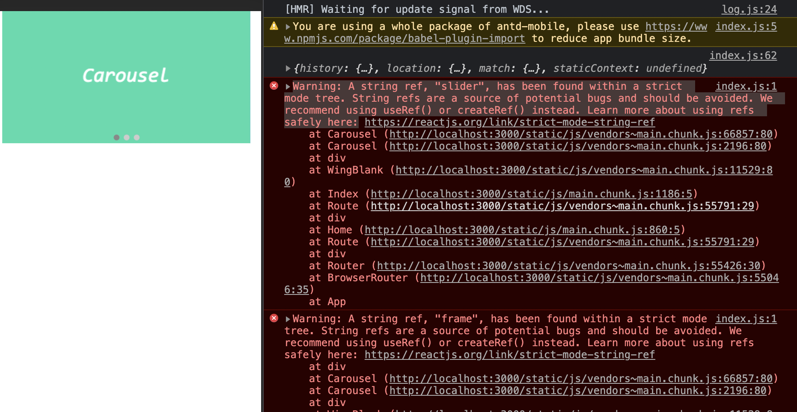
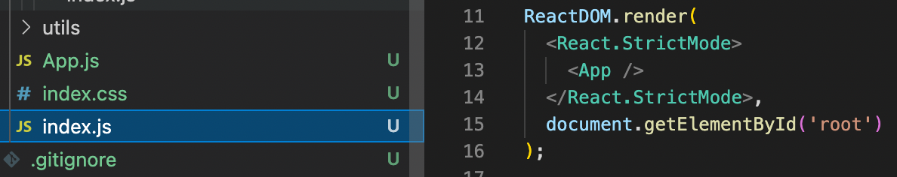

# React使用antd-mobile组件库中的跑马灯组件报错严格模式问题

在使用antd-mobile组件库中的Carousel（跑马灯）组件时出现报错：



```
Warning: A string ref, "slider", has been found within a strict mode tree. String refs are a source of potential bugs and should be avoided. We recommend using useRef() or createRef() instead. Learn more about using refs safely here:https://reactjs.org/link/strict-mode-string-ref
```

```
index.js:1 Warning: A string ref, "frame", has been found within a strict mode tree. String refs are a source of potential bugs and should be avoided. We recommend using useRef() or createRef() instead. Learn more about using refs safely here:https://reactjs.org/link/strict-mode-string-ref
```

在严格模式树中发现了字符串引用说明某处渲染被严格模式包裹。根据项目组件开发标准定位到 src 目录中的 index.js 。



删除<React.StrictMode>标签即可